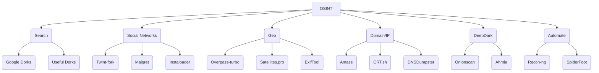

# 🕵️‍♂️ OSINT Bible 2026
> Compilation, procedures, tools and ethics for open source research

## ⚠️ Ethical Disclaimer

This repository is dedicated to the responsible and ethical practice of Open-Source Intelligence (OSINT). All information, tools, and methodologies provided herein are intended solely for educational, research, and lawful investigative purposes. Users are strongly encouraged to adhere to ethical guidelines, respect privacy rights, comply with applicable laws and regulations, and obtain necessary permissions before conducting any investigations. Misuse of this information for illegal activities, harassment, or violation of privacy is strictly prohibited and may result in legal consequences. By accessing this repository, you agree to use the content responsibly and ethically.

---

## 🧭 Quick Index with Buttons

### Foundations
[1. Fundamentals](#1-fundamentals) | [2. 4-Step Methodology](#2-4-step-methodology) | [3. Tools Mind Map](#3-tools-mind-map) | [11. Legal Considerations](#11-legal-considerations) | [28. Professional Methodologies](#28-professional-methodologies)

### Investigation Techniques
[4. Internet Search](#4-internet-search) | [5. Social Networks](#5-social-networks) | [6. GEOINT & Images](#6-geoint--images) | [7. Domain / IP / DNS](#7-domain--ip--dns) | [15. Email/Phone Investigation](#15-emailphone-investigation) | [17. Blockchain/Crypto](#17-blockchaincrypto) | [18. Transport OSINT](#18-transport-osint) | [19. WiFi/Wardriving](#19-wifiwardriving) | [20. Content Verification](#20-content-verification) | [21. Username Enumeration](#21-username-enumeration) | [22. Web Scraping](#22-web-scraping) | [23. Metadata Extraction](#23-metadata-extraction) | [24. Network Scanning](#24-network-scanning) | [29. Advanced Google Dorks](#29-advanced-google-dorks) | [31. People Investigations](#31-people-investigations) | [32. Company Research](#32-company-research) [36. Financial OSINT](#36-financial-osint) | [37. Investigator OPSEC & Sock Puppets](#37-investigator-opsec--sock-puppets) | [38. Cloud Storage OSINT](#38-cloud-storage-osint) | [39. Mobile App OSINT](#39-mobile-app-osint) | [40. Decentralized Social OSINT](#40-decentralized-social-osint) | [41. Counter-OSINT Self-Audit](#41-counter-osint-self-audit) | [42. Discord & Telegram OSINT 2026](#42-discord--telegram-osint-2026) | [43. Satellite OSINT 2026](#43-satellite-osint-2026) | [44. C2PA + SynthID + Deepfake Detection 2026](#44-c2pa--synthid--deepfake-detection-2026) | [45. Professional Templates & Deliverables](#45-professional-templates--deliverables) | [46. Regional OSINT](#46-regional-osint) | [47. Corporate OSINT Tradecraft](#47-corporate-osint-tradecraft) | [Appendix B. Structured Analytic Techniques](#appendix-b-structured-analytic-techniques-sats)

### Sources & Data
[8. Deep & Dark Web](#8-deep--dark-web) | [16. Data Breaches](#16-data-breaches) | [25. Dark Web](#25-dark-web) | [30. Learning Resources](#30-learning-resources) | [12. Extra Resources](#12-extra-resources)

### Frameworks & Automation
[9. Automation (Python)](#9-automation-python) | [10. Report Templates](#10-report-templates) | [13. AI Intelligence](#13-ai-intelligence) | [14. Facial Recognition](#14-facial-recognition) | [26. All-in-One Frameworks](#26-all-in-one-frameworks) | [27. Advanced Maltego](#27-advanced-maltego)

### Specialized
[33. Threat Intelligence Feeds](#33-threat-intelligence-feeds) | [34. ICS/OT & Critical-Infrastructure OSINT](#34-icsot--critical-infrastructure-osint) | [35. AI Agent Skills & MCP](#35-ai-agent-skills--mcp)

> [!TIP]
> **Apply this Bible in a private workspace:** > If you want to turn these methodologies into structured intelligence without exposing case data to third parties, explore [Abster Intelligence](https://github.com/frangelbarrera/Abster-Intelligence). It is a **free, open-source**, and local-first workspace for evidence organization, relationship mapping (Graph Engine), and AI-assisted investigation using your own keys.
---

## 1. Fundamentals
| Concept | Quick Definition |
|---|---|
| **OSINT** | Intelligence obtained from public sources without violating logical or physical access |
| **OPSEC** | Minimize footprint: VPN → VM → alias → metadata strip |
| **Intelligence Cycle** | Direction → Collection → Processing → Analysis → Dissemination |
| **PII** | Information that identifies: email, phone, RFC, CURP, IP, IMEI, MAC |
| **Primary Source** | Original publication (tweet, official PDF, photo EXIF) |
| **Secondary Source** | Article citing the primary (validate) |

---

## 2. 4-Step Methodology
1. **Define question** → What do I want to know?  
2. **Identify sources** → Table below |
3. **Collect** → Manual + automations |
4. **Validate and document** → Screenshots, hash, date, URL, archive.org |

| Data Type | Usual Location | Star Tool |
|---|---|---|
| Name | LinkedIn, Facebook | [Maigret](https://github.com/soxoj/maigret) |
| Email | Data breaches, newsletters | [HIBP](https://haveibeenpwned.com) |
| Phone | WhatsApp Business, TrueCaller | [Infobel](https://www.infobel.com) |
| Username | Forums, gaming, GitHub | [Snoop](https://github.com/snooppr/snoop) |
| Photo | Geolocation, EXIF | [Exiftool](https://exiftool.org) |
| Domain | WHOIS, certificates | [Amass](https://github.com/owasp-amass/amass) |
| IP | Scanning, Shodan | [Shodan](https://shodan.io) |
| Crypto wallet | Blockchain explorers | [BlockCypher](https://live.blockcypher.com) |

---

## 3. Tools Mind Map


---

## 4. Internet Search
### 4.1 Google Dorks – 20 essentials
| Objective | Dork | Example |
|---|---|---|
| Government PDFs | `site:gov filetype:pdf "contract"` | Mexico |
| Exposure | `intitle:"index of" passwords.txt` | — |
| IP Cameras | `inurl:viewer/live/index.html` | — |
| Emails | `site:linkedin.com "@company.com"` | — |
| Subdomains | `site:*.target.com -www` | — |

### 4.2 Alternative Search Engines
- [DuckDuckGo "bangs"](https://duckduckgo.com/bang) → `!archive`
- [Yandex](https://yandex.com) → best results CIS
- [Baidu](https://baidu.com) → Asia
- [Startpage](https://startpage.com) → no logs
- [Shodan](https://shodan.io) → IoT, ICS, SCADA
- [Censys](https://censys.io) → cert + banner
- [FOFA](https://fofa.info) → China, free API
- [BinaryEdge](https://binaryedge.io) → global scanning
- [Hunter.io](https://hunter.io) → corporate emails
- [PublicWWW](https://publicwww.com) → search in source code
- [SearchCode](https://searchcode.com) → search in 75B lines of code
- [SimilarSites](https://www.similarsites.com) → similar sites
- [Netlas](https://netlas.io) → internet intelligence
- [CriminalIP](https://www.criminalip.io) → search in connected internet
- [NerdyData](https://www.nerdydata.com) → website technologies
- [GreyNoise](https://www.greynoise.io) → internet noise
- [Intezer Analyze](https://analyze.intezer.com) → malware analysis
- [Kaspersky OpenTIP](https://opentip.kaspersky.com) → threat scanning
- [VirusTotal](https://virustotal.com) → file/URL analysis
- [AlienVault OTX](https://otx.alienvault.com) → threat exchange
- [ExploitDB](https://www.exploit-db.com) → exploit database
- [MalwareBazaar](https://bazaar.abuse.ch) → malware samples
- [Malware Domain List](https://www.malwarepatrol.net) → malicious domains
- [PhishTank](https://www.phishtank.com) → phishing URLs
- [URLhaus](https://urlhaus.abuse.ch) → malware URLs
- [ThreatMiner](https://www.threatminer.org) → threat intelligence
- [YARAify](https://yaraify.abuse.ch) → YARA rules
- [PulseDive](https://pulsedive.com) → IOC search
- [ThreatFox](https://threatfox.abuse.ch) → malware IOCs
- [Breach Directory](https://breachdirectory.org) → breach searches
- [Have I Been Pwned](https://haveibeenpwned.com) → breach verification
- [DNSViz](https://dnsviz.net) → DNSSEC visualization
- [DNSdumpster](https://dnsdumpster.com) → DNS enumeration
- [SpyOnWeb](https://spyonweb.com) → related sites
- [Yark](https://github.com/Owez/yark) → archive YouTube
- [CovertAction](https://covertactionmagazine.com) → investigative journalism
- [Trellix Research](https://www.trellix.com/en-us/about/newsroom/stories/research.html) → threat research
- [CP Research](https://research.checkpoint.com) → Checkpoint research
- [Wikistrat](https://www.wikistrat.com/blog) → collaborative analysis
- [PolySwarm](https://polyswarm.network) → threat scanning
- [HackerOne Hacktivity](https://hackerone.com/hacktivity) → public vulnerabilities
- [WikiLeaks](https://wikileaks.org) → leaked documents
- [Talos Reports](https://talosintelligence.com/vulnerability_reports) → vulnerability reports
- [MalAPI](https://malapi.io) → malware APIs
- [UserSearch](https://usersearch.org) → user search
- [SecureList](https://securelist.com) → Kaspersky blog
- [SPLC Hate Map](https://www.splcenter.org/hate-map) → hate map
- [ICSR](https://icsr.info) → radicalization studies
- [Militant Wire](https://www.militantwire.com) → militancy analysis
- [START Publications](https://www.start.umd.edu/publications) → terrorism publications
- [SPLC Resources](https://www.splcenter.org/resources) → SPLC resources
- [Tracking Terrorism](https://trackingterrorism.org) → terrorism tracking
- [Mapping Militants](https://cisac.fsi.stanford.edu/mappingmilitants) → mapping militants
- [Naval Institute](https://news.usni.org) → naval news
- [Institute of International Relations](https://www.iir.cz/en) → international relations
- [Janes](https://www.janes.com) → defense intelligence
- [TASS News](https://tass.com) → Russian news
- [Sputnik News](https://sputnikglobe.com) → Sputnik news
- [PIPS](https://www.pakpips.com) → Pakistan peace studies
- [PICSS](https://www.picss.net) → Pakistan conflict studies
- [Reuters](https://www.reuters.com) → news agency
- [RT](https://rt.com) → Russia Today
- [InternetActivism](https://internetactivism.org) → humanitarian tools
- [IISS](https://iiss.org) → international studies institute
- [CFR](https://cfr.org/newsletters) → council on foreign relations
- [SciHub](https://sci-hub.ru) → access to scientific papers
- [ResearchHub](https://www.researchhub.com) → research discussion
- [IDCrawl](https://www.idcrawl.com) → people search
- [Osint Industries](https://osint.industries) → email/phone search
- [ESPY](http://espysys.com) → phone search
- [SUNDERS](https://sunders.uber.space) → surveillance cameras
- [Deepinfo](https://deepinfo.com) → internet intelligence
- [Session](https://getsession.org) → private messaging
- [Consortium News](https://consortiumnews.com) → independent journalism
- [Tutanota](https://tutanota.com) → encrypted email
- [Committee to Protect Journalists](https://cpj.org) → journalist protection
- [SecurityWeek](https://www.securityweek.com) → security news
- [NCRI](https://networkcontagion.us) → network contagion research
- [Geopolitical Economy Report](https://geopoliticaleconomy.com) → geopolitical reports
- [The Grayzone](https://thegrayzone.com) → independent journalism
- [FlightAware](https://www.flightaware.com) → flight tracking
- [FlightRadar24](https://www.flightradar24.com) → flight radar
- [MarineTraffic](https://www.marinetraffic.com) → maritime traffic
- [VesselFinder](https://www.vesselfinder.com) → ship search
- [NewspaperArchive](https://newspaperarchive.com) → newspaper archives
- [The Indian Express](https://indianexpress.com) → Indian news
- [Daily Excelsior](http://www.dailyexcelsior.com) → Jammu Kashmir news
- [DNA India](https://www.dnaindia.com) → Indian news
- [Greater Kashmir](https://www.greaterkashmir.com) → Kashmir news
- [Nagaland Post](https://www.nagalandpost.com) → Nagaland news
- [RFE/RL](https://www.rferl.org) → Radio Free Europe
- [Akto](https://www.akto.io) → API security
- [Generated Photos](https://generated.photos) → AI photos
- [HDRobots](https://hdrobots.com) → AI tools directory
- [Channel 4 News](https://www.channel4.com/news) → British news
- [ThreatMon Reports](https://threatmon.io/reports) → threat reports
- [Israel Datasets](https://data.gov.il/dataset) → Israeli datasets
- [AI Dubbing](https://elevenlabs.io/dubbing) → AI dubbing
- [Budget Key](https://next.obudget.org/?lang=en) → Israel budget
- [Ship Spotting](https://www.shipspotting.com) → ship photos
- [Broadcastify](https://www.broadcastify.com) → police audio
- [OpenCelliD](https://www.opencellid.org) → cell tower database
- [AviationStack](https://aviationstack.com) → aviation API
- [DocumentCloud](https://www.documentcloud.org/documents/) → document management
- [IDRW](https://idrw.org) → Indian defense
- [XFE](https://exchange.xforce.ibmcloud.com) → X-Force exchange
- [Scumware](https://www.scumware.org) → malware research
- [Ukraine Live Cams](https://nagix.github.io/ukraine-livecams) → Ukraine cameras
- [TWN](http://www.the-webcam-network.com) → webcam network
- [Opentopia](http://www.opentopia.com) → public webcams
- [Transparency](https://www.transparency.org) → anti-corruption
- [Maigret](https://github.com/soxoj/maigret) → user search
- [OCCRP](https://www.occrp.org/en) → organized crime
- [Qdorks](https://qdorks.com) → dork generator
- [Radio Garden](https://radio.garden) → world radios
- [LolArchiver OSINT](https://osint.lolarchiver.com) → OSINT search
- [BreachBase](https://breachbase.com) → breach base
- [WorldCam](https://worldcam.eu) → world webcams
- [Webcam Galore](https://www.webcamgalore.com) → webcams
- [WiFi Map](https://www.wifimap.io) → WiFi hotspots
- [OpenTrafficCamMap](https://otc.armchairresearch.org/map) → traffic cameras
- [Skyline Webcams](https://www.skylinewebcams.com/en/webcam) → skyline webcams
- [Pictimo](https://www.pictimo.com) → world webcams
- [Instances.social](https://instances.social) → Mastodon recommender
- [CamHacker](https://www.camhacker.com) → public webcams
- [Labs TIB Geoestimation](https://labs.tib.eu/geoestimation) → geographic estimation
- [Picarta](https://picarta.ai) → photo location prediction
- [Tiny Scan](https://www.tiny-scan.com) → URL scanning
- [ZeroDay](https://www.zero-day.cz) → zero-day vulnerabilities
- [Predicta Search](https://predictasearch.com) → digital search
- [Ventusky](https://www.ventusky.com) → weather maps
- [OSV](https://osv.dev) → open source vulnerabilities
- [Coalition ESS](https://ess.coalitioninc.com) → exploit scoring
- [Validin](https://app.validin.com) → attack surface mapping
- [CIRCL PDNS](https://www.circl.lu/services/passive-dns) → passive DNS
- [InTheWild](https://inthewild.io) → exploits in wild
- [360 Quake](https://quake.360.net) → cyberspace mapping
- [Cloudflare Radar](https://radar.cloudflare.com/traffic) → internet trends
- [Crisis24](https://crisis24.garda.com) → security risk management
- [arXiv](https://arxiv.org) → scientific papers

### 4.3 Archives and snapshots
- [Wayback Machine](https://archive.org/web)
- [CachedView](https://cachedview.com) (Google + Archive.is)
- [URLScan](https://urlscan.io) → capture + DOM + requests
- [Ubikron](https://ubikron.com ) → AI-powered evidence collection & entity extraction
- [Screenshot Guru](https://screenshot.guru) → screen test
- [Stored Website](https://stored.website) → cached pages
- [ThreatMiner](https://www.threatminer.org) → IOC context
- [YARAify](https://yaraify.abuse.ch) → YARA rules
- [PulseDive](https://pulsedive.com) → IOC search
- [ThreatFox](https://threatfox.abuse.ch) → malware IOCs
- [Breach Directory](https://breachdirectory.org) → breaches
- [Have I Been Pwned](https://haveibeenpwned.com) → breach verification
- [DNSViz](https://dnsviz.net) → DNSSEC
- [DNSdumpster](https://dnsdumpster.com) → DNS enumeration
- [SpyOnWeb](https://spyonweb.com) → related sites
- [Yark](https://github.com/Owez/yark) → archive YouTube

---

## 5. Social Networks
### 5.1 Facebook
1. **Facebook Recover Lookup** - Link: [Facebook Recover Lookup](https://www.facebook.com/login/identify?ctx=recover) - Description: Used to check if a given email or phone number is associated with any Facebook account or not.
2. **Social Searcher** - Link: [Social Searcher](https://www.social-searcher.com/) - Description: Allows you to monitor all public social mentions in social networks and the web.
3. **Lookup-id.com** - Link: [Lookup-id.com](https://lookup-id.com/) - Description: Helps you find the Facebook ID of anyone's profile or a Group.
4. **Who posted this** - Link: [Who posted this](https://whopostedwhat.com/) - Description: Facebook keyword search for people who work in the public interest. It allows you to search keywords on specific dates.
5. **Facebook Search** - Link: [Facebook Search](https://www.sowsearch.info/) - Description: Allows you to search on Facebook for posts, people, photos, etc., using some filters.
6. **Facebook Graph Searcher** - Link: [Facebook Graph Searcher](https://intelx.io/tools?tab=facebook) - Description: To search someone on Facebook.
7. **Facebook People Search** - Link: [Facebook People Search](https://www.facebook.com/directory/people/) - Description: Search on Facebook by victim's name.
8. **DumpItBlue** - Link: [DumpItBlue+](https://chrome.google.com/webstore/detail/dumpitblue%2B/igmgknoioooacbcpcfgjigbaajpelbfe/) - Description: helps to dump Facebook stuff for analysis or reporting purposes.
9. **Export Comments** - Link: [Export Comments](https://exportcomments.com/) - Description: Easily exports all comments from your social media posts to Excel file.
10. **Facebook Applications** - Link: [Facebook Applications](https://khalil-shreateh.com/khalil.shtml/social_applications/facebook-applications/) - Description: A collection of online tools that automate and facilitate Facebook.
11. **Social Analyzer** - Link: [SocialAnalyzer - Social Sentiment & Analysis](https://chromewebstore.google.com/detail/socialanalyzer-social-sen/efeikkcpimdfpdlmlbjdecnmkknjcfcp) - Description: a free tool of social media monitoring and analysis.
12. **AnalyzeID** - Link: [AnalyzeID](https://analyzeid.com/) - Description: Just looking for sites that supposedly may have the same owner. Including a FaceBook App ID match.
13. **SOWsearch** - Link: [sowsearch](https://www.sowsearch.info/) - Description: a simple interface to show how the current Facebook search function works.
14. **Facebook Matrix** - Link: [FacebookMatrix](https://plessas.net/facebookmatrix) - Description: Formulas for Searching Facebook.
15. **Who posted what** - Link: [Who Posted What](https://whopostedwhat.com/) - Description: A non public Facebook keyword search for people who work in the public interest. It allows you to search keywords on specific dates.
16. **StalkFace** - Link: [StalkFace](https://stalkface.com/en/) - Description: Toolkit to stalk someone on Facebook.
17. **Search is Back** - Link: [Search is Back](https://searchisback.com/) - Description: ind people and events on Facebook Search by location, relationships, and more!.
18. **FB-Search** - Link: [FB-Search](https://fb-search.com) - Description: busca por teléfono o correo.
19. **FB-Posts-scraper** - Link: [FB-Posts-scraper](https://github.com/rugantio/fbcrawl) - Description: (Python).
20. **FB-Video-downloader** - Link: [FB-Video-downloader](https://fdown.net) - Description: .

### 5.2 Instagram
1. **IFTTT Integrations** - Link: [IFTTT Instagram integrations](https://ifttt.com/instagram) - Description: Popular Instagram workflows & automations.
2. **IMGinn.io** - Link: [IMGinn.io](https://imginn.io/) - Description: view and download all the content on the social network Instagram all at one place.
3. **Instaloader** - Link: [Instaloader](https://github.com/instaloader/instaloader) - Description: Download pictures (or videos) along with their captions and other metadata from Instagram.
4. **SolG** - Link: [SolG](https://github.com/yezz123/SoIG) - Description: The Instagram OSINT Tool gets a range of information from an Instagram account that you normally wouldn't be able to get from just looking at their profile.
5. **Osintgram** - Link: [Osintgram](https://github.com/Datalux/Osintgram) - Description: Osintgram is an OSINT tool on Instagram to collect, analyze, and run reconnaissance.
6. **Toutatis** - Link: [toutatis](https://pypi.org/project/toutatis/) - Description: It is a tool written to retrieve private information such as Phone Number, Mail Address, ID on Instagram accounts via API.
7. **instalooter** - Link: [instalooter](https://pypi.org/project/instalooter/) - Description: InstaLooter is a program that can download any picture or video associated from an Instagram profile, without any API access.
8. **Exportgram** - Link: [Exportgram](https://exportgram.net/) - Description: A web application made for people who want to export instagram comments into excel, csv and json formats.
9. **Profile Analyzer** - Link: [Profile Analyzer](https://inflact.com/tools/profile-analyzer/) - Description: Analyze any public profile on Instagram – the tool is free, unlimited, and secure. Enter a username to take advantage of precise statistics.
10. **Find Instagram User Id** - Link: [Find Instagram User Id](https://www.codeofaninja.com/tools/find-instagram-user-id/) - Description: This tool called "Find Instagram User ID" provides an easy way for developers and designers to get Instagram account numeric ID by username.
11. **Instahunt** - Link: [Instahunt](https://instahunt.huntintel.io/) - Description: Easily find social media posts surrounding a location.
12. **Musicaldown** - Link: [Musicaldown](https://musicaldown.com) - Description: web.

### 5.3 LinkedIn
1. **RecruitEm** - Link: [RecruitEm](https://recruitin.net/) - Description: Allows you to search social media profiles. It helps recruiters to create a Google boolean string that searches all public profiles.
2. **RocketReach** - Link: [RocketReach](https://rocketreach.co/person) - Description: Allows you to programmatically search and lookup contact info over 700 million professionals and 35 million companies.
3. **Phantom Buster** - Link: [Phantom Buster](https://phantombuster.com/phantombuster) - Description: Automation tool suite that includes data extraction capabilities.
4. **linkedprospect** - Link: [LinkedIn Boolean Search](https://linkedprospect.com/linkedin-boolean-search-tool/#tool) - Description: Build a targeted list of LinkedIn people using boolean search.
5. **ReverseContact** - Link: [Reverse Email Lookup](https://www.reversecontact.com/) - Description: Find Linked Profiles associated with any email.
6. **LinkedIn Search Engine** - Link: [Programmable Search Engine](https://cse.google.com/cse?cx=daaf18e804f81bed0) - Description: Programmable Search Engine for LinkedIn profiles.
7. **Free People Search Tool** - Link: [Free People Search Tool](https://freepeoplesearchtool.com/#gsc.tab=0) - Description: Find people easily online.
8. **IntelligenceX Linkedin** - Link: [IntelligenceX Linkedin](https://intelx.io/tools?tab=linkedin) - Description: A webbased tool for searching someone on Linkedin.
9. **Linkedin Search Tool** - Link: [Linkedin Search Tool](https://inteltechniques.com/tools/Linkedin.html) - Description: Provides you a interface with various tools for Linkedin Osint.
10. **LinkedInt** - Link: [LinkedInt](https://github.com/vysecurity/LinkedInt) - Description: Providing you with Linkedin Intelligence.
11. **InSpy** - Link: [InSpy](https://github.com/jobroche/InSpy) - Description: InSpy is a python based LinkedIn enumeration tool.
12. **CrossLinked** - Link: [CrossLinked](https://github.com/m8sec/CrossLinked) - Description: CrossLinked is a LinkedIn enumeration tool that uses search engine scraping to collect valid employee names from an organization.
13. **Hunter.io** - Link: [Hunter.io](https://hunter.io) - Description: Find and verify corporate email patterns. 25 free searches per month.

### 5.4 Twitter/X
1. **TweetDeck** - Link: [TweetDeck](https://tweetdeck.twitter.com/) - Description: Offers a more convenient Twitter experience by allowing you to view multiple timelines in one easy interface.
2. **FollowerWonk** - Link: [FollowerWonk](https://followerwonk.com/bio) - Description: Helps you find Twitter accounts using bio and provides many other useful features.
3. **Twitter Advanced Search** - Link: [Twitter Advanced Search](https://twitter.com/search-advanced) - Description: Allows you to search on Twitter using filters for better search results.
4. **memory.lol** - Link: [memory.lol](https://memory.lol/app/) - Description: a tiny web service that provides historical information about twitter users.
5. **SocialData API** - Link: [SocialData API](https://socialdata.tools/) - Description: an unofficial Twitter API alternative that allows scraping historical tweets, user profiles, lists and Twitter spaces without using Twitter's API.
6. **Social Bearing** - Link: [Social Bearing](https://socialbearing.com/) - Description: Insights & analytics for tweets & timelines.
7. **Tinfoleak** - Link: [Tinfoleak](https://tinfoleak.com/) - Description: Search for Twitter users leaks.
8. **Network Tool** - Link: [Network Tool](https://osome.iu.edu/tools/networks/) - Description: Explore how information spreads across Twitter with an interactive network using OSoMe data.
9. **Foller** - Link: [Foller](https://foller.me/) - Description: Looking for someone in the United States? Our free people search engine finds social media profiles, public records, and more!
10. **SimpleScraper OSINT** - Link: [SimpleScraper OSINT](https://airtable.com/appyDhNeSetZU0rIw/shrceHfvukijgln9q/tblxgilU0SzfXNEwS/viwde4ACDDOpeJ8aO?blocks=bipxY3tKD5Lx0wmEU) - Description: This Airtable automatically scrapes OSINT-related twitter accounts ever 3 minutes and saves tweets that contain coordinates.
11. **Deleted Tweet Finder** - Link: [Deleted Tweet Finder](https://cache.digitaldigging.org/) - Description: Search for deleted tweets across multiple archival services.
12. **Twitter Search Tool** - Link: [Twitter search tool](https://www.aware-online.com/en/osint-tools/twitter-search-tool/) - Description: On this page you can create advanced search queries within Twitter.
13. **Twitter Video Downloader** - Link: [Twitter Video Downloader](https://twittervideodownloader.com/) - Description: Download Twitter videos & GIFs from tweets.
14. **Download Twitter Data** - Link: [Download Twitter Data](https://www.twtdata.com/) - Description: Download Twitter data in csv format by entering any Twitter handle, keyword, hashtag, List ID or Space ID.
15. **Twitonomy** - Link: [Twitonomy](https://www.twitonomy.com/) - Description: Twitter #analytics and much more.
16. **tweeterid** - Link: [tweeterid](https://tweeterid.com/) - Description: Type in any Twitter ID or @handle below, and it will be converted into the respective ID or username.
17. **BirdHunt** - Link: [BirdHunt](https://birdhunt.huntintel.io/) - Description: Easily find social media posts surrounding a location.
18. **Twint-docker** - Link: [Twint-docker](https://github.com/twintproject/twint) - Description: Download all tweets from a user without API access.
19. **Sentiment140** - Link: [Sentiment140](http://sentiment140.com) - Description: Bulk sentiment analysis for tweets via CSV.
20. **Xquik** - Link: [Xquik](https://xquik.com) - Description: 122 API endpoints for search, user, post and monitor. API key, USD 0.00015/read.

### 5.5 Pinterest
1. **DownAlbum** - Link: [DownAlbum](https://chrome.google.com/webstore/detail/downalbum/cgjnhhjpfcdhbhlcmmjppicjmgfkppok) - Description: Google Chrome extension for downloading albums of photos from various websites, including Pinterest.
2. **Experts PHP: Pinterest Photo Downloader** - Link: [Pinterest Photo Downloader](https://www.expertsphp.com/pinterest-photo-downloader.html) - Description: Website providing a tool to download photos from Pinterest.
3. **Pingroupie** - Link: [Pingroupie](http://pingroupie.com) - Description: A Meta Search Engine for Pinterest that lets you discover Collaborative Boards, Influencers, Pins, and new Keywords.
4. **Tailwind** - Link: [Tailwind](https://www.tailwindapp.com) - Description: Social media scheduling and management tool that supports Pinterest.
5. **Pinterest Guest** - Link: [Pinterest Guest](https://addons.mozilla.org/en-US/firefox/addon/pinterest-guest) - Description: Mozilla Firefox add-on for browsing Pinterest without logging in or creating an account.

### 5.6 Reddit
1. **F5BOT** - Link: [F5BOT](https://f5bot.com) - Description: Receive notifications for new Reddit posts matching specific keywords.
2. **Mostly Harmless** - Link: [Mostly Harmless](http://kerrick.github.io/Mostly-Harmless/#features) - Description: A suite of tools for Reddit, including user analysis, subreddit comparison, and more.
3. **OSINT Combine: Reddit Post Analyzer** - Link: [OSINT Combine: Reddit Post Analyzer](https://www.osintcombine.com/tools) - Description: Analyze and gather information from Reddit posts for OSINT purposes.
4. **Phantom Buster** - Link: [Phantom Buster](https://phantombuster.com/phantombuster?category=reddit) - Description: Automation tool suite that includes Reddit data extraction capabilities.
5. **rdddeck** - Link: [rdddeck](https://rdddeck.com) - Description: Real-time dashboard for monitoring multiple Reddit communities.
6. **Readr for Reddit** - Link: [Readr for Reddit](https://chrome.google.com/webstore/detail/readr-forreddit/molhdaofohigaepljchpmfablknhabmo) - Description: Google Chrome extension for an improved reading experience on Reddit.
7. **Reddit Archive** - Link: [Reddit Archive](http://www.redditarchive.com) - Description: Archive of Reddit posts and comments for historical reference.
8. **Reddit Comment Search** - Link: [Reddit Comment Search](https://redditcommentsearch.com) - Description: Search for specific comments and conversations on Reddit.
9. **Redditery** - Link: [Redditery](http://www.redditery.com) - Description: Explore Reddit posts and comments based on various criteria.
10. **Reddit Hacks** - Link: [Reddit Hacks](https://github.com/EdOverflow/hacks) - Description: Collection of Reddit hacks and tricks for advanced users.
11. **Reddit List** - Link: [Reddit List](http://redditlist.com) - Description: Directory of popular subreddits organized by various categories.
12. **reddtip** - Link: [reddtip](https://www.redditp.com) - Description: Show appreciation to Reddit users by sending them tips in cryptocurrencies.
13. **Reddit Search** - Link: [Reddit Search (realsrikar)](https://realsrikar.github.io/reddit-search) - Description: Various tools and websites for searching and discovering content on Reddit.
14. **Reddit Shell** - Link: [Reddit Shell](https://redditshell.com) - Description: Command-line interface for browsing and interacting with Reddit.
15. **Reddit Stream** - Link: [Reddit Stream](http://reddit-stream.com) - Description: Live-streaming of Reddit comments for real-time discussions.
16. **Reddit Suite** - Link: [Reddit Enhancement Suite (Chrome Extension)](https://chrome.google.com/webstore/detail/redditenhancementsuite/kbmfpngjjgdllneeigpgjifpgocmfgmb) - Description: Browser extension that enhances the Reddit browsing experience with additional features.
17. **Reddit User Analyser** - Link: [Reddit User Analyser](https://atomiks.github.io/reddit-user-analyser) - Description: Analyze and visualize the activity and behavior of Reddit users.
18. **redditvids** - Link: [redditvids](https://redditvids.com) - Description: Watch Reddit videos and browse popular video subreddits.
19. **Reditr** - Link: [Reditr](http://reditr.com) - Description: Desktop Reddit client with a clean and intuitive interface.
20. **Reeddit** - Link: [Reeddit](https://reedditapp.com) - Description: Simplified and clean Reddit web interface for a distraction-free browsing experience.
21. **smat** - Link: [smat](https://www.smat-app.com/timeline) - Description: Social media analytics tool that includes Reddit for tracking trends and engagement.
22. **socid_extractor** - Link: [socid_extractor](https://github.com/soxoj/socid_extractor) - Description: Extract user information from Reddit and other social media platforms.
23. **Suggest me a subreddit** - Link: [Suggest me a subreddit](https://nikas.praninskas.com/suggest-subreddit) - Description: Get recommendations for new subreddits to explore based on your preferences.
24. **Subreddits** - Link: [Subreddits](http://subreddits.org) - Description: Directory of active subreddits organized by various categories.
25. **uforio** - Link: [uforio](http://uforio.com) - Description: Generate word clouds from Reddit comment threads.
26. **Universal Reddit Scraper (URS)** - Link: [Universal Reddit Scraper (URS)](https://github.com/JosephLai241/URS) - Description: Python-based tool for scraping Reddit data for analysis.
27. **Vizit** - Link: [Vizit](https://redditstuff.github.io/sna/vizit) - Description: Visualize and analyze relationships between Reddit users and subreddits.
28. **Wisdom of Reddit** - Link: [Wisdom of Reddit](https://wisdomofreddit.com) - Description: Curated collection of insightful quotes and comments from Reddit.

### 5.7 Github
1. **Awesome Lists** - Link: [Awesome Lists](http://awesomelists.top) - Description: A curated list of awesome lists for various programming languages, frameworks, and tools.
2. **CoderStats** - Link: [CoderStats](https://coderstats.net) - Description: A platform for developers to track and showcase their coding activity and statistics from GitHub.
3. **Digital Privacy** - Link: [Digital Privacy](https://github.com/ffffffff0x/Digital-Privacy) - Description: A collection of resources and tools for enhancing digital privacy and security.
4. **Find Github User ID** - Link: [Find Github User ID](http://caius.github.io/github_id) - Description: A web tool for finding the unique identifier (ID) of a GitHub user.
5. **GH Archive** - Link: [GH Archive](http://www.gharchive.org) - Description: A project that provides a public dataset of GitHub activity, including events and metadata.
6. **GitGot** - Link: [GitGot](https://github.com/BishopFox/GitGot) - Description: A semi-automated, feedback-driven tool for auditing Git repositories.
7. **gitGraber** - Link: [gitGraber](https://github.com/hisxo/gitGraber) - Description: A tool for searching and cloning sensitive information in GitHub repositories.
8. **git-hound** - Link: [git-hound](https://github.com/tillson/git-hound) - Description: A tool for finding sensitive information exposed in GitHub repositories.
9. **Github Dorks** - Link: [Github Dorks](https://github.com/techgaun/github-dorks) - Description: A collection of GitHub dorks, which are search queries to find sensitive information in repositories.
10. **Github Stars** - Link: [Github Stars](http://githubstars.com) - Description: A website that showcases GitHub repositories with the most stars and popularity.
11. **Github Trending RSS** - Link: [Github Trending RSS](https://mshibanami.github.io/GitHubTrendingRSS) - Description: An RSS feed generator for trending repositories on GitHub.
12. **Github Username Search Engine** - Link: [Github Username Search Engine](https://jonnygovish.github.io/Github-username-search-engine) - Description: A search engine to find GitHub usernames based on various filters and criteria.
13. **Github Username Search Engine** - Link: [Github Username Search Engine](https://githubnotes-47071.firebaseapp.com/#/?_k=n0bgxn) - Description: Another search engine to find GitHub usernames with advanced filtering options.
14. **GitHut** - Link: [GitHut](https://githut.info) - Description: A website that provides statistics and visualizations of programming languages on GitHub.

### 5.8 Snapchat
1. **addmeContacts** - Link: [addmeContacts](http://add-me-contacts.com) - Description: A platform to find and connect with new contacts on various social media platforms.
2. **AddMeSnaps** - Link: [AddMeSnaps](https://www.addmesnaps.com) - Description: A website for discovering and adding new Snapchat friends.
3. **ChatToday** - Link: [ChatToday](https://chattoday.com) - Description: An online chat platform for connecting and chatting with people from around the world.
4. **Gebruikersnamen: Snapchat** - Link: [Gebruikersnamen: Snapchat](https://gebruikersnamen.nl/snapchat) - Description: A website for finding Snapchat usernames.
5. **OSINT Combine: Snapchat MultiViewer** - Link: [OSINT Combine: Snapchat MultiViewer](https://www.osintcombine.com/snapchat-multi-viewer) - Description: A tool for viewing multiple Snapchat accounts simultaneously.
6. **Snapchat-mapscraper** - Link: [Snapchat-mapscraper](https://github.com/nemec/snapchat-map-scraper) - Description: A tool for scraping public Snapchat Stories from the Snap Map.
7. **Snap Political Ads Library** - Link: [Snap Political Ads Library](https://www.snap.com/en-GB/political-ads) - Description: Snapchat's library of political ads displayed on the platform.
8. **Social Finder** - Link: [Social Finder](https://socialfinder.app) - Description: A platform to search and discover social media profiles on various platforms.
9. **SnapIntel** - Link: [SnapIntel](https://github.com/Kr0wZ/SnapIntel) - Description: a python tool providing you information about Snapchat users.
10. **AddMeS** - Link: [AddMeS](https://addmes.io/) - Description: The 'Add Me' directory of Snapchat users on web.

### 5.9 WhatsApp
1. **checkwa** - Link: [checkwa](https://checkwa.online) - Description: An online tool to check the status and availability of WhatsApp numbers.
2. **WhatsApp Fake Chat** - Link: [WhatsApp Fake Chat](http://www.fakewhats.com/generator) - Description: An online tool to generate fake WhatsApp conversations for fun or pranks.
3. **whatsfoto** - Link: [whatsfoto](https://github.com/zoutepopcorn/whatsfoto) - Description: A Python script to download profile pictures from WhatsApp contacts.

### 5.10 Skype
1. **addmeContacts** - Link: [addmeContacts](http://add-me-contacts.com) - Description: A platform to find and connect with new contacts on various social media platforms.
2. **ChatToday** - Link: [ChatToday](https://chattoday.com) - Description: An online chat platform for connecting and chatting with people from around the world.
3. **Skypli** - Link: [Skypli](https://www.skypli.com) - Description: A website for discovering and connecting with new Skype contacts.

### 5.11 Telegram
1. **ChatBottle: Telegram** - Link: [ChatBottle: Telegram](https://chatbottle.co/bots/telegram) - Description: A directory of Telegram bots for various purposes.
2. **ChatToday** - Link: [ChatToday](https://chattoday.com) - Description: An online chat platform for connecting and chatting with people from around the world.
3. **informer** - Link: [informer](https://github.com/paulpierre/informer) - Description: A Python library for retrieving information about Telegram channels, groups, and users.
4. **_IntelligenceX: Telegram** - Link: [_IntelligenceX: Telegram](https://intelx.io/tools?tab=telegram) - Description: IntelligenceX's Telegram tool for searching and analyzing Telegram data.
5. **Lyzem.com** - Link: [Lyzem.com](https://lyzem.com) - Description: A website to search and find Telegram groups and channels.
6. **Telegram Channels** - Link: [Telegram Channels](https://telegramchannels.me) - Description: A directory of Telegram channels covering various topics.
7. **Telegram Channels** - Link: [Telegram Channels](https://tlgrm.eu/channels) - Description: A platform to discover and browse Telegram channels.
8. **Telegram Channels Search** - Link: [Telegram Channels Search](https://xtea.io/ts_en.html) - Description: A search engine to find Telegram channels by keywords.
9. **Telegram Directory** - Link: [Telegram Directory](https://tdirectory.me) - Description: A comprehensive directory of Telegram channels, groups, and bots.
10. **Telegram Group** - Link: [Telegram Group](https://www.telegram-group.com) - Description: A website to search and join Telegram groups.
11. **telegram-history-dump** - Link: [telegram-history-dump](https://github.com/tvdstaaij/telegram-history-dump) - Description: A Python script to dump the history of a Telegram chat into a SQLite database.
12. **Telegram-osint-lib** - Link: [Telegram-osint-lib](https://github.com/Postuf/telegram-osint-lib) - Description: A Python library for performing open-source intelligence (OSINT) on Telegram.
13. **Telegram Scraper** - Link: [Telegram Scraper](https://github.com/th3unkn0n/TeleGram-Scraper) - Description: A powerful Telegram scraping tool for extracting user information and media.
14. **Tgram.io** - Link: [Tgram.io](https://tgram.io) - Description: A platform to explore and search for Telegram channels, groups, and bots.
15. **Tgstat.com** - Link: [Tgstat.com](https://tgstat.com) - Description: A comprehensive platform for analyzing and tracking Telegram channels and groups.
16. **Tgstat RU** - Link: [Tgstat RU](https://tgstat.ru) - Description: A Russian platform for analyzing and monitoring Telegram channels and groups.

### 5.12 Discord
1. **DiscordOSINT** - Link: [DiscordOSINT](https://github.com/husseinmuhaisen/DiscordOSINT?tab=readme-ov-file#-discord-search-syntax-) - Description: This Repository Will contain useful resources to conduct research on Discord.
2. **Discord.name** - Link: [Discord.name](https://discord.name/) - Description: Discord profile lookup using user ID.
3. **Discord History Tracker** - Link: [Discord History Tracker](https://dht.chylex.com/) - Description: Discord History Tracker lets you save chat history in your servers, groups, and private conversations, and view it offline.
4. **Top.gg** - Link: [Top.gg](https://top.gg/) - Description: Explore millions of Discord Bots.
5. **Unofficial Discord Lookup** - Link: [Unofficial Discord Lookup](https://discord.id/) - Description: Search for discord profile using id.
6. **Disboard** - Link: [Disboard](https://disboard.org/) - Description: DISBOARD is the place where you can list/find Discord servers.

### 5.13 ONLYFANS
1. **OnlyFans Finder** - Link: [The Favourite OnlyFans search](https://onlyfansfinder.co/) - Description: The tools allow easy searching via advanced filtering capabilities and sorting functionality, making it easy to access desired material.
2. **OnlyFam** - Link: [OnlyFam](https://onlyfam.com) - Description: OnlyFans Search & Model Finder - Find Creators in the World's Largest OnlyFans Database
3. **OnlyFinder** - Link: [OnlyFinder](https://onlyfinder.com/) - Description: OnlyFans Search Engine - OnlyFans Account Finder.
4. **OnlySearch** - Link: [OnlySearch](https://onlysearch.co/) - Description: Find OnlyFans profiles by searching for key words.
5. **Sotugas** - Link: [SóTugas](https://sotugas.com/) - Description: Encontra Contas do OnlyFans Portugal 🇵🇹.
6. **Fansmetrics** - Link: [Fansmetrics](https://fansmetrics.com/) - Description: Use this OnlyFans Finder to search in 3,000,000 OnlyFans Accounts.
7. **Findr.fans** - Link: [Findr.fans](https://findr.fans/) - Description: Only Fans Search Tool.
8. **Hubite** - Link: [Hubite](https://hubite.com/en/onlyfans-search/) - Description: Advanced OnlyFans Search Engine.
9. **Similarfans** - Link: [Similarfans](https://similarfans.com/) - Description: Blog for OnlyFans content creators.
10. **Fansearch** - Link: [Fansearch](https://www.fansearch.com/) - Description: Fansearch is the best OnlyFans Finder to search in 3,000,000 OnlyFans Accounts.

### 5.14 TikTok
1. **Mavekite** - Link: [Mavekite](https://mavekite.com/) - Description: Search the profile using username.
2. **TikTok hashtag analysis toolset** - Link: [TikTok hashtag analysis toolset](https://github.com/bellingcat/tiktok-hashtag-analysis) - Description: The tool helps to download posts and videos from TikTok for a given set of hashtags over a period of time.
3. **TikTok Video Downloader** - Link: [TikTok Video Downloader](https://ssstik.io/en-1) - Description: ssstiktok is a free TikTok video downloader without watermark tool that helps you download TikTok videos without watermark (Musically) online.
4. **Exolyt** - Link: [exolyt](https://exolyt.com/) - Description: The best tool for TikTok analytics & insights.

---

## 6. Geoint & Images
### 6.1 Metadata
```bash
exiftool -a -u foto.jpg | grep -i "gps\|date\|camera"
# strip before publishing
exiftool -all= foto_sanitizada.jpg
```

### 6.2 Geolocate
- [Google Earth Pro](https://earth.google.com) → temporal displacement
- [Suncalc](https://suncalc.org) → shadow = time
- [Overpass-turbo](https://overpass-turbo.eu) → POI within radius
- [FlightAware](https://www.flightaware.com) → flight tracking
- [FlightRadar24](https://www.flightradar24.com) → flight radar
- [MarineTraffic](https://www.marinetraffic.com) → maritime traffic
- [VesselFinder](https://www.vesselfinder.com) → ships
- [WiGLE](https://wigle.net) → geolocated WiFi database
- [OpenCelliD](https://www.opencellid.org) → cell towers
- [Broadcastify](https://www.broadcastify.com) → police audio
- [AviationStack](https://aviationstack.com) → aviation API
- [Labs TIB Geoestimation](https://labs.tib.eu/geoestimation) → geographic estimation
- [Picarta](https://picarta.ai) → photo location prediction
- [Ventusky](https://www.ventusky.com) → weather maps
- [Ukraine Live Cams](https://nagix.github.io/ukraine-livecams) → Ukraine cameras
- [TWN](http://www.the-webcam-network.com) → webcam network
- [Opentopia](http://www.opentopia.com) → public webcams
- [WorldCam](https://worldcam.eu) → world webcams
- [Webcam Galore](https://www.webcamgalore.com) → webcams
- [OpenTrafficCamMap](https://otc.armchairresearch.org/map) → traffic cameras
- [Skyline Webcams](https://www.skylinewebcams.com/en/webcam) → skyline webcams
- [Pictimo](https://www.pictimo.com) → world webcams
- [CamHacker](https://www.camhacker.com) → public webcams

### 6.3 Satellite / Drone
- [Sentinel-Hub](https://apps.sentinel-hub.com) → 10m resolution, free
- [NASA-FIRMS](https://firms.modaps.eosdis.nasa.gov) → real-time fires
- [Zoom Earth](https://zoom.earth) → METAR overlay
- [FlightRadar24](https://www.flightradar24.com) → flight radar
- [ADS-B Exchange](https://globe.adsbexchange.com) → no military filters
- [FlightAware](https://flightaware.com) → flight history
- [PiAware (Raspberry Pi)](https://flightaware.com/adsb/piaware) → own ADS-B receiver
- [MarineTraffic](https://www.marinetraffic.com) → global AIS tracking
- [VesselFinder](https://www.vesselfinder.com) → free alternative
- [ShipSpotting](http://www.shipspotting.com) → ship photo database

---

## 7. Domain / IP / DNS
| Objective | Tool | Quick Command |
|---|---|---|
| Subdomains | Amass | `amass enum -d target.com -o subs.txt` |
| Certificates | CRT.sh | `curl https://crt.sh/?q=%25.target.com&output=json` |
| Historical DNS | [SecurityTrails](https://securitytrails.com) | Free API 50/month |
| Neighbor IPs | [BGP.he](https://bgp.he.net) | CIDR |
| Reputation | [VirusTotal](https://virustotal.com) | `vt ip_info <ip>` |
| Quick scan | [Nmap-online](https://nmap.online) | no VPN |
| Subdomains | Subdomain Center | `https://www.subdomain.center` |
| Subdomains | SubdomainRadar | `https://www.subdomainradar.io` |
| Historical DNS | DNS History | `http://dnshistory.org` |
| Reputation | Talos | `https://www.talosintelligence.com/` |
| Scan | Binary Defense | `https://www.binarydefense.com/banlist.txt` |
| BGP Ranking | CIRCL BGP | `https://bgpranking.circl.lu` |
| Botnet Tracker | MalwareTech | `https://intel.malwaretech.com/` |
| BOTVRIJ.EU | BOTVRIJ | `http://www.botvrij.eu/` |
| C&C Tracker | Bambenek | `http://osint.bambenekconsulting.com/feeds/c2-ipmasterlist.txt` |
| CertStream | CertStream | `https://certstream.calidog.io/` |
| CCSS Forum | CCSS Forum | `http://www.ccssforum.org/malware-certificates.php` |
| CI Army List | CINS Score | `http://cinsscore.com/#list` |
| Cisco Umbrella | Cisco Umbrella | `http://s3-us-west-1.amazonaws.com/umbrella-static/index.html` |
| Cloudmersive | Cloudmersive | `https://cloudmersive.com/virus-api` |
| Critical Stack | Critical Stack | `https://intelstack.com/` |
| CrowdSec | CrowdSec | `https://app.crowdsec.net/` |
| Cyber Cure | Cyber Cure | `https://www.cybercure.ai/` |
| DataPlane | DataPlane | `https://dataplane.org/` |
| Focsec | Focsec | `https://focsec.com` |
| Disposable Domains | Disposable Domains | `https://github.com/martenson/disposable-email-domains` |
| Emerging Threats | Emerging Threats | `http://rules.emergingthreats.net/fwrules/` |
| ExoneraTor | ExoneraTor | `https://exonerator.torproject.org/` |
| Exploitalert | Exploitalert | `http://www.exploitalert.com/` |
| FastIntercept | FastIntercept | `https://intercept.sh/threatlists/` |
| Feodo Tracker | Feodo Tracker | `https://feodotracker.abuse.ch/` |
| FireHOL | FireHOL | `http://iplists.firehol.org/` |
| FraudGuard | FraudGuard | `https://fraudguard.io/` |
| Grey Noise | Grey Noise | `http://greynoise.io/` |
| HoneyDB | HoneyDB | `https://riskdiscovery.com/honeydb/` |
| Icewater | Icewater | `https://github.com/SupportIntelligence/Icewater` |
| InQuest Labs | InQuest Labs | `https://labs.inquest.net` |
| I-Blocklist | I-Blocklist | `https://www.iblocklist.com/lists` |
| IPsum | IPsum | `https://raw.githubusercontent.com/stamparm/ipsum/master/ipsum.txt` |
| James Brine | James Brine | `https://jamesbrine.com.au` |
| Kaspersky Feeds | Kaspersky | `https://support.kaspersky.com/datafeeds` |
| Malpedia | Malpedia | `https://malpedia.caad.fkie.fraunhofer.de/` |
| MalShare | MalShare | `http://www.malshare.com/` |
| Maltiverse | Maltiverse | `https://www.maltiverse.com/` |
| MalwareBazaar | MalwareBazaar | `https://bazaar.abuse.ch/` |
| Malware Domain List | Malware Domain List | `https://www.malwarepatrol.net/` |
| MetaDefender | MetaDefender | `https://www.opswat.com/developers/threat-intelligence-feed` |
| Netlab OpenData | Netlab | `https://data.netlab.360.com/` |
| NoThink! | NoThink! | `http://www.nothink.org` |
| Obstracts | Obstracts | `https://www.obstracts.com/` |
| OpenPhish | OpenPhish | `https://openphish.com/phishing_feeds.html` |
| 0xSI_f33d | 0xSI_f33d | `https://feed.seguranca-informatica.pt/index.php` |
| PhishTank | PhishTank | `https://www.phishtank.com/developer_info.php` |
| PickupSTIX | PickupSTIX | `https://www.celerium.com/pickupstix` |
| RST Cloud | RST Cloud | `https://rstcloud.net/` |
| SecurityScorecard | SecurityScorecard | `https://github.com/securityscorecard/SSC-Threat-Intel-IoCs` |
| Stixify | Stixify | `https://www.stixify.com/` |
| signature-base | signature-base | `https://github.com/Neo23x0/signature-base` |
| Spamhaus | Spamhaus | `https://www.spamhaus.org/` |
| Sophos Intelix | Sophos | `https://www.sophos.com/intelix` |
| Spur | Spur | `https://spur.us` |
| SSL Blacklist | SSL Blacklist | `https://sslbl.abuse.ch/` |
| Statvoo | Statvoo | `https://statvoo.com/dl/top-1million-sites.csv.zip` |
| Strongarm | Strongarm | `https://strongarm.io` |
| SIEM Rules | SIEM Rules | `https://www.siemrules.com` |
| Talos | Talos | `https://www.talosintelligence.com/` |
| threatfeeds.io | threatfeeds.io | `https://threatfeeds.io` |
| threatfox | threatfox | `https://threatfox.abuse.ch/` |
| Technical Blogs (Dataminr) | Technical Blogs | `https://www.dataminr.com/blog/` |
| ThreatMiner | ThreatMiner | `https://www.threatminer.org/` |
| ThreatExchange | ThreatExchange | `https://developers.facebook.com/docs/threat-exchange/` |
| TypeDB CTI | TypeDB CTI | `https://github.com/typedb-osi/typedb-cti` |
| XFE | XFE | `https://exchange.xforce.ibmcloud.com/` |
| Yeti | Yeti | `https://yeti-platform.github.io/` |
| 1st Dual Stack | 1st Dual Stack | `https://IOCFeed.mrlooquer.com/` |
| Yara-Rules | Yara-Rules | `https://github.com/Yara-Rules/rules` |
| VirusShare | VirusShare | `https://virusshare.com/` |
| CIRCL PDNS | CIRCL PDNS | `https://www.circl.lu/services/passive-dns` |
| InTheWild | InTheWild | `https://inthewild.io` |
| 360 Quake | 360 Quake | `https://quake.360.net` |
| Cloudflare Radar | Cloudflare Radar | `https://radar.cloudflare.com/traffic` |
| Validin | Validin | `https://app.validin.com` |
| OSV | OSV | `https://osv.dev` |
| Coalition ESS | Coalition ESS | `https://ess.coalitioninc.com` |
| WHOIS & Domain History | WhoisFreaks | `https://whoisfreaks.com` |
| IP Geolocation & Threat Intel | ipgeolocation.io | `https://ipgeolocation.io` |

### 7.1 Google Dorks – Domains
```
site:*.target.com filetype:pdf
site:*.target.com intitle:"dashboard"
site:*.target.com intext:"confidential"
```

---

## 8. Deep & Dark Web
| Need | Solution | URL |
|---|---|---|
| Search .onion | [Ahmia](https://ahmia.fi) | clean index |
| IOC aggregation | DeepTrawl (author's) | `https://github.com/frangelbarrera/deepweb-leak-search` |
| Check if data leaked | [HaveIBeenPwned](https://haveibeenpwned.com) | API |
| Markets | DarkOwl (paid) | — |
| Credentials | [DeHashed](https://dehashed.com) (freemium) | — |
| Search .onion | TOR Link | `https://tor.link` |
| Scanner services | OnionScan | `https://github.com/s-rah/onionscan` |
| Verified directory | Dark.fail | `https://dark.fail` |
| Old searcher | Torch | (only .onion) |
| Scraper onion | DarkDump | `https://github.com/josh0xA/darkdump` |
| Tor Project | Tor Project | `https://torproject.org` |
| Public webcams | TWN | `http://www.the-webcam-network.com` |
| Public webcams | Opentopia | `http://www.opentopia.com` |
| World webcams | WorldCam | `https://worldcam.eu` |
| Webcams | Webcam Galore | `https://www.webcamgalore.com` |
| Traffic cameras | OpenTrafficCamMap | `https://otc.armchairresearch.org/map` |
| Skyline webcams | Skyline Webcams | `https://www.skylinewebcams.com/en/webcam` |
| World webcams | Pictimo | `https://www.pictimo.com` |
| Public webcams | CamHacker | `https://www.camhacker.com` |
| Surveillance cameras | SUNDERS | `https://sunders.uber.space` |
| Ukraine cameras | Ukraine Live Cams | `https://nagix.github.io/ukraine-livecams` |

**OPSEC for .onion**
- TailsOS → USB → bridge-Tor → NO extra proxies
- Disable scripts Noscript → max
- Never maximize window (fingerprint)
- Never use VPN + Tor (traffic correlation)
- Use bridges if Tor is blocked
- NoScript to max
- No window resizing
- No downloading to persistent disk

---

## 9. Automation (Python)
### 9.1 Minimum Stack
```bash
python -m venv osint-env
source osint-env/bin/activate
pip install twint-fork recon-ng selenium requests beautifulsoup4 shodan
```

### 9.2 Mini-OSINT Script – unifies 5 sources
```python
#!/usr/bin/env python3
# mini_osint.py
import shodan, requests, json, sys
from bs4 import BeautifulSoup

API_KEY = 'YOUR_SHODAN_API'
s = shodan.Shodan(API_KEY)
domain = sys.argv[1]

# 1. Subdomains via CRT.sh
crt = requests.get(f'https://crt.sh/?q=%25.{domain}&output=json').json()
subs = sorted(set([r['name_value'] for r in crt]))
print('[+] Found subdomains:', len(subs))

# 2. IPs from resolution
ips = set()
for sub in subs[:20]:  # demo limit
    try:
        ips.add(socket.gethostbyname(sub))
    except:
        pass

# 3. Shodan quick look
for ip in ips:
    try:
        info = s.host(ip)
        print(ip, info['org'], info.get('vulns', 'N/A'))
    except:
        pass
```

### 9.3 Recon-ng – fast workflow
```bash
recon-ng
> marketplace install all
> workspaces add target
> use domains-domains/brute_force
> set SOURCE target.com
> run
> use hosts-hosts/resolve
> run
> use reporting/csv
> run
```

---

## 10. Report Templates
Folder `/templates/` in your repo. Mandatory YAML front-matter:

```markdown
---
investigator: your-alias
date: 2025-12-16
objective: "Target Name"
scope: domain + RRSS
status: draft # draft | reviewed | delivered
---

# Executive Summary
(5 lines)

# Primary Sources
- URL | date | capture hash

# Chronology
- 2024-10-01: Domain registration
- 2025-01-15: First leak

# Annexes
- Screenshots folder `/annexes/`
- CSV extracts
```

---

## 11. Legal Considerations
| Country | Framework | Key |
|---|---|---|
| Mexico | PDP Law 2018 | Explicit consent for PII |
| Spain | LOPD-GDPR | Art. 6.1-f: legitimate interest (research) |
| USA | CFAA | No bypass to authentication |
| Europe | GDPR | DPIA if >1000 people |
| — | OSINT-Code-Ethics | No doxxing, no stalking, no data selling |

**Ethical checklist**
☐ Is the source 100% public?
☐ Is the data sensitive PII? → minimize
☐ Is there verifiable public interest?
☐ Can it be de-identified?

---

## 12. Extra Resources
### Free Books
- [Open Source Intelligence Techniques — Michael Bazzell](https://inteltechniques.com/) — Official site with book updates, podcast & tools (current edition available on Amazon)
- [Bellingcat Resources](https://www.bellingcat.com/resources/) — Free guides, case studies & methodology articles
- [Bellingcat Online Investigation Toolkit](https://www.bellingcat.com/toolkit/) — Live, searchable toolkit maintained by Bellingcat
- [SANS Reading Room — OSINT](https://www.sans.org/reading-room/whitepapers/OSINT/) — Peer-reviewed whitepapers (free with registration)
- [SANS Reading Room — Forensics](https://www.sans.org/reading-room/whitepapers/forensics/) — DFIR whitepapers, free
- [SANS SEC497 OSINT Course](https://www.sans.org/cyber-security-courses/open-source-intelligence-gathering/) — Course outline, free sample content
- [NIST SP 800-150 — Guide to Cyber Threat Information Sharing](https://csrc.nist.gov/pubs/sp/800/150/final) — Official US gov PDF, free
- [ENISA Threat Landscape 2024](https://www.enisa.europa.eu/publications/enisa-threat-landscape-2024) — Full EU report, free PDF
- [UK NCSC Threat Reports](https://www.ncsc.gov.uk/section/keep-up-to-date/threat-reports) — UK government cyber threat reports
- [INTERPOL Cybercrime Reports](https://www.interpol.int/Crimes/Cybercrime) — Official INTERPOL publications hub
- [Citizen Lab Publications](https://citizenlab.ca/publications/) — Academic research on digital threats, free PDFs
- [RAND Open Source Intelligence Research](https://www.rand.org/topics/open-source-intelligence.html) — Peer-reviewed RAND papers
- [CSIS Strategic Technologies Program](https://www.csis.org/programs/strategic-technologies-program) — Think-tank reports on tech & security
- [arXiv Cryptography & Security](https://arxiv.org/list/cs.CR/recent) — Academic preprints, fully free
- [FIRST.org Best Practices Guides](https://www.first.org/resources/guides) — CSIRT best-practice guides
- [MITRE ATT&CK Resources](https://attack.mitre.org/resources/) — Framework docs, FAQs, training
- [Trace Labs Resources](https://www.tracelabs.org/resources) — Missing persons OSINT CTF methodology
- [OSINT Dojo](https://www.osintdojo.com/) — Free daily challenges & training paths
- [OSINT Framework](https://osintframework.com/) — Live searchable tree of OSINT tools
- [Awesome OSINT (jivoi)](https://github.com/jivoi/awesome-osint) — Curated mega-list, GitHub
- [OSINT Collection (Ph055a)](https://github.com/Ph055a/OSINT_Collection) — Curated free & actionable resources
- [INCIBE-CERT Blog](https://www.incibe-cert.es/blog) — Spanish cybersecurity articles (free)
- [The DFIR Report](https://thedfirreport.com/) — Real-world intrusion case studies, free
- [Krebs on Security](https://krebsonsecurity.com/) — Investigative cybersecurity journalism
- [Cisco Talos Blog](https://blog.talosintelligence.com/) — Daily threat intel blog
- [EFF Surveillance Self-Defense](https://ssd.eff.org/) — Free multilingual guides on privacy & OPSEC
- [Pwn.college](https://pwn.college/) — Free ASU-hosted security course platform

### Courses / Certifications
- [SEINT (SANS 487)](https://sans.org)
- [OSINT-Do-jo](https://twitter.com/osintdojo) – daily challenges

### Communities
- [Telegram: OSINT Latam](https://t.me/OSINTLatam)
- [Discord: OSINT Español](https://discord.gg/osint-es)
- [Reddit: r/OSINT](https://reddit.com/r/osint)

---

## 13. AI Intelligence
**AI-powered tools for OSINT 2025:**

| Tool | Function | URL | Note |
|---|---|---|---|
| **anonchatgpt** | Anonymous ChatGPT client | https://anonchatgpt.com | No account needed |
| **ai-toolkit** | Essential AI toolkit for journalists | https://huggingface.co/spaces/JournalistsonHF/ai-toolkit | Free and open-source |
| **ChatPDF** | Ask questions to PDFs | https://www.chatpdf.com/ | Simple and free |
| **Monica** | ChatGPT copilot in Chrome | https://monica.im/ | Summarize, translate |
| **BabelX** | Multilingual OSINT platform | https://www.babelstreet.com | 200+ languages |
| **Fivecast** | Predictive analysis with ML | https://www.fivecast.com | Real-time threat detection |
| **HyperVerge** | Deepfake detection | https://hyperverge.co | AI biometric verification |
| **ShadowDragon** | Social Darkint with AI | https://shadowdragon.io | Behavior analysis |
| **Talkwalker** | Media monitoring with AI | https://www.talkwalker.com | Sentiment analysis |
| **DorkGPT** | AI dork generator | https://www.dorkgpt.com | Auto-creates Google dorks |
| **SearchDorks** | Dorks for multiple engines | https://kriztalz.sh/search-dorks | FOFA, Shodan, Censys |
| **Sensity AI** | Deepfake detection | https://sensity.ai | Professional |
| **Factinsect** | AI fact-checking | https://factinsect.com | Free |
| **Full Fact** | AI fact-checking (UK) | https://fullfact.org | Free |
| **Logically** | AI disinfo detection | https://logically.com | Free tier |

### 13.1 Curated AI directories (cross-references)
| Directory | Coverage | URL |
|---|---|---|
| **Artificial-Intelligence-Universe** | 800+ AI tools | https://github.com/frangelbarrera/Artificial-Intelligence-Universe |
| **awesome-ai-agents** | 132 AI agents, 22 categories | https://github.com/frangelbarrera/awesome-ai-agents |
| **Awesome-Hacking-with-AI** | AI-powered offensive security | https://github.com/frangelbarrera/Awesome-Hacking-with-AI |
| **osint-agent-skills** | MCP server for OSINT agents | https://github.com/frangelbarrera/osint-agent-skills |

---

## 14. Facial Recognition
**Beyond basic searches:**

| Tool | Capability | URL | Cost |
|---|---|---|---|
| **PimEyes** | Facial search on internet | https://pimeyes.com/en | Freemium |
| **OSINT by PimEyes** | Pro version for professionals | https://osint.pimeyes.com | Paid |
| **FaceCheck.ID** | Search in social networks | https://facecheck.id | Freemium |
| **Clearview AI** | Police facial recognition | (Requires authorization) | Professional |

**Usage methodology:**
1. Capture high-quality image
2. Use FaceCheck.ID for social networks
3. PimEyes for broad web search
4. Validate results by crossing platforms

---

## 15. Email/Phone Investigation

#### **📧 Email OSINT Tools**

| Tool | Function | URL |
|---|---|---|
| **Holehe** | Find associated accounts to email | https://github.com/megadose/holehe |
| **GHunt** | Investigate Google accounts | https://github.com/mxrch/GHunt |
| **Epieos** | Email + phone reverse lookup | https://epieos.com |
| **h8mail** | Search in data breaches | https://github.com/khast3x/h8mail |
| **EmailHippo** | Email verification | https://tools.emailhippo.com |
| **Hunter.io** | Find corporate emails | https://hunter.io |

#### **📱 Phone OSINT Tools**

| Tool | Function | URL |
|---|---|---|
| **Phoneinfoga** | Investigation framework | https://github.com/sundowndev/phoneinfoga |
| **Truecaller** | Call identifier | https://www.truecaller.com |
| **Infobel** | International search | https://www.infobel.com |
| **Numverify** | Validation API | https://numverify.com |

**Automation script (Python):**
```python
# email_osint_checker.py
import holehe
import requests

def check_email_accounts(email):
    """Checks in 120+ platforms"""
    modules = holehe.import_submodules('holehe.modules')
    for module in modules:
        # Execute verification
        pass
```

---

## 16. Data Breaches

**Alternatives and complements to HIBP:**

| Platform | Database | URL | Access |
|---|---|---|---|
| **DeHashed** | 17+ billion records | https://dehashed.com | Freemium |
| **Snusbase** | Recent breaches | https://snusbase.com | Paid |
| **LeakCheck** | Real-time search | https://leakcheck.io | Freemium |
| **Intelligence X** | Dark web + breaches | https://intelx.io | Freemium |
| **h8mail** | Local breach search | GitHub | Free |
| **Hudson Rock** | Infostealer intelligence | https://www.hudsonrock.com/threat-intelligence-cybercrime-tools | Free |
| **LeakRadar** | 290B+ stealer logs & breaches | https://leakradar.io | Freemium |

**Quick command:**
```bash
# h8mail - mass search
h8mail -t targets.txt -bc local_breach_folder/ --power-all
```

---

## 17. Blockchain/Crypto

**Specialized tools:**

| Tool | Blockchain | URL | Function |
|---|---|---|---|
| **Chainalysis Reactor** | Multi-chain | https://www.chainalysis.com | Forensic analysis professional |
| **Elliptic** | Bitcoin, Ethereum | https://www.elliptic.co | Money laundering detection |
| **Arkham Intelligence** | Multi-chain | https://www.arkhamintelligence.com | Entity mapping with AI |
| **Glassnode** | On-chain analytics | https://glassnode.com | Advanced metrics |
| **Etherscan** | Ethereum | https://etherscan.io | Main explorer |
| **Blockchain.info** | Bitcoin | https://www.blockchain.com/explorer | Classic explorer |
| **BlockCypher** | Multi-chain API | https://www.blockcypher.com | Free API |
| **Wallet Explorer** | Bitcoin | https://www.walletexplorer.com | Wallet analysis |

**Investigation methodology:**
```
1. Identify wallet address
2. Search in Arkham Intelligence (known labels)
3. Analyze transactions in Etherscan/Blockchain.info
4. Trace fund flow with BlockCypher
5. Check in Chainalysis if available
```

---

## 18. Transport OSINT

#### **🚗 Vehicle Investigation**

| Tool | Function | URL |
|---|---|---|
| **OpenALPR** | License plate recognition | https://github.com/openalpr/openalpr |
| **Carfax** | Vehicle history (US) | https://www.carfax.com |

#### **✈️ Aviation - FlightRadar and ADS-B**

| Tool | Function | URL |
|---|---|---|
| **FlightRadar24** | Live tracking | https://www.flightradar24.com |
| **ADS-B Exchange** | No military filters | https://globe.adsbexchange.com |
| **FlightAware** | Flight history | https://flightaware.com |
| **Phantom Tide** | Restricted airspace, maritime, and incident map | https://phantom.labs.jamessawyer.co.uk |
| **PiAware (Raspberry Pi)** | Own ADS-B receiver | https://flightaware.com/adsb/piaware |

**Setup of homemade ADS-B receiver:**
```bash
# Configure PiAware on Raspberry Pi
sudo apt-get install piaware
sudo piaware-config <options>
sudo systemctl restart piaware
```

#### **🚢 Maritime - AIS Tracking**

| Tool | Function | URL |
|---|---|---|
| **MarineTraffic** | Global AIS tracking | https://www.marinetraffic.com |
| **VesselFinder** | Free alternative | https://www.vesselfinder.com |
| **ShipSpotting** | Photo database | http://www.shipspotting.com |

---

## 19. WiFi/Wardriving

| Tool | Function | URL/Installation |
|---|---|---|
| **WiGLE** | Global WiFi database | https://wigle.net |
| **WiGLE WiFi Wardriving (Android)** | Mapping app | Google Play |
| **Kismet** | WiFi/Bluetooth detector | https://www.kismetwireless.net |
| **Aircrack-ng** | WiFi audit suite | https://www.aircrack-ng.org |

**OSINT use case:**
```
1. Search unique SSID in WiGLE
2. Find approximate router location
3. Correlate with other geolocation data
4. Identify movements/locations of target
```

---

## 20. Content Verification

**Fact-checking tools:**

| Tool | Function | URL | Type |
|---|---|---|---|
| **InVID & WeVerify** | Video verification plugin | https://weverify.eu/verification-plugin | Extension |
| **FotoForensics** | ELA image analysis | https://fotoforensics.com | Web |
| **Forensically** | Visual analysis suite | https://29a.ch/photo-forensics | Web |
| **HyperVerge Deepfake Detector** | AI detection | https://hyperverge.co | API |
| **Sensity AI** | Deepfakes detection | https://sensity.ai | Professional |
| **Content Authenticity Initiative** | Origin verification | https://contentauthenticity.org | Standard |

**Verification process:**
```
1. Extract metadata with ExifTool
2. Analyze with FotoForensics (ELA)
3. Check consistencies with Forensically
4. For video: use InVID for keyframes
5. Reverse image search in TinEye/Google
```

---

## 21. Username Enumeration

**Beyond Maigret and Sherlock:**

| Tool | Platforms | URL | Highlight |
|---|---|---|---|
| **Sherlock** | 400+ platforms | https://github.com/sherlock-project/sherlock | Faster |
| **Maigret** | 500+ platforms | https://github.com/soxoj/maigret | More precise |
| **WhatsMyName** | 600+ platforms | https://github.com/WebBreacher/WhatsMyName | Most complete |
| **Snoop** | 320+ (RU/CIS emphasis) | https://github.com/snooppr/snoop | Russian/CIS |
| **Blackbird** | 200+ with PDF report | https://github.com/p1ngul1n0/blackbird | Export |
| **UserSearch** | 600+ platforms | https://usersearch.org | Largest Reverse User Search Online |

**Speed comparison:**
```bash
# Benchmark (10 usernames)
sherlock: ~45 seconds
maigret: ~90 seconds (more precise)
blackbird: ~60 seconds (with report)
```

---

## 22. Web Scraping

| Tool | Function | URL | Level |
|---|---|---|---|
| **Photon** | Ultra-fast crawler | https://github.com/s0md3v/Photon | Intermediate |
| **Scrapy** | Complete framework | https://scrapy.org | Advanced |
| **Playwright** | Browser automation | https://playwright.dev | Advanced |
| **Selenium** | Classic automation | https://www.selenium.dev | Intermediate |
| **Beautiful Soup** | HTML/XML parser | https://www.crummy.com/software/BeautifulSoup | Basic |

**Basic Photon script:**
```bash
python photon.py -u https://target.com \
  --export=json \
  --dns \
  --keys \
  --threads 10
```

---

## 23. Metadata Extraction

**Complete suite:**

| Tool | File Type | URL | Platform |
|---|---|---|---|
| **ExifTool** | Images, PDF, Office | https://exiftool.org | CLI |
| **FOCA** | Office, PDF (GUI) | https://github.com/ElevenPaths/FOCA | Windows |
| **Metagoofil** | Public documents | https://github.com/laramies/metagoofil | CLI |
| **MAT2** | Metadata cleaner | https://0xacab.org/jvoisin/mat2 | CLI |

**Metadata workflow:**
```bash
# 1. Extract metadata
exiftool -a -u -g1 document.pdf > metadata.txt

# 2. Search sensitive info
grep -i "author\|creator\|email\|gps" metadata.txt

# 3. Clean before publishing
mat2 --inplace clean_document.pdf
```

---

## 24. Network Scanning

**Advanced tools:**

| Tool | Speed | URL | Ideal Use |
|---|---|---|---|
| **Nmap** | Medium | https://nmap.org | Complete scan |
| **Masscan** | Very fast | https://github.com/robertdavidgraham/masscan | Internet-scale |
| **RustScan** | Very fast | https://github.com/RustScan/RustScan | Modern port |
| **Nuclei** | Templates | https://github.com/projectdiscovery/nuclei | Vulnerabilities |

**Speed comparison:**
```bash
# Scan 65k ports on 1 IP
nmap: ~5 minutes
rustscan: ~10 seconds → then nmap
masscan: ~5 seconds (less detail)
```

---

## 25. Dark Web

**Specialized tools:**

| Tool | Function | URL | Requirement |
|---|---|---|---|
| **Ahmia** | .onion searcher | https://ahmia.fi | Web browser |
| **OnionScan** | Service scanner | https://github.com/s-rah/onionscan | Tor installed |
| **Dark.fail** | Verified directory | https://dark.fail | Tor Browser |
| **Torch** | Old searcher | (only .onion) | Tor Browser |
| **DarkDump** | Onion scraper | https://github.com/josh0xA/darkdump | Python + Tor |
| **DeepTrawl** | Tor-routed IOC aggregator + BTC/XMR wallet extraction | https://github.com/frangelbarrera/deepweb-leak-search | Python + Tor + PostgreSQL |

**Dark Web OPSEC:**
```
1. Operating system: Tails OS (amnesic)
2. Never use VPN + Tor (traffic correlation)
3. Use bridges if Tor is blocked
4. NoScript to max
5. No window resizing
6. No downloading to persistent disk
```

---

## 26. All-in-One Frameworks

**All-in-one platforms:**

| Framework | Language | URL | Strength |
|---|---|---|---|
| **Abster Intelligence** | TypeScript / Next.js | https://github.com/frangelbarrera/Abster-Intelligence | Local-first, graph engine, BYOK-LLM, privacy-first |
| **Ubikron** | Browser Ext | https://ubikron.com | AI-powered case management & entity extraction |
| **SpiderFoot** | Python | https://github.com/smicallef/spiderfoot | Total automation |
| **Recon-ng** | Python | https://github.com/lanmaster53/recon-ng | Modular |
| **theHarvester** | Python | https://github.com/laramies/theHarvester | Email/subdomain |
| **Maltego** | Java | https://www.maltego.com | Visualization |
| **SentinelScope** | Python | https://github.com/frangelbarrera/sentinelscope | Lightweight Recon-ng alternative, modular |

**SpiderFoot setup:**
```bash
git clone https://github.com/smicallef/spiderfoot.git
cd spiderfoot
pip3 install -r requirements.txt
python3 sf.py -l 127.0.0.1:5001
```

---

## 27. Advanced Maltego

**Essential plugins:**

| Transform Hub | Function | Note |
|---|---|---|
| **Standard Transforms** | 150+ official transforms | Free |
| **Shodan Transform** | Shodan integration | Requires API |
| **VirusTotal** | Malware/URL analysis | Requires API |
| **Netlas Transform** | Similar to Shodan | https://netlas.io |
| **Hunter.io** | Email search | Requires account |
| **Builtwith** | Site technologies | Requires API |

**Create custom transform:**
```python
# my_transform.py
from maltego_trx.entities import Person, EmailAddress
from maltego_trx.transform import DiscoverableTransform

class PersonToEmail(DiscoverableTransform):
    @classmethod
    def create_entities(cls, request, response):
        person_name = request.Value
        # Your logic here
        response.addEntity(EmailAddress, f"{person_name}@example.com")
        return response
```

---

## 28. Professional Methodologies

#### **Bellingcat Methodology**
```
1. Identification: What are we investigating?
2. Preservation: Archive EVERYTHING (archive.is, wayback)
3. Verification: Triangulate with 3+ sources
4. Contextualization: Complete chronology
5. Documentation: Screenshots + hash + timestamp
6. Validation: Peer review before publishing
```

#### **Professional OSINT Cycle (5 Phases)**
```
PHASE 1: DIRECTION
├── Define questions (RFI)
├── Establish legal limits
└── Approve scope

PHASE 2: COLLECTION
├── Passive sources
├── Semi-passive sources
└── Save evidence

PHASE 3: PROCESSING
├── Normalize data
├── Translate languages
└── Structure information

PHASE 4: ANALYSIS
├── Link analysis (Maltego)
├── Timeline creation
├── Pattern recognition
└── Cross validation

PHASE 5: DISSEMINATION
├── Executive report
├── Technical report
├── Visual presentation
└── Evidence archive
```

---

## 29. Advanced Google Dorks

**2025 Dorks (specific):**

```
# Sensitive information leaks
site:pastebin.com "password" "@company.com"
site:github.com "api_key" OR "api_secret" "company"
site:trello.com intext:"password" OR intext:"passwd"

# Exposed corporate documents
site:*.s3.amazonaws.com ext:xls | ext:xlsx "confidential"
filetype:pdf intext:"internal use only" site:gov

# IP cameras and IoT devices
inurl:/view/view.shtml
intitle:"webcamXP 5"

# Exposed admin panels
intitle:"index of" "admin"
intitle:"Dashboard" inurl:login
inurl:wp-admin intitle:"Dashboard"

# Exposed databases
intitle:"phpMyAdmin" "Welcome to phpMyAdmin"
inurl:"/phpmyadmin/index.php"
"#mysql dump" filetype:sql

# Employee information
site:linkedin.com "company name" "CEO" | "CTO" | "CISO"
site:*.linkedin.com "@companymail.com"

# Subdomains (combine with crt.sh)
site:*.target.com -www
site:*.*.target.com
```

---

## 30. Learning Resources

**📺 YouTube Channels (Spanish):**
- Ethical Hacking - Pablo González
- CyberSecurityJobs
- DragonJAR
- José Luis García
- Security Hacklabs

**📚 Recommended Books:**
1. "Open Source Intelligence Techniques" - Michael Bazzell (8th ed., 2024)
2. "OSINT for Threat Intelligence" - Scott J Roberts
3. "The OSINT Handbook" - i-intelligence

**🎓 Certifications:**
- **GOSI** (GIAC Open Source Intelligence) - SANS
- **CSCTP** (Certified Social Media Intelligence Expert) - McAfee Institute
- **OSINT Professional Certification** - OSINT Combine

**🔗 Communities:**
- Reddit: r/OSINT, r/OpenSourceIntelligence
- Discord: IntelTechniques Server, OSINT-FR
- Telegram: OSINT Latam, OSINT Dojo
- Twitter/X: #OSINT, #OSINTfor Good

---

## 31. People Investigations

**Tools for investigating individuals:**

| Tool | Function | URL |
|---|---|---|
| **Pipl** | People search engine | https://pipl.com |
| **Spokeo** | Background checks | https://www.spokeo.com |
| **BeenVerified** | Public records search | https://www.beenverified.com |
| **Intelius** | People finder | https://www.intelius.com |
| **Whitepages** | Phone and address lookup | https://www.whitepages.com |
| **ZabaSearch** | Free people search | https://www.zabasearch.com |
| **PeopleFinder** | Comprehensive search | https://www.peoplefinder.com |
| **Instant Checkmate** | Background reports | https://www.instantcheckmate.com |
| **TruthFinder** | Public records | https://www.truthfinder.com |
| **US Search** | People search | https://www.ussearch.com |

---

## 32. Company Research

**Tools for investigating companies:**

| Tool | Function | URL |
|---|---|---|
| **Crunchbase** | Company database | https://crunchbase.com |
| **WellFound (formerly AngelList)** | Startup database | https://wellfound.com |
| **PitchBook** | Private company data | https://pitchbook.com |
| **ZoomInfo** | Business contacts | https://www.zoominfo.com |
| **D&B Hoovers** | Company profiles | https://app.dnbhoovers.com |
| **Dun & Bradstreet** | Business credit reports | https://www.dnb.com |
| **EDGAR** | SEC filings | https://www.sec.gov/edgar |
| **OpenCorporates** | Global company registry | https://opencorporates.com |
| **Company House** | UK company registry | https://find-and-update.company-information.service.gov.uk |
| **Bloomberg** | Financial data | https://www.bloomberg.com |

---

## 33. Threat Intelligence Feeds

**Consolidated IoC feeds for threat intelligence :**

### 33.1 Malware & C2 Feeds
| Feed | Type | URL |
|---|---|---|
| **MalwareBazaar** | Malware samples | https://bazaar.abuse.ch |
| **ThreatFox** | IoC aggregator | https://threatfox.abuse.ch |
| **Feodo Tracker** | C2 IPs | https://feodotracker.abuse.ch |
| **SSL Blacklist** | Malicious SSL certs | https://sslbl.abuse.ch |
| **URLhaus** | Malware URLs | https://urlhaus.abuse.ch |
| **MalShare** | Malware repository | http://www.malshare.com |
| **VirusShare** | Sample sharing | https://virusshare.com |
| **Malware Domain List** | Malicious domains | https://www.malwarepatrol.net |
| **AlienVault OTX** | Community threat intel | https://otx.alienvault.com |
| **IBM X-Force** | Threat exchange | https://exchange.xforce.ibmcloud.com |
| **Recorded Future** | Commercial feed (free blog) | https://www.recordedfuture.com |
| **Microsoft Threat Intelligence** | MS-curated | https://www.microsoft.com/en-us/wdsi |
| **CISA Known Exploited Vulnerabilities** | KEV catalog | https://www.cisa.gov/known-exploited-vulnerabilities-catalog |
| **Vulnrichment** | CISA enriched CVEs | https://github.com/cisagov/vulnrichment |

### 33.2 Phishing & Fraud Feeds
| Feed | Type | URL |
|---|---|---|
| **PhishTank** | Phishing URLs | https://www.phishtank.com |
| **OpenPhish** | Phishing URLs | https://openphish.com |
| **FraudGuard** | Fraud intelligence | https://fraudguard.io |
| **HaveIBeenPwned** | Breach notification | https://haveibeenpwned.com |
| **DeHashed** | Breach search | https://dehashed.com |
| **IntelligenceX** | Dark web + leaks | https://intelx.io |
| **LeakCheck** | Real-time breach | https://leakcheck.io |
| **Snusbase** | Recent breaches | https://snusbase.com |
| **Hudson Rock** | Infostealer intel | https://www.hudsonrock.com |

### 33.3 IP & Domain Reputation
| Feed | Type | URL |
|---|---|---|
| **Spamhaus** | IP/domain reputation | https://www.spamhaus.org |
| **FireHOL** | IP blocklists | http://iplists.firehol.org |
| **AbuseIPDB** | IP abuse reports | https://www.abuseipdb.com |
| **GreyNoise** | Internet scanner noise | https://www.greynoise.io |
| **CINS Score** | Botnet IPs | http://cinsscore.com/#list |
| **Binary Defense** | Banlist | https://www.binarydefense.com/banlist.txt |
| **IPsum** | Curated IPs | https://raw.githubusercontent.com/stamparm/ipsum/master/ipsum.txt |

### 33.4 CTI Platforms (ingest & correlate)
| Platform | Type | URL |
|---|---|---|
| **MISP** | Open-source CTI platform | https://www.misp-project.org |
| **OpenCTI** | CTI platform | https://www.opencti.io |
| **Yeti** | IoC platform | https://yeti-platform.github.io |
| **aegistrace-threat-intelligence** | Python CTI pipeline (author's) | https://github.com/frangelbarrera/aegistrace-threat-intelligence |
| **ThreatMiner** | Threat intel search | https://www.threatminer.org |
| **PulseDive** | IoC enrichment | https://pulsedive.com |
| **AlienVault OTX** | Threat exchange | https://otx.alienvault.com |

---

## 34. ICS/OT & Critical-Infrastructure OSINT

**OSINT for industrial control systems, SCADA, and critical infrastructure:**

### 34.1 Methodology & Frameworks
| Resource | Type | URL |
|---|---|---|
| **ICS-Cybersecurity-Audit** (author's) | 5-phase audit methodology, IEC 62443 / NIST 800-82 | https://github.com/frangelbarrera/ICS-Cybersecurity-Audit |
| **MITRE ATT&CK for ICS** | Tactics & techniques matrix | https://attack.mitre.org/matrices/ics |
| **CISA ICS Advisories** | Vulnerability advisories | https://www.cisa.gov/news-events/cybersecurity-advisories |
| **ICS-CERT** | US-CERT industrial alerts | https://us-cert.cisa.gov/ics |

### 34.2 Scanners & Tools
| Tool | Function | URL |
|---|---|---|
| **IndustrialScanner-Lite** (author's) | Modbus/S7Comm/DNP3 PCAP analyzer | https://github.com/frangelbarrera/IndustrialScanner-Lite |
| **Shodan ICS filters** | ICS device search | https://www.shodan.io/search?query=port%3A502 |
| **Censys ICS** | ICS device search | https://search.censys.io/search?resource=hosts&q=tags%3A%22ics%22 |
| **Claroty** | OT security (vendor) | https://claroty.com |
| **Nozomi Networks** | OT security (vendor) | https://www.nozominetworks.com |

### 34.3 Notable ICS Incidents (Case Studies)
| Year | Incident | Target | Lesson |
|---|---|---|---|
| 2010 | Stuxnet | Natanz uranium enrichment (IR) | First digital weapon, S7 PLC reprogramming |
| 2015 | BlackEnergy | Ukraine power grid | First confirmed cyber-physical blackout |
| 2016 | Industroyer/CrashOverride | Ukraine power grid | Automated ICS protocol abuse |
| 2017 | TRITON/TRISIS | Saudi Petrochemical (SIS) | First attack on Safety Instrumented Systems |
| 2021 | Colonial Pipeline | US fuel pipeline (IT-side) | Ransomware OT impact without direct compromise |
| 2022 | Industroyer2 | Ukraine energy sector | Modular ICS malware evolution |

Full case studies: https://github.com/frangelbarrera/ICS-Cybersecurity-Audit/tree/main/docs/case-studies

### 34.4 Protocol-specific Dorks (Shodan)
```
port:502 country:DE        # Modbus
port:102 country:ES        # S7Comm
port:20000                 # DNP3
port:47808                 # BACnet
port:4840                  # OPC UA
"Schneider Electric"       # Quantum PLCs
"Siemens" port:102         # S7 devices
```
---

## 35. AI Agent Skills & MCP

**Run OSINT workflows inside Claude Code, Cursor, Ollama, or any MCP-compatible client:**

### 35.1 MCP Servers & Skill Packs
| Resource | Type | URL |
|---|---|---|
| **osint-agent-skills** (author's) | 22 MCP tools + 295-line system prompt + 9 pivot playbooks | https://github.com/frangelbarrera/osint-agent-skills |
| **PulseMCP** | MCP server directory | https://www.pulsemcp.com |
| **MCP Server Finder (Glama)** | Directory | https://glama.ai/mcp/servers |
| **awesome-mcp-servers** | Curated list | https://github.com/punkpeye/awesome-mcp-servers |

### 35.2 MCP Servers for Specific OSINT Tools
| MCP Server | Wraps | URL |
|---|---|---|
| **Shodan MCP** | Shodan API | https://github.com/BeehiveInnovations/shodan-mcp |
| **VirusTotal MCP** | VT API | https://github.com/burningion/online-ophelia |
| **Brave Search MCP** | Brave Search | https://github.com/Anthropic/modelcontextprotocol-servers |
| **Fetch MCP** | Web fetcher | https://github.com/Anthropic/modelcontextprotocol-servers |
| **SQLite MCP** | Local DB | https://github.com/Anthropic/modelcontextprotocol-servers |

### 35.3 Agent Frameworks for OSINT Orchestration
| Framework | Language | URL | Highlight |
|---|---|---|---|
| **AutoGPT** | Python | https://github.com/Significant-Gravitas/AutoGPT | Autonomous goal-driven agents |
| **CrewAI** | Python | https://github.com/crewAIInc/crewAI | Role-based multi-agent |
| **LangGraph** | Python | https://github.com/langchain-ai/langgraph | Stateful agent graphs |
| **n8n** | TypeScript | https://n8n.io | Visual workflow + AI nodes |
| **Dify** | Python | https://dify.ai | Open-source LLM app platform |
| **secure-agent-orchestrator** (author's) | Python | https://github.com/frangelbarrera/secure-agent-orchestrator | Lightweight SOAR for distributed security agents |

### 35.4 Local & Sovereign LLMs (OPSEC for sensitive investigations)
| Tool | Type | URL |
|---|---|---|
| **Ollama** | Local LLM runner | https://ollama.com |
| **LM Studio** | Desktop GUI | https://lmstudio.ai |
| **vLLM** | Production server | https://github.com/vllm-project/vllm |
| **Jan** | Offline assistant | https://jan.ai |

### 35.5 Quick Start (Claude Code)
```bash
# 1. Clone the skills repo
git clone https://github.com/frangelbarrera/osint-agent-skills.git
cd osint-agent-skills

# 2. Add to .claude/settings.json
{
  "mcpServers": {
    "osint": {
      "command": "node",
      "args": ["./tools/mcp-server.js"],
      "env": {
        "SHODAN_KEY": "your-key",
        "VT_API_KEY": "your-key",
        "GITHUB_TOKEN": "your-token"
      }
    }
  }
}

# 3. Launch Claude Code — tools will be auto-discovered
```
---

## 36. Financial OSINT

### 36.1 UBO Tracing Workflow (Ultimate Beneficial Owner) — 12 Steps

| Step | Action | Tool / Source |
|---|---|---|
| 1 | Identify initial entity: legal name, jurisdiction, registration number | [OpenCorporates](https://opencorporates.com) · [Companies House UK](https://find-and-update.company-information.service.gov.uk/) |
| 2 | Obtain incorporation document | National public registry · [OCCRP Aleph](https://aleph.occrp.org) |
| 3 | Identify active AND historical directors | [OpenCorporates](https://opencorporates.com) · [SEC EDGAR](https://www.sec.gov/edgar) |
| 4 | Identify declared shareholders | [OpenOwnership Register](https://register.openownership.org) · [GLEIF](https://www.gleif.org) |
| 5 | Detect nominees and trusts | [ICIJ Offshore Leaks](https://offshoreleaks.icij.org) |
| 6 | Verify physical-person identities | [LittleSis](https://littlesis.org) · national civil registries |
| 7 | Walk the chain to next level (iterate to person or 5 levels max) | [Maltego](https://www.maltego.com) · [Obsidian](https://obsidian.md) |
| 8 | Cross-check against sanctions (incl. OFAC 50 Percent Rule) | [OpenSanctions](https://www.opensanctions.org) · [OFAC SDN](https://ofac.treasury.gov) |
| 9 | Verify UBO tax-residency transparency | [FATF High-Risk Jurisdictions](https://www.fatf-gafi.org/en/topics/high-risk-and-other-monitored-jurisdictions.html) |
| 10 | Search adverse media and litigation | [OpenSanctions PEPs](https://www.opensanctions.org) · [CourtListener](https://www.courtlistener.com) |
| 11 | Validate with blockchain/crypto if applicable | [Arkham Intelligence](https://www.arkhamintelligence.com) · [Etherscan](https://etherscan.io) |
| 12 | Document final ownership chain (nodes, edges, %, dates, hashes) | Maltego + Obsidian + SHA-256 per document |

### 36.2 Verified Financial OSINT Tools

| Tool | URL | Function |
|---|---|---|
| OpenCorporates | https://opencorporates.com | Global corporate registry (140M+ entities) |
| OpenOwnership Register | https://register.openownership.org | Public UBO registers |
| OpenSanctions | https://www.opensanctions.org | Aggregated sanctions + PEPs |
| OCCRP Aleph | https://aleph.occrp.org | Cross-border asset investigation |
| ICIJ Offshore Leaks | https://offshoreleaks.icij.org | Pandora / Panama / Paradise Papers |
| LittleSis | https://littlesis.org | US people–power connections |
| FollowTheMoney | https://followthemoney.tech | OpenSanctions data model |
| FinCEN | https://www.fincen.gov | US financial records portal |
| SEC EDGAR | https://www.sec.gov/edgar | US corporate filings |
| GLEIF | https://www.gleif.org | Legal Entity Identifier registry |
| OFAC SDN List | https://ofac.treasury.gov | US Treasury sanctions |
| EU Sanctions Map | https://www.sanctionsmap.eu | Interactive EU sanctions map |
| CourtListener | https://www.courtlistener.com | US federal court records |
| OpenSecrets | https://www.opensecrets.org | US money-in-politics |
| Sayari | https://sayari.com | Commercial corporate-network intel |
| Equasis | https://www.equasis.org | Global merchant vessel registry |
| Arkham Intelligence | https://www.arkhamintelligence.com | On-chain wallet attribution |
| Dune Analytics | https://dune.com | SQL across 100+ blockchains (free tier) |
| Nansen | https://nansen.ai | Smart-money signals ($49/mo) |
| Arbiscan | https://arbiscan.io | Arbitrum L2 explorer |
| Basescan | https://basescan.org | Base L2 explorer |
| Optimistic Etherscan | https://optimistic.etherscan.io | Optimism L2 explorer |

### 36.3 Common Errors in Financial OSINT

1. **Confusing director with UBO.** A director signs minutes; a UBO economically controls. In offshore shells the director is usually a professional nominee with 200+ companies.
2. **Not handling transliterations.** Mohammed / Muhammad / Mohamad / Mehmet — exact match fails. Use ISO 9 (Russian) or Hanyu Pinyin (Chinese).
3. **Trusting PSC Register as ground truth.** The UK PSC Register is self-reported; real UBOs hide behind nominees. Always cross-check with ICIJ.
4. **Treating sanctions lists as binary.** "Not listed" ≠ "clean". Designation takes months–years. Use adverse media + peer designations.
5. **Mixing accusation with conviction.** A DOJ forfeiture complaint is a civil allegation, not a conviction. Cite as "the DOJ alleges in its 2016 complaint...".
6. **Forgetting OFAC 50 Percent Rule.** An unlisted entity owned 50%+ in aggregate by sanctioned persons is legally blocked.
7. **Treating blockchain analytics as absolute truth.** Wallet attributions (Arkham, Chainalysis) are heuristics. Always document source and confidence level.
8. **No chain-of-custody.** A screenshot without URL, date, and hash is not admissible. For formal DD: archive.org snapshot + timestamped screenshot + SHA-256.

### 36.4 Case Study — 1MDB ($4.5B Misappropriated)

1Malaysia Development Berhad (1MDB) was a Malaysian sovereign wealth fund established in 2009. Between 2009 and 2015, approximately **USD 4.5 billion** was misappropriated according to the US Department of Justice. The DOJ filed civil forfeiture complaints in 2016, 2017 and 2019 seeking to recover more than **USD 1.7 billion** in assets.

**Public money flow reconstructed from open sources:**

1. **Origin:** Bonds issued by 1MDB (2009-2013) under joint management with Goldman Sachs.
2. **First shell layer:** Transfers to **Good Star Limited** (Seychelles), controlled by **Jho Low** (Low Taek Jho).
3. **Intermediate layer:** Good Star → **Wynton Trading (BVI)** → **Black Rock Asia (HK)** → accounts linked to Malaysian PM Najib Razak. Part reached Najib's personal AmBank account (USD 681M in 2013, the "Saudi donation").
4. **Final destination:** Real estate in NY / Beverly Hills (USD 100M+), the yacht *Equanimus* (USD 250M), rights to *The Wolf of Wall Street*, art works.

**Verified public sources:**

- [DOJ Kleptocracy Asset Recovery Initiative](https://www.justice.gov/criminal/criminal-mlnsa/kleptocracy-asset-recovery-initiative)
- [DOJ press release July 2016](https://www.justice.gov/opa/pr/united-states-seeks-recover-more-1-billion-obtained-corruption-involving-malaysian-sovereign)
- [DOJ press release October 2019](https://www.justice.gov/opa/pr/united-states-announces-recovery-over-1-billion-assets-stolen-1mdb)
- [Sarawak Report](https://www.sarawakreport.org) — Clare Rewcastle Brown's blog that broke the scandal in 2015
- [ICIJ Offshore Leaks](https://offshoreleaks.icij.org) — search "Good Star", "Wynton", "Jho Low"
- [PACER US Courts](https://pacer.uscourts.gov) — civil filings, Central District of California

---

## 37. Investigator OPSEC & Sock Puppets

### 37.1 Browser Fingerprinting — Audit & Mitigation

| Tool | URL | Function |
|---|---|---|
| Cover Your Tracks (EFF) | https://coveryourtracks.eff.org | Browser fingerprinting test |
| CreepJS | https://github.com/AbrahamJuliot/creepjs | Advanced Trust Score analysis |
| Mullvad Browser | https://mullvad.net/en/browser | Anti-fingerprinting browser (Tor Project + Mullvad VPN) |
| LibreWolf | https://librewolf.net | Hardened Firefox for privacy |
| Whonix | https://www.whonix.org | Two-VM Tor workstation |

### 37.2 Pre-Investigation OPSEC Workflow — 10 Steps

1. **Audit your current fingerprint** with Cover Your Tracks + CreepJS. Document the baseline.
2. **Decide OPSEC level:** Low (normal browser + VPN), Medium (Mullvad Browser + VPN), High (Whonix gateway + Workstation VM).
3. **Create an isolated research identity:** dedicated email, no reuse of personal identity elements.
4. **For sensitive investigations:** use Tails OS on a bootable USB, no persistence.
5. **Rotate identity periodically** (every 30–90 days for long-running investigations).
6. **Never mix identities:** each sock puppet lives in its own browser profile / VM.
7. **Network hygiene:** trusted VPN + DNS over HTTPS. Do not use ISP DNS.
8. **Metadata strip:** MAT2 or ExifTool before uploading any file.
9. **Communications:** Signal or Session for source contact. Not personal WhatsApp.
10. **Document OPSEC decisions** in the final report: what level was used, why, what was done if something failed.

### 37.3 Sock Puppet Methodology (Updated 2026)

**Rule 1:** Never use real personal identity. Create a consistent fictitious identity (age, interests, plausible location).

**Rule 2:** The sock puppet needs a "digital history" — it cannot be born the day of the investigation. Buy accounts with 1–2 years of age or cultivate identities in standby.

**Rule 3:** Human behaviour. Do not do 200 searches in an hour. Respect plausible hours. Interact with irrelevant content to mix signal.

**Rule 4:** Consistent device fingerprint. If the sock puppet "lives" in Madrid, the browser must have timezone Europe/Madrid, locale es-ES, no obvious extensions.

**Rule 5:** Do not cross the line. Sock puppets for verifying public accounts = legitimate. Sock puppets to deceive, manipulate or extract information from people = ethically problematic and legally risky in many jurisdictions.

### 37.4 VPN & Anti-Correlation

| Resource | URL | Function |
|---|---|---|
| Mullvad VPN | https://mullvad.net | No-log VPN, anonymous cash payment |
| IVPN | https://www.ivpn.net | Audited no-log VPN |
| ProtonVPN | https://protonvpn.com | Swiss VPN, freemium |
| Tor Project | https://www.torproject.org | Network anonymity |
| Snowflake | https://snowflake.torproject.org | WebRTC pluggable transport |
| obfs4 bridges | https://bridges.torproject.org | Anti-censorship Tor bridges |

---

## 38. Cloud Storage OSINT

### 38.1 Verified Tools

| Tool | URL | Function |
|---|---|---|
| GrayhatWarfare | https://buckets.grayhatwarfare.com | 712K+ indexed buckets (2K free, premium paid) |
| osint.sh/buckets | https://osint.sh/buckets | Keyword search across AWS+Azure buckets |
| cloud_enum | https://github.com/initstring/cloud_enum | Multi-cloud enumeration (AWS / Azure / GCP) |
| GrayhatWarfare Shorteners | https://grayhatwarfare.com | URL shortener enumeration |

### 38.2 Cloud Storage OSINT Workflow — 8 Steps

1. **Identify candidate bucket names** based on target domain (e.g. `acmecorp-backups`, `acme-assets`, `acme-public`).
2. **Search GrayhatWarfare** by target keyword.
3. **Validate with cloud_enum** (permutation brute-force of plausible names).
4. **If an open bucket is found, enumerate objects** with `aws s3 ls --no-sign-request s3://bucket-name/ --recursive`.
5. **Document timestamp + hash** before downloading evidence.
6. **For Azure:** use Azure Storage Explorer or `az storage blob list --account-name X --container-name Y --auth-mode login`.
7. **For GCP:** `gsutil ls gs://bucket-name/` (without auth shows public objects).
8. **Responsible disclosure** if sensitive data is found exposed.

### 38.3 Cloud Storage Google Dorks

```text
site:s3.amazonaws.com "target"
site:blob.core.windows.net "target"
site:storage.googleapis.com "target"
site:amazonaws.com filetype:pdf "confidential"
```

### 38.4 Legal Considerations

- **Accessing a public bucket is legitimate.** If the bucket is open, it is the owner's responsibility.
- **Downloading sensitive data (PII, credentials) and publishing it** = illegal in most jurisdictions.
- **Report to the owner** via responsible disclosure (security.txt of the domain).
- **Do not use found credentials** to escalate access. That crosses from OSINT into attack.

---

## 39. Mobile App OSINT

### 39.1 Verified Tools

| Tool | URL | Function |
|---|---|---|
| MobSF | https://github.com/MobSF/Mobile-Security-Framework-MobSF | Automated static/dynamic analysis framework |
| jadx | https://github.com/skylot/jadx | Java decompiler for APKs |
| apktool | https://ibotpeaches.github.io/Apktool/ | APK resource decoder |
| dex2jar | https://github.com/pxb1988/dex2jar | .dex → .jar converter |
| APKPure | https://apkpure.com | Alternative APK source to Google Play |
| APKMirror | https://www.apkmirror.com | Historical APK archive |

### 39.2 Mobile App OSINT Workflow — 6 Steps

1. **Download APK** from APKPure, APKMirror or Google Play (with `apkeep` or `gplaycli`).
2. **Load into MobSF** for an automatic report: permissions, components, hardcoded secrets, URLs in code.
3. **Decompile with jadx** for manual inspection: search for `api_key|secret|token|password|AWS_|STRIPE_` with grep.
4. **Audit AndroidManifest.xml** for excessive permissions (location + contacts + SMS in an app that doesn't need them).
5. **Identify third-party SDKs** (analytics, ads, trackers): Facebook SDK, Google Analytics, Firebase, AppsFlyer, Adjust.
6. **Document findings** with code captures + file names + line numbers.

### 39.3 Use Cases

- **Government / banking apps:** audit permissions and SDKs to see what data they collect.
- **Competitor apps:** identify internal APIs (hardcoded URLs) for competitive intelligence.
- **Dating / social apps:** find undocumented endpoints (useful for safety investigations).
- **Tracking apps:** verify what data from minors educational apps collect.

### 39.4 Ethical Considerations

- **Static analysis is legitimate.** The APK is distributable and public.
- **Dynamic analysis on your own device** is legitimate.
- **Publicly sharing decompiled code** may violate copyright and Terms of Service.
- **Do not use discovered internal APIs** for mass scraping or abuse.

---

## 40. Decentralized Social OSINT

### 40.1 Verified Tools

| Tool | URL | Function |
|---|---|---|
| Bluesky Firehose (official) | https://docs.bsky.app/docs/advanced-guides/firehose | Authenticated stream of ALL events |
| AT Protocol SDK | https://atproto.blue/en/latest/atproto_firehose/index.html | Python SDK for the firehose |
| Reaper Social | https://reaper.social | Mastodon / Fediverse search & investigation |
| DigitalStakeout Bluesky monitoring | https://www.digitalstakeout.com/blog/bluesky-firehose-integration | Commercial monitoring |
| Nostr | https://nostr.org | Protocol + NIP-05 identity verification |

### 40.2 Minimum Methodology

1. **Bluesky real-time:** subscribe to the firehose with a keyword/user filter. For historical data, Bluesky has no native search API — use third-party (Reaper Social).
2. **Mastodon:** each instance has its own API. Federated search is limited. List instances relevant to the target (e.g. `infosec.exchange`, `mas.to`).
3. **Nostr:** NIP-05 verification exposes domain-linked identity. Allows pivoting from handle to verified domain.
4. **Farcaster:** Warpcast is the main client. Public API for feeds.

### 40.3 Use Cases

- **Extremism monitoring:** migration of accounts banned from X to Mastodon / Nostr.
- **Geopolitical investigations:** Russian / Chinese actors moving to decentralized platforms after blocks on Western ones.
- **Crypto communities:** many Web3 projects use Farcaster and Nostr natively.

---

## 41. Counter-OSINT Self-Audit

### 41.1 Verified Tools

| Tool | URL | Function |
|---|---|---|
| Have I Been Pwned | https://haveibeenpwned.com | Free personal breach check (1018+ sites) |
| DeHashed | https://dehashed.com | Deep-web scans (freemium) |
| Intelligence X | https://intelx.io | Dark web + breaches |
| JustDeleteMe | https://justdeleteme.xyz | Direct deletion links for 500+ services |
| JustGetMyData | https://justgetmydata.com | GDPR data request links |
| Hudson Rock | https://www.hudsonrock.com/threat-intelligence-cybercrime-tools | Infostealer free lookup |

### 41.2 Self-Doxxing Audit Workflow — 6 Steps

1. **Initial self-audit:** search your email, username, real name in HIBP + DeHashed + IntelX + Google (`"your name" filetype:pdf`).
2. **Identify forgotten accounts** via JustDeleteMe — list of services where you ever registered.
3. **Request personal data download** via JustGetMyData (GDPR gives right to data export in 30 days).
4. **Delete unnecessary accounts** with priority: old social networks, abandoned forums, duplicate services.
5. **Rotate compromised passwords** with a password manager (Bitwarden, 1Password, KeePassXC).
6. **Document your own footprint** BEFORE starting a sensitive investigation — knowing your exposure prevents surprises.

### 41.3 Per-Service Privacy

- **Google Account:** Activity Controls (disable Web & App Activity, Location History, YouTube History).
- **Facebook:** review privacy settings, download data, disable facial recognition.
- **LinkedIn:** review profile visibility, hide connections if you investigate sectors where your network may be a signal.
- **Telegram:** use a virtual number, not your main one. Enable 2FA.
- **WhatsApp:** review profile photo visibility, last connection, status. For investigations: secondary account with virtual number.

---

## 42. Discord & Telegram OSINT 2026

### 42.1 Verified Tools

| Tool | URL | Function |
|---|---|---|
| Telepathy v2.3.4 | https://github.com/prose-intelligence-ltd/Telepathy-Community | Telegram OSINT toolkit (Jordan Wildon) |
| Telegago (Google CSE) | https://cse.google.com/cse?cx=006368593537057042503:efxu7xprihg | Google CSE for Telegram (do NOT use telegago.com — hijacked) |
| TelegramDB | https://telegramdb.org | Telegram channel search engine |
| TGStat | https://tgstat.com | Telegram statistics |
| DiscordLeaks (Unicorn Riot) | https://discordleaks.unicornriot.ninja/ | Discord server leaks |

### 42.2 Telegram OSINT Workflow

1. **Get API credentials** at https://my.telegram.org (real, valid phone number required).
2. **Install Telepathy:** `pip install telepathy`.
3. **Basic commands:** `telepathy -c channel_name` (channel info), `telepathy -u username` (user info), `telepathy -g group_id --members` (memberlist).
4. **Mass archiving:** `telepathy -c channel --export json`.
5. **Location lookup:** Telegram users may expose approximate location via the "People Nearby" feature.

### 42.3 Discord OSINT Workflow

1. **Server discovery** via https://disboard.org and https://discordservers.com (third-party search engines).
2. **Discord API v10** with correct intents: `GUILD_MESSAGES` to read messages, `GUILD_MEMBERS` for memberlist (requires verification if bot is in >100 servers).
3. **Audit log analysis** if you have admin in the server: `discord.com/api/v10/guilds/{guild.id}/audit-logs`.
4. **User ID lookup:** https://discord.id (decodes snowflake to creation timestamp).
5. **OPSEC:** NEVER join a target server with your personal account. Create a sock puppet with a dedicated email.

### 42.4 Verified Learning Resources

- [OSINT Combine — Inside Discord: An OSINT Guide](https://www.osintcombine.com/post/inside-discord-an-osint-guide-to-servers-search-and-opsec)
- [Bellingcat Toolkit — Telepathy entry](https://bellingcat.gitbook.io/toolkit/more/all-tools/telepathy)
- [OSINT Handbook — Telegram](https://www.osinthandbook.com/telegram)

---

## 43. Satellite OSINT 2026

> **Critical context (2026):** The Economist (15 March 2026) documented "Open-source intelligence shuts down" — Planet Labs enacted an indefinite blackout over the Middle East following the Gaza war; Maxar, Planet and BlackSky restricted commercial imagery. In parallel, democratization via SkyFi ($15 per image) and Copernicus Browser (ESA, free) continues. This is the defining tension of GEOINT in 2026.

### 43.1 Verified Tools

| Tool | URL | Function |
|---|---|---|
| Copernicus Browser | https://browser.dataspace.copernicus.eu | Sentinel-1/2/3/5P free, full resolution |
| SkyFi | https://skyfi.com | Multi-provider marketplace ($15/image) |
| Sentinel Hub | https://www.sentinel-hub.com | Commercial over Sentinel data |
| NASA Worldview | https://worldview.earthdata.nasa.gov | Near-real-time satellite |
| USGS Earth Explorer | https://earthexplorer.usgs.gov | USGS catalogue (Landsat, MODIS) |
| Planet Labs | https://www.planet.com | Daily commercial satellite (may be restricted) |
| Maxar | https://www.maxar.com | High resolution (may be restricted post-Gaza) |
| Umbra Space | https://www.umbra.space | High-resolution SAR |

### 43.2 Satellite OSINT Workflow — 7 Steps

1. **Start with Copernicus Browser** (free, historical archive from 2015+, Sentinel-2 at 10 m resolution).
2. **If you need near-real-time:** NASA Worldview (latency <3 hours for MODIS).
3. **For new tasking or sub-meter resolution:** SkyFi ($15+ per selective image, multi-provider).
4. **Before publishing:** verify the provider's EULA (Planet/Maxar may revoke publication rights).
5. **Document source + timestamp + cloud cover %** for every image used.
6. **For chronolocation:** combine with historical imagery from Google Earth Pro (free).
7. **For SAR (cloud-penetrating):** Copernicus Sentinel-1 or Umbra (commercial).

### 43.3 Verified Learning Resources

- [Bellingcat — How to Use Free Satellite Imagery (May 2024)](https://www.bellingcat.com/resources/2024/05/17/how-to-use-free-satellite-imagery-to-monitor-the-expansion-of-west-bank-settlements)
- [GIJN Reporter's Tipsheet — Free Satellite Images](https://gijn.org/resource/guide-acquire-free-satellite-images)

---

## 44. C2PA + SynthID + Deepfake Detection 2026

> **Industrial milestone (May–August 2026):** OpenAI joined the C2PA steering committee and adopted Google DeepMind's SynthID. Google announced native C2PA + SynthID verification in Search and Chrome (Google I/O 2026). Reality Defender was named "Market Shaper" by Gartner. This is the industry's scalable response to the deepfake arms race.

### 44.1 Verified Standards & Tools

| Tool | URL | Function |
|---|---|---|
| C2PA viewer | https://c2paviewer.com | Visual verifier of C2PA manifests |
| Content Credentials | https://contentcredentials.org | Official C2PA standard |
| SynthID (Google DeepMind) | https://deepmind.google/technologies/synthid/ | AI content watermarking |
| Reality Defender | https://www.realitydefender.com | Deepfake detection (free API 50/mo) |
| Truepic | https://truepic.com | Content credentials platform |
| Sensity AI | https://sensity.ai | Deepfake detection |

### 44.2 Layered Verification Methodology

1. **Verify C2PA Content Credentials** with c2paviewer.com before any analysis.
2. **Detect SynthID watermark** if present (Google SynthID detector).
3. **If no credentials, run Reality Defender / Sensity** for forensic analysis.
4. **Document absence of credentials** as an indicator (not proof) of manipulation.
5. **Cross-check with reverse image search** (Google Lens, Yandex, TinEye).
6. **For video:** extract keyframes with FFmpeg and analyse each one.

---

## 45. Professional Templates & Deliverables

### 45.1 Intelligence Information Report (IIR) — NATO/OSINT Adapted Format

> The IIR is the atomic deliverable: **one question, one source, one time, one evaluation**. It is not a dossier (that is the Target Package). The IIR feeds a dossier.

```text
====================================================================
INTELLIGENCE INFORMATION REPORT (IIR)
====================================================================

--- HEADER ---
REPORT NUMBER:        [ORG]-IIR-[YYYY]-[NNNN]
CLASSIFICATION:       UNCLASSIFIED // FOR OFFICIAL USE ONLY
SUBJECT COUNTRY:      [Country ISO 3166-1 alpha-3]
PREPARED BY:          [Analyst name or team]
REPORT DATE:          [ISO 8601: YYYY-MM-DDThh:mmZ]
PERIOD OF REPORT:     [Start date → End date]
REQUESTING OFFICE:    [Team/Department that requested the analysis]

--- SOURCE EVALUATION (NATO A-F / 1-6 system) ---
SOURCE RELIABILITY:   [A/B/C/D/E/F]
  A=Confirmed · B=Usually reliable · C=Fairly reliable
  D=Not usually reliable · E=Unreliable · F=Cannot be judged
INFO CREDIBILITY:     [1/2/3/4/5/6]
  1=Confirmed by others · 2=Probably true
  3=Possibly true · 4=Doubtfully true · 5=Improbable
  6=Cannot be judged
SOURCE DESCRIPTION:   [One line, do not expose sensitive source]
SOURCE ACCESS:        [Public / Aggregated / Paid / Provided by third party]

--- CONFIDENCE LEVEL (ICD 203) ---
CONFIDENCE:           [HIGH / MODERATE / LOW]
JUSTIFICATION:        [2-3 lines. High = corroborated by ≥2 independent sources
                       with solid causal logic. Moderate = 1 reliable or 2 moderate.
                       Low = single or weak source]
KEY ASSUMPTIONS:      [List of assumptions that, if broken, lower confidence]

--- BODY ---
BLUF (Bottom Line Up Front):
   [1-3 sentences. The reader must understand the critical finding from this alone.]

KEY FINDINGS (numbered, max 5):
   1. [Critical finding #1]
   2. [Critical finding #2]
   3. [Critical finding #3]

EVIDENCE (each finding with support):
   - Finding #1:
       * Sources: [URL + capture date]
       * Capture: [SHA-256 of original document / screenshot]
       * Archive: [archive.org snapshot URL if applicable]

ANALYSIS (interpretation, not evidence):
   [What it means, what it implies, what it does not imply. Apply SATs from Appendix B]

KNOWLEDGE GAPS (what you DO NOT know):
   - [Gap 1]
   - [Gap 2]

RECOMMENDATIONS (prioritized next steps):
   1. [Action — who, what, when]
   2. [Action]
   3. [Action]

--- ANNEXES ---
A. Sources list (URLs, dates, hashes)
B. Charts/maps/graphs (ownership diagram, timeline, geo)
C. Raw data (PDFs, screenshots, exports)
D. Methodology note (which SATs were applied)
E. Chain of Custody log (see 45.5)

--- DISTRIBUTION ---
TO:    [Nominal list]
CC:    [Nominal list]
NOFORN: [Y/N]

--- REVISION HISTORY ---
| Rev | Date       | Author              | Changes                       |
|-----|------------|---------------------|-------------------------------|
| 0.1 | 2026-07-19 | A. Senior           | Initial draft                 |
| 1.0 | 2026-07-20 | A. Senior+Reviewer  | Peer review, approval         |
====================================================================
```

### 45.2 Target Package (Person) Template — 20 Fields

| # | Field | Typical Source |
|---|-------|----------------|
| 1 | Full canonical name + aliases | LinkedIn, civil registry |
| 2 | Date and place of birth | Adverse media, public records |
| 3 | Nationality(ies) | Public visas, public records |
| 4 | Official identifiers (RFC/CURP/CPF/CUIT/DNI) | Public registry |
| 5 | Reference photo(s) (min. 1 frontal) | LinkedIn, press |
| 6 | Chronological professional bio | LinkedIn, OCCRP Aleph |
| 7 | Current positions | LinkedIn, corporate registry |
| 8 | Relevant historical positions (10 years) | OpenCorporates, EDGAR |
| 9 | Key personal relationships | LittleSis, adverse media |
| 10 | Corporate relationships (UBO/director) | OpenOwnership, OpenCorporates |
| 11 | PEP status + since when + level | OpenSanctions PEP |
| 12 | Sanctions status + designation date | OpenSanctions aggregator |
| 13 | Adverse media (3-5 incidents) | Google News, OCCRP, ICIJ |
| 14 | Litigation (civil/criminal/admin) | PACER, local judicial registry |
| 15 | Digital footprint (email/phone/domains) | Maigret, HIBP, WhoisXML |
| 16 | Real estate footprint | Property registry |
| 17 | Declared net worth (if PEP) | Asset declaration |
| 18 | Travel and residences (5 years) | Press, Instagram geotags |
| 19 | Identified associated risks | Output of analysis |
| 20 | Analytic confidence + gap list | — |

### 45.3 Executive Briefing Template (1 Page)

```text
┌──────────────────────────────────────────────────────────────────┐
│ EXECUTIVE BRIEFING — [Topic]                                      │
│ Classification: CONFIDENTIAL // C-Suite only    Date: YYYY-MM-DD │
├──────────────────────────────────────────────────────────────────┤
│                                                                   │
│ BLUF (Bottom Line Up Front):                                      │
│ [2-3 sentences, no jargon]                                        │
│                                                                   │
│ Confidence: HIGH ▓▓▓ / MODERATE ▓▓░ / LOW ▓░░                     │
│                                                                   │
├──────────────────────────────────────────────────────────────────┤
│ 1. CONTEXT (what was investigated and why)          [3-4 lines]  │
│                                                                   │
│ 2. KEY FINDING                                      [4-6 lines]  │
│    - Central fact                                                 │
│    - Source(s)                                                    │
│    - Implication for the organization                             │
│                                                                   │
│ 3. RISK AND IMPACT (financial/reputational/operational/legal)    │
│    [2x2 table or list; A/B/C marks by severity/probability]     │
│                                                                   │
│ 4. RECOMMENDATIONS (3, prioritized)                              │
│    1. [Immediate action — 24-72h]                                │
│    2. [30-day action]                                             │
│    3. [90-day action]                                             │
│                                                                   │
│ 5. NEXT STEPS / KNOWLEDGE GAPS                                    │
│    - What is missing and how to close it (cost/effort estimate)   │
│                                                                   │
├──────────────────────────────────────────────────────────────────┤
│ Full annex: [link to full IIR / Target Package]                   │
│ Analyst contact: [name, email, phone]                            │
└──────────────────────────────────────────────────────────────────┘
```

### 45.4 Fact-Check Report Template (Journalism)

```text
FACT-CHECK REPORT
=================

1. CLAIM (the verified statement)
   Literal text: "..."
   Claim source: [URL + date + capture]
   Who said it: [person/entity + position]

2. VERIFICATION DATE: YYYY-MM-DD
3. VERIFIER(S): [name(s)]
4. VERIFICATION STATUS:
   [ ] True        [ ] Mostly true
   [ ] Misleading  [ ] Mostly false
   [ ] False       [ ] Unverifiable

5. EVIDENCE COLLECTED
   5.1 Source 1: [type, URL, date, hash]
   5.2 Source 2: ...
   5.3 Source 3: ...

6. ANALYSIS (what weighs more and why)

7. OMITTED CONTEXT (what the claim does not say)

8. CONTACT WITH ORIGINAL SOURCE
   Was the claimant contacted? Yes/No · Response: [...]

9. REFERENCES [verifiable URLs]

10. POST-PUBLICATION CORRECTIONS [log]

11. LICENSE AND REUSE
```

### 45.5 Digital Chain of Custody Checklist — 12 Steps

**Before capturing:**

- [ ] **1.** Synchronise the device clock with NTP (difference <1s).
- [ ] **2.** Verify the browser is clean (no logged-in session that biases served content).
- [ ] **3.** Log pre-capture: exact URL, date/time with explicit timezone, public IP, access method (direct/VPN/Tor).

**During capture:**

- [ ] **4.** Capture with **visible timestamp** on screen.
- [ ] **5.** Save original format: complete HTML ("Save Page As → Webpage, Complete") + uncropped PNG screenshot.
- [ ] **6.** Generate a **snapshot on archive.org / archive.today** and save the returned URL.
- [ ] **7.** For video: download with `yt-dlp` preserving original metadata; do not re-encode.

**Immediately after:**

- [ ] **8.** Compute **SHA-256** of the original file and log: filename, hash, size, UTC capture date.
- [ ] **9.** For JS-heavy captures: also save HAR file (Network → Save All as HAR) and WARC if using wpull or archiveweb.
- [ ] **10.** Rename files with convention `{YYYYMMDDTHHMMZ}_{slug}.{ext}` (no spaces or accents).

**Storage:**

- [ ] **11.** Store in an **append-only** repository (git with tags or WORM system). Never overwrite, only version. Second offline repository recommended.
- [ ] **12.** Maintain a **master CSV/JSON log** with columns: case_id · filename · sha256 · capture_url · capture_timestamp_utc · capture_method · analyst · notes. One master file per case.

### 45.6 Verified Templates & Deliverables Tools

| Tool | URL | Function |
|---|---|---|
| Obsidian | https://obsidian.md | Linked notes with graphs |
| TimelineJS | https://timeline.knightlab.com | Interactive timelines |
| Aeon Timeline | https://www.aeontimeline.com | Complex timelines |
| Draw.io / diagrams.net | https://www.diagrams.net | Diagrams and flows |
| Zotero | https://www.zotero.org | Reference management |
| CryptPad | https://cryptpad.fr | Encrypted collaboration |
| Standard Notes | https://standardnotes.com | E2E encrypted notes |
| VeraCrypt | https://www.veracrypt.fr | Container encryption |
| MAT2 | https://0xacab.org/jvoisin/mat2 | Metadata stripping |
| ExifTool | https://exiftool.org | Metadata extraction |
| OpenTimestamps | https://opentimestamps.org | Blockchain timestamping |
| Hunchly | https://www.hunchly.com | Web capture with OPSEC ($129/yr) |
| archive.org Wayback | https://web.archive.org | Historical web archive |
| Archive.today | https://archive.today | Wayback alternative |
| Maltego | https://www.maltego.com | Link analysis and visualization |
| Datasette | https://datasette.io | Explore CSV/SQLite |
| Gephi | https://gephi.org | Graph analysis |
| RAWGraphs | https://rawgraphs.io | Charts from CSV |
| Datawrapper | https://www.datawrapper.de | Visualization for reports |
| QGIS | https://qgis.org | Desktop GIS |
| Mapillary | https://www.mapillary.com | Crowdsourced street-view |
| Atlos | https://www.atlos.org | Collaborative investigation |
| Auto-Archiver (Bellingcat) | https://github.com/bellingcat/auto-archiver | Automatic archiving |
| 4CAT | https://github.com/digitalmethodsinitiative/4cat | Social data analysis |
| Pinpoint (Google Journalist Studio) | https://journaliststudio.google.com/pinpoint/ | Document analysis |

### 45.7 Common Errors in OSINT Deliverables

1. **BLUF absent or buried.** The executive reader has no time. If the critical finding is on page 7, it does not exist.
2. **Confusing fact with inference.** "Company X is owned by Y" (fact) vs. "probably controlled by Y" (inference). Use markers `[FACT]` vs `[ANALYSIS]`.
3. **No chain of custody.** A screenshot without URL, date and hash is anecdotal.
4. **Overloading with tools.** The C-Suite does not care which tools you used, only the findings.
5. **Not declaring knowledge gaps.** A senior declares what they do not know; a junior hides it.
6. **Unjustified confidence.** "High Confidence" without justification = suspicious.
7. **Wrong format scaling.** A 30-page IIR to a CFO = won't be read. A 1-page executive briefing to an auditor = useless.
8. **No versioning.** Without revision history, no one knows if they are reading version 0.1 or 1.4.

---

## 46. Regional OSINT

> Each country below is in a collapsible block — click to expand. Country selection criteria: digital footprint, OSINT practitioner community, geopolitical relevance, and verifiable public sources. **All URLs were verified on 2026-07-19.** Status legend: ✅ 200 OK · ⚠️ 403/401 (bot-blocked at edge, live in browser) · ⚠️ Timeout (slow gov site, works with patience).

### 46.1 Americas

<details>
<summary><strong>🇺🇸 United States — Click to expand</strong></summary>

#### Digital Landscape
Internet penetration ~93% of ~335M (Pew/ITU). Google (~88% market share), Bing, DuckDuckGo and Brave dominate search. Facebook, Instagram, X/Twitter, TikTok, Reddit, LinkedIn, Snapchat and Discord are the dominant social platforms; messaging skews to iMessage, WhatsApp, SMS (still heavily used for 2FA), Signal (journalistic) and Telegram (extremist/cyber-criminal). The US is also headquarters to most of the global OSINT-vendor stack (Palantir, Recorded Future, Sayari, Maltego ownership, Blackbird.AI, OSINT Industries).

#### Intelligence Agency & OSINT Tradecraft
- **Lead civilian foreign-intelligence agency:** Central Intelligence Agency (CIA) — https://www.cia.gov ✅
- **Lead signals-intelligence agency:** National Security Agency (NSA) — https://www.nsa.gov
- **Federal law-enforcement & domestic intel:** Federal Bureau of Investigation (FBI) — https://www.fbi.gov
- **OSINT dedicated unit:** **Open Source Enterprise (OSE)**, organisational descendant of the Open Source Center (OSC, est. 2005), itself descended from the Foreign Broadcast Information Service (FBIS, est. 1941). OSE sits under the CIA's Directorate of Digital Innovation (DDI) but coordinates across the IC through the Open Source Inter-Agency Center (OSIAC) reporting to the Director of National Intelligence.
- **Publicly verifiable tradecraft points:**
  - **ODNI Intelligence Community Open Source Strategy 2024-2026** — https://www.dni.gov/files/ODNI/documents/IC_OSINT_Strategy.pdf ⚠️ 403 to bots, downloadable in any browser. This is the first public IC document that formally elevates OSINT to a first-tier INT alongside HUMINT/SIGINT/GEOINT/MASINT.
  - **State Department OSINT Strategy 2024-2026** — corroborates the IC-wide elevation.
  - **FBIS historical lineage (declassified):** CIA Historical Review Program released the FBIS collection guide and millions of translated foreign-broadcast transcripts (1941-1995).
  - **WMD Commission (Silberman-Robb, 2005):** publicly recommended elevating OSINT — documented origin of the Open Source Center.
- **What is NOT verified (myth-busting):**
  - There is no public confirmation that the CIA runs sockpuppet armies at scale. The single documented case is the 2014 AP story on "ZunZuneo", a fake Cuban Twitter.
  - "The NSA reads every email" — actual Snowden-disclosed programs (PRISM, UPSTREAM, XKEYSCORE) targeted traffic under FISA §702; bulk domestic collection was narrowed by the USA FREEDOM Act 2015.
  - The CIA did *not* create the internet (DARPA did, 1969). CIA venture arm In-Q-Tel did fund Keyhole (→ Google Earth) and Palantir.

#### Government Sources (Verified URLs)

| Source | URL | Function | Status |
|---|---|---|---|
| SEC EDGAR | https://www.sec.gov/edgar | Corporate filings (10-K, 10-Q, 13D, S-1) | ⚠️ 403 bot-block, live in browser |
| PACER | https://pacer.uscourts.gov | Federal court records | ✅ 200 |
| OFAC SDN search | https://sanctionssearch.ofac.treas.gov | Sanctions / PEP screening | ✅ 200 |
| Data.gov | https://www.data.gov | Federal open data portal | ✅ 200 |
| FOIA.gov | https://www.foia.gov | FOIA portal & requester info | ✅ 200 |
| Federal Register | https://www.federalregister.gov | Presidential docs, rules, notices | ✅ 200 |
| USCourts.gov | https://www.uscourts.gov | Federal case statistics & finder | ✅ 200 |
| SAM.gov | https://sam.gov | Federal contractor registry + exclusions | ✅ 200 |
| FEC | https://www.fec.gov/data/ | Campaign finance data | ✅ 200 |

**State-level company registers:** The US has no federal companies register. Each state runs its own Secretary of State business search (e.g. California https://businesssearch.sos.ca.gov, Delaware https://icis.corp.delaware.gov/ecorp/entitysearch/namesearch.aspx, New York https://apps.dos.ny.gov/publicInquiry/).

#### Local Sources & Press
- **Quality press:** New York Times, Washington Post, Wall Street Journal, ProPublica, Reuters, AP, Bloomberg, Los Angeles Times, Miami Herald, Texas Tribune, CALmatters.
- **Investigative NGOs:** ProPublica (Pulitzer-winning nonprofit), International Consortium of Investigative Journalists (ICIJ) — https://www.icij.org ✅, Center for Public Integrity, OpenSecrets (https://www.opensecrets.org ⚠️ 403, live in browser), LittleSis (https://littlesis.org ✅).
- **OSINT community:** Bellingcat (US-originated, Amsterdam-based since 2018), IntelTechniques (Michael Bazzell), OSINT Framework (Lockfale), SANS SEC497/SEC487 training, Trace Labs, OSINT Curious, The OSINT Newsletter.
- **Academic OSINT:** National Security Institute (George Mason U.), Harvard Belfer Center, Stanford Internet Observatory, Texas A&M Scowcroft Institute.

#### Country-Specific OSINT Tools
- **CourtListener** (Free Law Project) — https://www.courtlistener.com ✅ — PACER alternative for federal appellate/district opinions and the RECAP archive.
- **OpenCorporates US state data** — https://opencorporates.com — pulls from 50+ state SOS feeds.
- **OpenSanctions US datasets** — https://www.opensanctions.org/datasets/ ✅ — FBI Most Wanted, OFAC SDN, BIS Denied Persons, SAM exclusions.
- **Sayari** — https://sayari.com ⚠️ — commercial, strong on corporate-network construction.
- **Palantir Gotham / Foundry** — used by US defense & law-enforcement.
- **Maltego** — https://www.maltego.com ✅ — graph-based link analysis.
- **Recorded Future** — https://www.recordedfuture.com ⚠️ — commercial threat intel.
- **OSINT Industries** — https://osint.industries — email/username → linked accounts.

#### Legal Considerations
- **First Amendment** protects newsgathering broadly but is not absolute.
- **Computer Fraud and Abuse Act (CFAA), 18 U.S.C. § 1030** — https://www.law.cornell.edu/uscode/text/18/1030 ✅. Post-*Van Buren v. United States* (2021) the Supreme Court narrowed "exceeds authorised access" but ToS-violation scraping with a login remains risky.
- **Electronic Communications Privacy Act (ECPA)** and **Stored Communications Act (SCA)** govern interception and access to stored comms.
- **FOIA (1966)** — https://www.foia.gov ✅ — the strongest federal transparency lever. State public-records laws vary (California PRA, Texas PIA, Florida Sunshine Law).
- **State privacy laws:** California CCPA/CPRA (2020/2023), Virginia VCDPA, Colorado CPA, Connecticut CTDPA, Utah UCPA, Texas TDPSA (2024).
- **No federal GDPR-equivalent.** Investigators publishing personal data of US persons are largely constrained by defamation, false-light and tortious-interference law.
- **SLAPP risk:** 32 states have anti-SLAPP statutes (California, Texas, New York, Florida among the strongest).
- **State secret / classification:** 18 U.S.C. § 798 (Espionage Act) relevant if an investigator receives leaked classified docs.
- **OPSEC:** US-based investigators can be subpoenaed by grand jury. Border searches under 8 CFR 287 — devices can be searched at the US border without reasonable suspicion.

#### Notable Cases
- **MH17 (2014, Netherlands-led but Bellingcat-driven).** Bellingcat used open VK posts, satellite imagery, geolocation of a Buk TELAR transport and matched social-media timestamps to attribute the downing of MH17 to Russian forces. Methodology PDF: https://www.bellingcat.com/app/uploads/2015/10/MH17-The-Open-Source-Evidence-EN.pdf ✅. The case is the textbook example of OSINT-as-evidence (used by the JIT and cited in the Dutch court verdict in absentia against Russians Girkin/Dubinsky/Pulatkij in 2022).
- **1MDB kleptocracy asset recovery (2016-2024).** DOJ Civil forfeiture complaints — https://www.justice.gov/criminal/criminal-mlnsa/kleptocracy-asset-recovery-initiative ⚠️ — used leaked bank records, SEC filings, real-estate records from NYC registry and shell-company filings from BVI/Seychelles.
- **Boston Marathon bombing misidentification (2013).** The cautionary counter-example: Reddit/Twitter crowd-sleuths wrongly identified missing student Sunil Tripathi as a suspect; he was later found dead by suicide. Teaching case on confirmation bias in OSINT.
- **January 6 Capitol riot (2021).** Sedition Hunters (https://seditionhunters.org) and the FBI used Parler video metadata and facial matches to identify >1,400 suspects.

</details>

<details>
<summary><strong>🇧🇷 Brazil — Click to expand</strong></summary>

#### Digital Landscape
Brazil had 187.9 million internet users at the start of 2024 (86.6% penetration) per DataReportal's *Digital 2024: Brazil*. WhatsApp is the dominant communication layer — roughly 147–148 million users, ~93% of internet users send messages online — making it the primary OSINT surface. Google dominates search; YouTube is the second social platform after WhatsApp.

#### Intelligence Agency & OSINT Tradecraft
- **Main agency:** Agência Brasileira de Inteligência (**ABIN**), subordinated to the Institutional Security Cabinet (GSI/PR). Public site: https://www.gov.br/abin/en
- **OSINT unit / tradecraft:** ABIN does not publicly advertise a dedicated OSINT directorate. Its *Desafios de Inteligência – Edição 2026* public report describes OSINT as a collection discipline integrated into its Obtaining (Obtenção) area, but no named OSINT unit is publicly attributed. The Brazilian intelligence community (SISBIN) coordinates civilian + military intelligence; ABIN is the central body.
- **Publicly attributable tradecraft:** None specifically attributable beyond ABIN's public acknowledgement that it collects open-source information as part of its mandate. The most mature Brazilian OSINT tradecraft is practised by investigative journalists (Agência Pública, Piauí) and civil-society investigators, not by ABIN.

#### Government Sources (Verified URLs)

| Source | URL | Function |
|---|---|---|
| Receita Federal — CNPJ | https://www.gov.br/receitafederal/pt-br/servicos/cadastro/cnpj | Business registry lookup |
| CNPJ Comprovante | https://solucoes.receita.fazenda.gov.br/servicos/cnpjreva/cnpjreva_solicitacao.asp | Registration/situation certificate |
| Diário Oficial da União (DOU) | https://in.gov.br/servicos/diario-oficial-da-uniao | Federal official gazette |
| Imprensa Nacional | https://www.gov.br/imprensanacional/pt-br | Print house & gazette archive |
| Portal de Compras (Comprasnet) | https://www.gov.br/compras/pt-br | Federal procurement contracts |
| Portal da Transparência | https://www.portaltransparencia.gov.br | CEIS (sanctioned companies), public spending |

**Court records:** Jusbrasil (https://www.jusbrasil.com.br/consulta-processual) and Escavador (https://www.escavador.com) are the two principal case-law aggregators; both index CNJ-connected tribunals. The official CNJ platform is https://www.cnj.jus.br.

**Property registry:** Brazil has no unified federal property registry; each Cartório de Registro de Imóveis (notary office) keeps its own records.

#### Local Sources & Press
- **Quality press:** Folha de S.Paulo (https://www1.folha.uol.com.br), O Globo (https://oglobo.globo.com), Estadão (https://www.estadao.com.br), Valor Econômico (https://valor.globo.com).
- **Investigative / non-profit:** Agência Pública (https://apublica.org), Agência Lupa (https://piaui.folha.uol.com.br/lupa/ fact-checking), The Intercept Brasil (https://theintercept.com/brasil/), Instituto Socioambiental (https://www.socioambiental.org).
- **Open-data portals:** dados.gov.br (federal open data), TSE Eleições (https://divulgacandcontas.tse.jus.br) for electoral/campaign finance.

#### Country-Specific OSINT Tools
- **Jusbrasil** & **Escavador** — case-law search (the closest Brazilian equivalent to US PACER).
- **Consulta CNPJ Receita** — corporate registry lookup (free; CAPTCHA-protected).
- **CNPJ.biz / ReceitaAWS** — community wrappers over the Receita Federal CNPJ API.
- **TSE DivulgaCandContas** — campaign finance & candidate asset declarations.
- **OSINT-Tools-Brazil** (GitHub: `bgmello/OSINT-Tools-Brazil`) — community-curated list.
- **OSINT Brasil** blog (https://osintbrasil.blogspot.com) — practitioner write-ups.

#### Legal Considerations
- **Data protection:** **LGPD** — *Lei Geral de Proteção de Dados*, Law 13.709/2018, in force since 18 Sep 2020. Enforced by ANPD (https://www.gov.br/anpd).
- **Access to information:** *Lei de Acesso à Informação* (LAI), Law 12.527/2011 — every citizen can request government records; FalaBR (https://falabr.cgu.gov.br) is the central portal.
- **SLAPP risk:** No dedicated anti-SLAPP statute; journalists face criminal defamation suits under the *Código Penal* (arts. 138–145).
- **Internet regulation:** *Marco Civil da Internet* (Law 12.965/2014) governs intermediary liability and data retention.

#### Notable Cases
- **Operação Lava Jato (Operation Car Wash)** — 2014–2021 anti-corruption task force led by the Curitiba federal court (Judge Sérgio Moro) and the *Ministério Público Federal*. Convictions included former president Lula (later annulled by STF in 2021), Odebrecht/Novonor executives, and Petrobras directors. OSINT tradecraft was light; the case was built on plea bargains (*delação premiada*) and leaks. Verified URLs: https://en.wikipedia.org/wiki/Operation_Car_Wash · https://apublica.org/especial/vaza-jato (the "Vaza Jato" leak archive).

</details>

<details>
<summary><strong>🇲🇽 Mexico — Click to expand</strong></summary>

#### Digital Landscape
Mexico has ~96 million internet users (~75% penetration per DataReportal *Digital 2024 Mexico*). WhatsApp is the dominant communication channel; Facebook, Instagram, X (Twitter) and TikTok follow. Google holds >90% search share. Internet penetration is highly uneven — urban vs rural gap is significant.

#### Intelligence Agency & OSINT Tradecraft
- **Main agency:** Centro de Investigación y Seguridad Nacional (**CISEN**) was replaced in December 2018 by the **Centro Nacional de Inteligencia (CNI)** under the Secretariat of Security and Citizen Protection (SSPC). Public reference: https://www.gob.mx/sspc/cni
- **OSINT unit / tradecraft:** No publicly attributed OSINT directorate. Mexican intelligence is widely regarded as under-resourced on technical collection; the public-record consensus is that Mexico "lacks a robust external intelligence capability" comparable to its partners in the region.
- **Verified URLs:**
  - https://en.wikipedia.org/wiki/Centro_de_Investigación_y_Seguridad_Nacional
  - https://www.gob.mx/sspc

#### Government Sources (Verified URLs)

| Source | URL | Function |
|---|---|---|
| SAT (Servicio de Administración Tributaria) | https://www.sat.gob.mx | Tax authority, RFC lookup, e.factura |
| DOF (Diario Oficial de la Federación) | https://www.dof.gob.mx | Federal official gazette |
| INEGI | https://www.inegi.org.mx | DENUE business directory, census, statistics |
| Compranet | https://www.gob.mx/compranet | Federal public procurement |
| INAI | https://www.inai.org.mx | Transparency / FOIA portal |
| Plataforma Digital Nacional | https://plataformadigitalnacional.org | Asset declarations, sanctions |
| RNIE | https://www.rnie.sems.gob.mx | National educational institutions registry |

#### Local Sources & Press
- **Quality press:** Proceso, Animal Político, Latinus, Emeequis, Reforma, El Universal, Milenio.
- **Investigative / non-profit:** MexicanLeaks (https://mexicanleaks.mx), Quinto Elemento Lab, Article 19 México (https://article19.org/offices/mexico-office).
- **OSINT community:** OSINT Español, OSINT México communities on Telegram/Discord.

#### Country-Specific OSINT Tools
- **INEGI DENUE** — Directorio Estadístico Nacional de Unidades Económicas (business directory).
- **SAT RFC lookup** — tax ID verification.
- **MexicanLeaks** — anonymous leak submission platform.
- **Plataforma Digital Nacional** — asset declarations of public officials, sanctioned entities.
- **Article 19 México** — attacks on journalists tracker.

#### Legal Considerations
- **Data protection:** **LFPDPPP** — *Ley Federal de Protección de Datos Personales en Posesión de los Particulares* (2010), reformed in 2025 for the private sector. ARCO rights (Acceso, Rectificación, Cancelación, Oposición). INAI is the authority (when in operation — INAI was paralysed for months in 2024-2025 due to lack of commissioners).
- **Access to information:** *Ley General de Transparencia y Acceso a la Información Pública* (2015).
- **SLAPP risk:** High. Mexico is one of the most dangerous countries for journalists (Article 19, CPJ). Criminal defamation suits are used to silence investigators.
- **OPSEC:** Critical. Investigating cartels or political corruption carries physical risk.

#### Notable Cases
- **Ayotzinapa case (2014).** 43 student teachers from the Ayotzinapa Rural Teachers' College disappeared in Iguala, Guerrero. The official "Historical Truth" (Verdad Histórica) was challenged by the **GIEI (Grupo Interdisciplinario de Expertos Personas)** report, which used OSINT (satellite imagery, phone records, geolocation of security forces) to contradict the government narrative. Verified URLs: https://en.wikipedia.org/wiki/2014_Iguala_mass_kidnapping · https://gieicom.org/informes/.
- **MexicanLeaks investigations** — multiple investigations into political corruption published through the platform.

</details>

<details>
<summary><strong>🇦🇷 Argentina — Click to expand</strong></summary>

#### Digital Landscape
Argentina has ~37 million internet users (~83% penetration per DataReportal *Digital 2024 Argentina*). WhatsApp is the dominant messaging channel; Facebook, Instagram and X (Twitter) follow. Google holds >90% search share.

#### Intelligence Agency & OSINT Tradecraft
- **Main agency:** Historically **SIDE / Secretaría de Inteligencia del Estado**; renamed **AFI** (*Agencia Federal de Inteligencia*) by Law 27.126 in 2015. In July 2024, President Javier Milei dissolved AFI by decree and re-created it as the **Secretaría de Estado de Inteligencia (SIDE)** under direct presidential authority.
- **OSINT unit / tradecraft:** No publicly attributed OSINT directorate. Argentine intelligence is widely regarded as under-resourced on technical collection.
- **Verified URLs:**
  - https://en.wikipedia.org/wiki/Secretariat_of_Intelligence
  - https://www.batimes.com.ar/news/argentina/milei-overhauls-argentinas-side-intelligence-services-by-decree.phtml

#### Government Sources (Verified URLs)

| Source | URL | Function |
|---|---|---|
| Boletín Oficial de la República Argentina | https://www.boletinoficial.gob.ar | National official gazette |
| AFIP / ARCA | https://www.afip.gob.ar | Tax authority, CUIT lookup |
| IGJ (Inspección General de Justicia) | https://www.jus.gob.ar/igj | National corporate registry |
| INDEC | https://www.indec.gob.ar | National statistics |
| Datos Jus.Gob.Ar | https://www.datos.jus.gob.ar | Justice open data |
| Padrón Electoral | https://www.padron.gob.ar | Electoral roll lookup |

#### Local Sources & Press
- **Quality press:** La Nación, Clarín, Página/12, Infobae, Perfil.
- **Investigative / non-profit:** Chequeado (https://chequeado.com, fact-checking), Revista Anfibia (https://revistaanfibia.com), Centro de Implementación de Políticas Públicas para la Equidad y el Crecimiento (CIPPEC).
- **OSINT community:** Hacks/Hackers Buenos Aires.

#### Country-Specific OSINT Tools
- **Chequeado** — Argentina's leading fact-checking organisation.
- **AFIP / ARCA CUIT lookup** — tax ID verification.
- **IGJ Sociedades** — corporate registry lookup.
- **Atlas ID** — forensic identification system (national registry).

#### Legal Considerations
- **Data protection:** Ley 25.326 (2000), regulated by AAIP (https://www.argentina.gob.ar/aaip). Argentina has EU adequacy status.
- **Access to information:** Ley 27.275 (2016) — comprehensive FOIA law.
- **SLAPP risk:** Moderate. Journalists face criminal defamation suits.

#### Notable Cases
- **Cuadernos de las coimas (Notebooks of the bribes, 2018).** Chauffeur Oscar Centeno's notebooks documented bribes from public-works contractors to Kirchner-era officials. Investigation led by journalist Diego Cabot (La Nación) and Cynthia García (C5N). Verified URL: https://en.wikipedia.org/wiki/Cuadernos_de_las_coimas.

</details>

<details>
<summary><strong>🇨🇦 Canada — Click to expand</strong></summary>

#### Digital Landscape
Canada has ~36 million internet users (~94% penetration). Google dominates search; Facebook, X, Instagram, Reddit and LinkedIn are the main social platforms. WhatsApp and iMessage dominate messaging. Local tech-OSINT ecosystem is concentrated in Toronto, Montreal and Vancouver.

#### Intelligence Agency & OSINT Tradecraft
- **Main civilian agency:** Canadian Security Intelligence Service (**CSIS**) — https://www.csis-scrs.gc.ca
- **Signals intelligence agency:** Communications Security Establishment (**CSE**) — https://www.cse-cst.gc.ca
- **Foreign intelligence assessment:** **Office of the Intelligence Commissioner** and Global Affairs Canada's Intelligence Assessment Division.
- **OSINT unit / tradecraft:** CSIS and CSE both maintain OSINT collection capabilities but do not publicly advertise dedicated OSINT directorates. CSIS publicly acknowledges OSINT as a collection discipline in its annual reports.
- **Verified URLs:**
  - https://www.csis-scrs.gc.ca/en/operations.php
  - https://www.cse-cst.gc.ca/en/who-we-are/mandate

#### Government Sources (Verified URLs)

| Source | URL | Function |
|---|---|---|
| Corporations Canada | https://www.ic.gc.ca/app/scr/cc/CorporationsCanada/feder.html | Federal corporate registry |
| Industry Canada Open Data | https://open.canada.ca | Federal open data portal |
| Canada Gazette | https://gazette.gc.ca/rp-pr/p1/whats-new/index-eng.html | Official gazette |
| CASL Registry | https://crtc.gc.ca/eng/internet/anti.htm | Anti-spam compliance |
| NSICOP reports | https://www.canada.ca/en/parliament/information/publications/national-security-intelligence-committee-parliamentarians.html | National security oversight reports |

#### Local Sources & Press
- **Quality press:** CBC, Toronto Star, The Globe and Mail, La Presse (French), National Post.
- **Investigative / non-profit:** CBC Investigates, Toronto Star Investigative, Discourse Media, The Pointer.
- **OSINT community:** Canadian OSINT community on LinkedIn, SecTor conference.

#### Country-Specific OSINT Tools
- **Open Canada** — open data aggregator.
- **Lobby Canada** — federal lobbying registry.
- **CASL Registry** — anti-spam compliance lookup.
- **Provincial corporate registries** — each province maintains its own (e.g. Ontario https://www.ontario.ca/page/search-and-buy-business-name-and-incorporation-information).

#### Legal Considerations
- **Data protection:** **PIPEDA** — Personal Information Protection and Electronic Documents Act (2000). Provincial equivalents (Quebec Law 25, BC PIPA, Alberta PIPA).
- **Access to information:** *Access to Information Act* (1985) — federal FOIA.
- **SLAPP risk:** Ontario has anti-SLAPP protections (Anti-SLAPP Act 2015). Other provinces vary.
- **OPSEC:** Strong press protections. Source shield recognised by courts.

#### Notable Cases
- **NSICOP reports (2019-2024).** The National Security and Intelligence Committee of Parliamentarians has published multiple reports on intelligence community activities, including the 2024 report on foreign interference in Canadian elections.
- **Hogue Commission (2024).** Public inquiry into foreign interference in Canadian electoral processes, led by Justice Marie-Josée Hogue.

</details>

### 46.2 Western Europe

<details>
<summary><strong>🇬🇧 United Kingdom — Click to expand</strong></summary>

#### Digital Landscape
Internet penetration ~98% (Ofcom 2024); 5G nationwide; gigabit-fibre rollout ~80% by 2025. Google (~90%), Bing and DuckDuckGo dominate search. WhatsApp is dominant (~80% of UK smartphone users), with iMessage, Signal (journalists) and Telegram. London is Europe's largest LinkedIn market. The UK has a concentrated tech-OSINT ecosystem including Darktrace, BAE Systems Applied Intelligence, Cellebrite UK, DeepMind (now Google DeepMind) and Recorded Future UK.

#### Intelligence Agency & OSINT Tradecraft
- **Lead foreign-intelligence agency:** Secret Intelligence Service (SIS / "MI6") — https://www.sis.gov.uk ⚠️ 403 to bots, live in browser.
- **Lead signals-intelligence & cyber agency:** Government Communications Headquarters (GCHQ) — https://www.gchq.gov.uk ✅. Includes the National Cyber Security Centre (NCSC) — https://www.ncsc.gov.uk ✅.
- **Domestic security service:** Security Service (MI5) — https://mi5.gov.uk.
- **Military intelligence:** Defence Intelligence (DI) sits under the Ministry of Defence.
- **OSINT dedicated unit:** **GCHQ Open Source Intelligence Hub (OSI Hub)** — publicly referenced in the 2023 GCHQ annual report and in the 2024 *Intelligence and Security Committee* report. Less publicly visible than CIA OSE. NCSC uses OSINT for threat-intel (weekly threat reports).
- **Publicly verifiable tradecraft points:**
  - GCHQ's legal basis is the **Investigatory Powers Act 2016** ("Snooper's Charter"); bulk personal datasets and bulk interception warrants are reviewed by the Investigatory Powers Commissioner's Office (IPCO) — public reports at https://ipco.org.uk.
  - NCSC publishes the **Early Warning** service (free to UK organisations) which is OSINT + sinkhole data — https://www.ncsc.gov.uk/section/services/early-warning.
  - GCHQ published **"Pioneers, a UK strategy for AI"** (2024) openly — first IC in Five Eyes to do so.
- **What is NOT verified (myth-busting):**
  - "GCHQ reads every email in the UK" — actual programs target external traffic under RIPA/IPA warrants; bulk domestic collection requires specific authorization.
  - JTRIG (Joint Threat Research Intelligence Group) — existence disclosed by Snowden; specific operations remain classified. Do not attribute specific operations without source.

#### Government Sources (Verified URLs)

| Source | URL | Function | Status |
|---|---|---|---|
| Companies House | https://find-and-update.company-information.service.gov.uk | UK companies registry (free, full, historical) | ✅ 200 |
| The Gazette | https://www.thegazette.co.uk | UK official public record | ✅ 200 |
| HM Land Registry | https://www.gov.uk/government/organisations/hm-land-registry | Property ownership | ✅ 200 |
| data.gov.uk | https://www.data.gov.uk | UK open data portal | ✅ 200 |
| UK Parliament | https://parliament.uk | Hansard, committee reports | ✅ 200 |
| National Archives | https://www.nationalarchives.gov.uk | Historical records | ✅ 200 |
| Find a Company | https://find-and-update.company-information.service.gov.uk | Search by name/number | ✅ 200 |
| OpenOwnership Register | https://register.openownership.org | UK PSC register | ⚠️ 403, live in browser |

#### Local Sources & Press
- **Quality press:** The Guardian, BBC News, Reuters, Financial Times, The Times, The Telegraph, The Independent.
- **Investigative NGOs:** Bureau of Investigative Journalism (https://www.thebureauinvestigates.com), OpenDemocracy, Finance Uncovered.
- **OSINT community:** Bellingcat (Amsterdam-HQ since 2018, originally UK-founded), CIISec (Chartered Institute of Information Security), OSINT Curious UK chapter.

#### Country-Specific OSINT Tools
- **Companies House API** — free, comprehensive UK corporate registry with full historical filings.
- **OpenOwnership Register** — UK PSC (Person with Significant Control) register.
- **OpenSanctions UK datasets** — UK OFSI sanctions, Consolidated List.
- **Hansard API** — parliamentary debates (https://hansard.parliament.uk).
- **DueDil** — UK corporate intelligence aggregator (commercial).
- **Wayback Machine UK Government snapshot archive** — via UK Web Archive (https://www.webarchive.org.uk).

#### Legal Considerations
- **Data protection:** UK GDPR (post-Brexit, retained EU GDPR) + Data Protection Act 2018. Regulated by ICO (https://ico.org.uk).
- **Access to information:** Freedom of Information Act 2000 (https://www.legislation.gov.uk/ukpga/2000/36/contents).
- **Investigatory Powers Act 2016** — regulates bulk interception and equipment interference.
- **Official Secrets Act 1989** — protects state secrets; relevant for investigators handling leaked UK gov material.
- **SLAPP risk:** UK has a libel tourism problem; Defamation Act 2013 added a "serious harm" threshold. UK recently published an anti-SLAPP bill proposal in 2024.

#### Notable Cases
- **Skripal poisoning (2018).** Bellingcat identified Salisbury suspects "Petrov" and "Boshirov" as GRU officers Anatoliy Chepiga and Alexander Mishkin using Russian leaked databases (probiv). URLs: https://www.bellingcat.com/news/europe/2018/10/09/full-report-skripal-poisoning-suspect-dr-alexander-mishkin-hero-russia/ · https://www.bellingcat.com/news/europe/2018/09/20/skripal-suspects-confirmed-gru-operatives-prior-european-operations-disclosed/
- **Cambridge Analytica / Facebook data breach (2018).** Investigation led by The Guardian / Observer (Carole Cadwalladr) and The New York Times.
- **Panama Papers / Pandora Papers** — UK persons featured prominently; ICIJ investigations.

</details>

<details>
<summary><strong>🇩🇪 Germany — Click to expand</strong></summary>

#### Digital Landscape
Internet penetration ~93% (Bitkom 2024). Google dominates search; alternative privacy-focused search engines (Ecosia, Metager) have notable market share. WhatsApp is the dominant messaging app; Telegram is notably stronger in Germany than in other Western European countries (used by political fringe, anti-vax, Reichsbürger). X and LinkedIn are the main professional networks.

#### Intelligence Agency & OSINT Tradecraft
- **Foreign intelligence agency:** Bundesnachrichtendienst (**BND**) — https://www.bnd.bund.de
- **Domestic intelligence agency (Verfassungsschutz):** Bundesamt für Verfassungsschutz (**BfV**) — https://www.verfassungsschutz.de
- **Military intelligence:** Militärischer Abschirmdienst (**MAD**) — https://www.bmvg.de/de/organisation/mad
- **OSINT unit / tradecraft:** BND has an OSINT branch (Open Source Intelligence), but its work is classified. The BfV publishes the annual *Verfassungsschutzbericht* (Constitutional Protection Report) which uses OSINT analysis of extremism and disinformation.
- **Publicly verifiable tradecraft points:**
  - BND's legal basis is the **BND-Gesetz (BND Act, 2020)** — https://www.gesetze-im-internet.de/bndg/, which explicitly regulates OSINT collection.
  - BfV publishes *Verfassungsschutzbericht* annually (https://www.verfassungsschutz.de/de/oeffentlichkeitsarbeit/publikationen/publikationsarchiv) — uses OSINT to map extremism.
  - **Federal Office for Information Security (BSI)** — https://www.bsi.bund.de — publishes threat reports based on OSINT.
- **What is NOT verified:** Specific BND OSINT operations are not publicly attributed. Avoid claims about "BND sockpuppets" without source.

#### Government Sources (Verified URLs)

| Source | URL | Function | Status |
|---|---|---|---|
| Unternehmensregister | https://www.unternehmensregister.de/en | Federal business registry | ✅ 200 |
| Bundesanzeiger | https://www.bundesanzeiger.de/pub/en/start | Federal gazette (annual financial statements) | ✅ 200 |
| Transparenzregister | https://www.transparenzregister.de | UBO register (implementing EU AMLD) | ✅ 200 |
| Datenportal der Bundesregierung | https://www.govdata.de | Federal open data portal | ✅ 200 |
| Destatis | https://www.destatis.de | Federal statistics office | ✅ 200 |
| Bundestag | https://www.bundestag.de | Parliamentary records (DIP) | ✅ 200 |

#### Local Sources & Press
- **Quality press:** Süddeutsche Zeitung, Frankfurter Allgemeine Zeitung (FAZ), Die Zeit, Der Spiegel, Die Welt, Handelsblatt, Tagesschau (public broadcaster ARD), ZDF heute.
- **Investigative NGOs:** Correctiv (https://correctiv.org/en ✅), Netzpolitik.org, Frag Den Staat (https://fragdenstaat.de, FOIA platform), OCCRP Germany partner.
- **OSINT community:** OSINT Deutsch (Telegram), IntelTechniques Germany, BSI Cyber-Sicherheitskonferenz.

#### Country-Specific OSINT Tools
- **Unternehmensregister** — official federal business registry (paid for full filings, free for basic info).
- **Bundesanzeiger** — federal gazette with annual financial statements of all German companies.
- **Transparenzregister** — UBO register (implementing EU 4th AMLD).
- **Frag Den Staat** — FOIA platform (https://fragdenstaat.de) — sends and tracks freedom-of-information requests.
- **Correctiv Research Hub** — investigative OSINT tools and methodology.
- **Netzpolitik.org** — digital rights and surveillance investigative site.

#### Legal Considerations
- **Data protection:** GDPR (DSGVO in German) + Bundesdatenschutzgesetz (BDSG). Regulated by BfDI (https://www.bfdi.bund.de).
- **Access to information:** Informationsfreiheitsgesetz (IFG, 2005) — federal FOIA. Each state (Land) has its own IFG.
- **Stasi files**: The **BStU** (Federal Commissioner for the Stasi Records, now BStU archives at Bundesarchiv) holds millions of records of the former East German secret police — accessible to researchers and individuals.
- **Network Enforcement Act (NetzDG, 2017)** — requires social platforms to remove "manifestly illegal" content within 24h.
- **SLAPP risk:** No specific anti-SLAPP law, but criminal defamation is rarely used against journalists.

#### Notable Cases
- **Wirecard scandal (2020).** Financial fraud at Wirecard AG, exposed by Financial Times (Dan McCrum) using OSINT on Asian phantom operations. Correctiv contributed with follow-up investigations. URLs: https://en.wikipedia.org/wiki/Wirecard_scandal · https://correctiv.org/en/latest-stories/wirecard/
- **Cum-Ex Files (2018).** Cross-border tax fraud scheme exposed by Correctiv and partners. URL: https://correctiv.org/en/latest-stories/cum-ex-files/
- **NSU (National Socialist Underground, 2011).** Neo-Nazi terror cell; investigation heavily criticised for intelligence failures.

</details>

<details>
<summary><strong>🇫🇷 France — Click to expand</strong></summary>

#### Digital Landscape
Internet penetration ~85% (ARCEP 2024). Google dominates search; Qwant is the French-made privacy-focused alternative. WhatsApp, iMessage, and Signal (used by journalists) dominate messaging. X, LinkedIn, Facebook, Instagram are the main social platforms. France has a strong domestic tech ecosystem (Dassault Systèmes, Thales, Mistral AI).

#### Intelligence Agency & OSINT Tradecraft
- **External intelligence agency:** Direction Générale de la Sécurité Extérieure (**DGSE**) — https://www.dgse.gouv.fr ✅
- **Internal intelligence agency:** Direction Générale de la Sécurité Intérieure (**DGSI**) — https://www.dgsi.gouv.fr
- **Military intelligence:** Direction du Renseignement et de la Sécurité de la Défense (**DRSD**) and Direction du Renseignement Militaire (**DRM**).
- **OSINT unit / tradecraft:** No publicly named OSINT directorate. DGSE and DGSI acknowledge OSINT as part of their collection disciplines in annual public reports to Parliament (https://www.assemblee-nationale.fr/dyn/15/rapplets).
- **Publicly verifiable tradecraft points:**
  - **Loi 2015-1556** (anti-terrorist intelligence law) — https://www.legifrance.gouv.fr/eli/loi/2015/11/30/DEFX1414385L/jo/texte — explicitly regulates OSINT collection by French intelligence.
  - **CNCTR** (Commission Nationale de Contrôle des Techniques de Renseignement) — https://www.cncctr.fr — public oversight reports on intelligence techniques including OSINT.
- **What is NOT verified:** "DGSE runs suitcase nuclear devices" — this is fiction (referenced in films like *La French*) and not attributable.

#### Government Sources (Verified URLs)

| Source | URL | Function | Status |
|---|---|---|---|
| Infogreffe | https://www.infogreffe.fr | Commercial court registry | ✅ 200 |
| Pappers | https://www.pappers.fr | Free corporate data aggregator | ⚠️ 403, live in browser |
| data.gouv.fr | https://www.data.gouv.fr | French open data portal | ✅ 200 |
| Légifrance | https://www.legifrance.gouv.fr | Official legal gazette | ✅ 200 |
| INSEE | https://www.insee.fr | National statistics | ✅ 200 |
| BODACC | https://www.bodacc.fr | Bulletin officiel des annonces civiles et commerciales | ✅ 200 |

#### Local Sources & Press
- **Quality press:** Le Monde, Le Figaro, Libération, Les Echos, Le Parisien, L'Equipe, Mediapart (investigative).
- **Investigative NGOs:** Mediapart (https://www.mediapart.fr/en/english ✅), StreetPress, Disclose (https://disclose.ngo).
- **OSINT community:** OSINT-FR community (Discord), CFM News (https://cfmnews.fr).

#### Country-Specific OSINT Tools
- **Pappers** — free corporate data aggregator (uses Infogreffe data).
- **Infogreffe** — official commercial court registry.
- **BODACC** — official bulletin of civil and commercial announcements.
- **Légifrance** — official legal database (laws, decrees, jurisprudence).
- **data.gouv.fr** — French open data portal.
- **INSEE Sirene database** — official business directory (https://www.sirene.fr).

#### Legal Considerations
- **Data protection:** GDPR + Loi Informatique et Libertés (1978, modified 2018). Regulated by CNIL (https://www.cnil.fr/en ✅).
- **Access to information:** Loi CADA (1978) — French FOIA.
- **Secret défense**: Classified defense information protected by law; relevant for investigators handling leaked French intel material.
- **SLAPP risk:** France has strong defamation laws; recent reform is moving toward anti-SLAPP protections.
- **Loi Sécurité Globale (2021)** — restricts publication of police officer images (controversial).

#### Notable Cases
- **Cahuzac case (2013).** Budget Minister Jérôme Cahuzac was exposed for hiding money in Swiss bank accounts. Investigation led by Mediapart (Fabrice Arfi). URL: https://en.wikipedia.org/wiki/Jérôme_Cahuzac
- **CatalanGate (2022).** Citizen Lab investigation into Pegasus spyware infections of Catalan politicians and civil society. URL: https://citizenlab.ca/2022/04/catalangate/
- **Panama Papers / Pandora Papers** — French persons featured prominently; ICIJ investigations.

</details>

<details>
<summary><strong>🇪🇸 Spain — Click to expand</strong></summary>

#### Digital Landscape
Internet penetration ~93% (ONTSI 2024). Google dominates search. WhatsApp is the dominant messaging app; Telegram has high penetration (used by political groups). X, LinkedIn, Instagram are the main social platforms. Spain has active OSINT and hacking communities (DragonJAR, OSINT Español).

#### Intelligence Agency & OSINT Tradecraft
- **National intelligence agency:** Centro Nacional de Inteligencia (**CNI**) — https://www.cni.es/en ✅
- **Defence intelligence centre:** Centro de Inteligencia de las Fuerzas Armadas (**CIFAS**).
- **OSINT unit / tradecraft:** CNI acknowledges OSINT as part of its collection disciplines. The public *Ley 11/1995* (https://www.boe.es/buscar/act.php?id=BOE-A-1995-22306) regulates intelligence activity including OSINT.
- **Publicly verifiable tradecraft points:**
  - **CCN-CERT** (Centro Criptológico Nacional) — https://www.ccn-cert.cni.es/en/ — public cybersecurity incidents and threat reports based on OSINT.
  - **INCIBE** (Instituto Nacional de Ciberseguridad) — https://www.incibe.es — public threat intel.
- **What is NOT verified:** "CNI runs mass surveillance" — the Catalangate Citizen Lab report documented Pegasus infections but did not attribute them directly to CNI; CNI's director Pablo Melgar was asked about this in parliamentary committee and neither confirmed nor denied.

#### Government Sources (Verified URLs)

| Source | URL | Function | Status |
|---|---|---|---|
| BORME (Boletín Oficial del Registro Mercantil) | https://www.boe.es/datosabiertos/borme | Commercial registry bulletin | ✅ 200 |
| BOE (Boletín Oficial del Estado) | https://www.boe.es | State official gazette | ✅ 200 |
| datos.gob.es | https://datos.gob.es/en | Spanish open data portal | ✅ 200 |
| Registro Mercantil Central | https://www.rmcerranet.es | Central commercial registry | ⚠️ requires login |
| AEPD | https://www.aepd.es | Data protection authority | ✅ 200 |
| Congress of Deputies | https://www.congreso.es | Parliamentary records | ✅ 200 |

#### Local Sources & Press
- **Quality press:** El País, El Mundo, La Vanguardia, ABC, La Razón, El Confidencial, El Diario.
- **Investigative NGOs:** Civio (https://civio.es/en/ ✅), eldiario.es, Newtral (fact-checking), Maldita (fact-checking).
- **OSINT community:** OSINT Español (Telegram/Discord), DragonJAR community.

#### Country-Specific OSINT Tools
- **BORME** — official commercial registry bulletin.
- **Civio** — civic tech and OSINT tools.
- **Maldita** — leading Spanish fact-checker.
- **AEPD** — Spanish data protection authority.
- **INCIBE Cybersecurity** — public threat intel.

#### Legal Considerations
- **Data protection:** GDPR + LOPDGDD (Ley Orgánica de Protección de Datos Personales y garantía de los derechos digitales, 2018). Regulated by AEPD.
- **Access to information:** Ley 19/2013 de transparencia.
- **Ley Mordaza (Gag Law, 2015)** — restricts photography of police officers (controversial).
- **SLAPP risk:** Criminal defamation suits are used against journalists.

#### Notable Cases
- **CatalanGate (2022).** Citizen Lab investigation documented Pegasus infections of 65+ Catalan politicians, civil society members, and European MPs. URL: https://citizenlab.ca/2022/04/catalangate/
- **Pandora Papers (2021)** — Spanish political figures exposed.

</details>

<details>
<summary><strong>🇮🇹 Italy — Click to expand</strong></summary>

#### Digital Landscape
Internet penetration ~87% (AGCOM 2024). Google dominates search. WhatsApp is the dominant messaging app. X, LinkedIn, Instagram are the main social platforms. Italy has a strong cybersecurity and OSINT community (SANS Milan, Italian Cybersecurity Summit).

#### Intelligence Agency & OSINT Tradecraft
- **External intelligence agency:** Agenzia Informazioni e Sicurezza Esterna (**AISE**) — https://www.sicurezzanazionale.gov.it ✅
- **Internal intelligence agency:** Agenzia Informazioni e Sicurezza Interna (**AISI**) — https://www.sicurezzanazionale.gov.it
- **Coordinating body:** Dipartimento delle Informazioni per la Sicurezza (**DIS**) — https://www.sicurezzanazionale.gov.it
- **OSINT unit / tradecraft:** AISE and AISI acknowledge OSINT collection. The annual *Relazione al Parlamento* (https://www.sicurezzanazionale.gov.it/pubblicazioni/relazione-annuale-al-parlamento) is public and references OSINT analysis.
- **Publicly verifiable tradecraft points:**
  - **Legge 124/2007** (Intelligence reform) — https://www.normattiva.it/uri-res/N2Ls?urn:nir:stato:legge:2007-08-03;124 — regulates intelligence activity.
  - **ACN** (Agenzia per la Cybersicurezza Nazionale) — https://www.acn.gov.it — public cybersecurity agency with OSINT-based threat reports.

#### Government Sources (Verified URLs)

| Source | URL | Function | Status |
|---|---|---|---|
| Registro Imprese | https://www.registroimprese.it | National business registry | ✅ 200 |
| Gazzetta Ufficiale | https://www.gazzettaufficiale.it | Official gazette | ✅ 200 |
| INPS | https://www.inps.it | Social security | ✅ 200 |
| ISTAT | https://www.istat.it | National statistics | ✅ 200 |
| Garante Privacy | https://www.garanteprivacy.it | Data protection authority | ✅ 200 |
| dati.gov.it | https://www.dati.gov.it | Italian open data portal | ✅ 200 |

#### Local Sources & Press
- **Quality press:** Corriere della Sera, La Repubblica, La Stampa, Il Sole 24 Ore, Il Fatto Quotidiano, Internazionale.
- **Investigative NGOs:** IRPI (Investigative Reporting Project Italy, https://irpimedia.irpi.eu/en/ ✅), La Notizia (Fact-checking), FrontiereCriminali.
- **OSINT community:** OSINT Italia community, Cybersecurity Italia Summit.

#### Country-Specific OSINT Tools
- **Registro Imprese** — national business registry (free for basic lookups, paid for full filings).
- **IRPI** — investigative reporting with OSINT methodology.
- **Garante Privacy** — data protection authority with public decisions.
- **ACN Cybersecurity Alerts** — public threat reports.

#### Legal Considerations
- **Data protection:** GDPR + Codice Privacy (Decreto Legislativo 196/2003, modified 2018). Regulated by Garante per la Protezione dei Dati Personali.
- **Access to information:** Decreto Legislativo 33/2013 (FOIA).
- **SLAPP risk:** Italy has criminal defamation with prison sentences; multiple SLAPP cases against journalists documented by EFJ.
- **OPSEC:** Anti-mafia investigations carry significant physical risk.

#### Notable Cases
- **Mafia Capitale (2015).** Investigation into Rome's criminal-political network, led by prosecutor Michele Prestipino. URLs: https://en.wikipedia.org/wiki/Mafia_Capitale
- **IRPI investigations** — cross-border crime and corruption investigations using OSINT. URL: https://irpimedia.irpi.eu/en/

</details>

<details>
<summary><strong>🇵🇱 Poland — Click to expand</strong></summary>

#### Digital Landscape
Internet penetration ~88% (GUS 2024). Google dominates search; presearch.com has small share. WhatsApp and Messenger dominate messaging; Signal is growing among journalists and activists. X, LinkedIn, Facebook are the main social platforms. Poland has a strong cybersecurity and OSINT community (CyberSec community, NASK, Sekurak).

#### Intelligence Agency & OSINT Tradecraft
- **External intelligence agency:** Agencja Wywiadu (**AW**) — https://www.aw.gov.pl
- **Internal intelligence agency:** Agencja Bezpieczeństwa Wewnętrznego (**ABW**) — https://www.abw.gov.pl
- **Military intelligence:** Służba Wywiadu Wojskowego (**SWW**) and Służba Kontrwywiadu Wojskowego (**SKW**).
- **OSINT unit / tradecraft:** AW and ABW acknowledge OSINT collection. The annual *Raport o stanie bezpieczeństwa* (https://www.bbn.gov.pl) references OSINT analysis.
- **Publicly verifiable tradecraft points:**
  - **Ustawa o Agencji Wywiadu (2002)** — https://isap.sejm.gov.pl/isap.nsf/DocDetails.xsp?id=WDU2002065118 — regulates intelligence activity including OSINT.
  - **NASK ARIA** (Cybersecurity Response) — https://www.nask.pl/en — public threat reports based on OSINT.
  - **Sekurak** — public OSINT and pentesting blog.

#### Government Sources (Verified URLs)

| Source | URL | Function | Status |
|---|---|---|---|
| eKRS (Krajowy Rejestr Sądowy) | https://ekrs.ms.gov.pl | National court registry | ✅ 200 |
| Biznes.gov.pl | https://biznes.gov.pl/en/wyszukiwarka-firm | Business search | ✅ 200 |
| dane.gov.pl | https://dane.gov.pl/en/dataset | Open data portal | ✅ 200 |
| Dziennik Ustaw | https://www.dziennikustaw.gov.pl | Official journal of laws | ✅ 200 |
| UODO | https://uodo.gov.pl/en | Data protection authority | ✅ 200 |
| Sejm | https://www.sejm.gov.pl | Parliamentary records | ✅ 200 |

#### Local Sources & Press
- **Quality press:** Gazeta Wyborcza (https://wyborcza.pl ✅), Rzeczpospolita, Dziennik Gazeta Prawna, Polityka, OKO.press (https://oko.press ✅, investigative), Onet.
- **Investigative NGOs:** OKO.press, Fundacja Batorego (https://www.batory.org.pl), ICPC Poland.
- **OSINT community:** Sekurak (https://sekurak.pl), OSINT Polska (Telegram), 9wind's OSINT Poland GitHub (https://github.com/9wind/OSINT-Poland ✅).

#### Country-Specific OSINT Tools
- **eKRS** — National Court Registry (free, comprehensive for Polish companies).
- **Biznes.gov.pl** — business search portal.
- **OKO.press** — investigative journalism with OSINT.
- **Sekurak** — OSINT and pentesting resources.
- **OSINT Poland GitHub** (https://github.com/9wind/OSINT-Poland) — curated list of Polish OSINT resources.

#### Legal Considerations
- **Data protection:** GDPR + Polish Data Protection Act (2018). Regulated by UODO (https://uodo.gov.pl/en).
- **Access to information:** Ustawa o dostępie do informacji publicznej (2001).
- **SLAPP risk:** Multiple SLAPP cases against journalists documented by OKO.press and EFJ.
- **Hate speech laws:** Strong regulations against defamation of religious and ethnic groups.

#### Notable Cases
- **Visegrad Insight / Notes from Poland** — investigations into rule-of-law backsliding using OSINT.
- **Aleksandra Gajewska corruption case** — OSINT used by OKO.press to expose political corruption.

</details>

### 46.3 Eastern Europe & Russia

<details>
<summary><strong>🇷🇺 Russia — Click to expand</strong></summary>

#### Digital Landscape
Internet penetration ~88% (RUNet 2024). Yandex dominates search (~65% market share). VKontakte (VK) is the dominant social network; Odnoklassniki (OK) for older demographic. Telegram is the dominant messaging app (post-2022 blocking of Western platforms). X, Facebook and Instagram are **blocked** (since March 2022). LinkedIn has been blocked since 2016.

#### Intelligence Agency & OSINT Tradecraft
- **External intelligence agency:** Sluzhba Vneshney Razvedki (**SVR**) — https://www.svr.gov.ru
- **Military intelligence:** Glavnoye Upravleniye General'nogo Shtaba (**GRU**) — https://structure.mil.ru/structure/forces/hq/general.htm
- **Domestic security service:** Federal'naya Sluzhba Bezopasnosti (**FSB**) — https://www.fsb.ru
- **OSINT unit / tradecraft:** Russian intelligence services use OSINT as part of their active measures and disinformation campaigns. The GRU's Unit 26165 (Fancy Bear / APT28) has been documented using OSINT to identify targets for spear-phishing and influence operations (Mueller Report, 2019; Bellingcat investigations).
- **Publicly verifiable tradecraft points:**
  - **CSIS Russia Shadow War analysis** — https://www.csis.org/analysis/russias-shadow-war-against-west ✅ — documents Russian intelligence tradecraft including OSINT use.
  - **CheckFirst investigation on GRU Information Operations Troops** — https://checkfirst.network/unveiling-grus-information-operations-troops-with-osint-and-medals — uses OSINT to map GRU units through medal analysis.
  - **Bellingcat Russia investigations** — https://www.bellingcat.com/category/regions/europe/russia/ — multiple investigations using Russian probiv databases.
- **What is NOT verified (myth-busting):**
  - "Every Russian troll is GRU" — many influence operations are conducted by private actors (IRA, Prigozhin's networks) with loose state coordination.
  - "Russian intelligence has perfect access to all Russian data" — Russian investigators also use grey-market probiv bots, suggesting they don't have direct access to all databases.

#### Government Sources (Verified URLs)

| Source | URL | Function | Status |
|---|---|---|---|
| ФНС (Federal Tax Service) | https://www.nalog.gov.ru | Federal Tax Service | ✅ 200 |
| ЕГРЮЛ (Unified State Register of Legal Entities) | https://egrul.nalog.ru | Russian business registry | ⚠️ 307 redirect |
| Pravo.gov.ru | https://publication.pravo.gov.ru | Official legal portal | ⚠️ Timeout |
| Rosstat | https://www.rosstat.gov.ru | Federal statistics | ✅ 200 |
| Kremlin | https://en.kremlin.ru | Presidential administration | ✅ 200 |

#### Local Sources & Press
- **Independent press (in exile):** Meduza (https://meduza.io ✅, Riga-based), Novaya Gazeta Europe (https://novayagazeta.eu), The Moscow Times (https://www.themoscowtimes.com).
- **Investigative NGOs:** OCCRP Russian partners, Bellingcat Russia desk, Agentstvo (https://agentstvo.net).
- **OSINT community:** Russian-speaking OSINT community on Telegram (pro-Ukrainian investigative channels: InformNapalm, Cyber Resistance,.peacekeeper).

#### Country-Specific OSINT Tools
- **RuPEP** (Russian Political Exposed Persons) — https://rupep.ru ⚠️ Timeout — database of Russian elites and PEPs.
- **Meduza** — independent Russian-language news.
- **Agentstvo** — investigative journalism.
- **InformNapalm** — OSINT community documenting Russian military actions.
- **Peacekeeper (Mirotvorets)** — Ukrainian-run database of pro-Russian actors (controversial).
- **Russian Telegram channels** — main source for real-time OSINT on Russian military, political events.

#### Legal Considerations & OPSEC
- **"Fake news" law (March 2022):** Criminalises publication of "false information" about the Russian military, punishable by up to 15 years imprisonment. This affects any OSINT investigator publishing about Russian military actions.
- **Foreign agent law:** Individuals and organizations receiving foreign support must register as "foreign agents".
- **VPN legality:** VPNs are technically legal but providers must block sites on the Russian government's blacklist. Many VPN providers have left the Russian market.
- **OPSEC:** Investigators publishing about Russia from outside should use sock puppets, never real identities. Russian intelligence has a documented history of targeting diaspora investigators.

#### Notable Cases
- **MH17 (2014).** Bellingcat used open VK posts, satellite imagery, and geolocation to attribute the downing of MH17 to Russian forces. URL: https://www.bellingcat.com/app/uploads/2015/10/MH17-The-Open-Source-Evidence-EN.pdf ✅
- **Skripal poisoning (2018).** Bellingcat identified the GRU officers behind the Salisbury poisoning using Russian leaked databases. URL: https://www.bellingcat.com/news/europe/2018/10/09/full-report-skripal-poisoning-suspect-dr-alexander-mishkin-hero-russia/
- **Navalny poisoning (2020).** Bellingcat and The Insider identified an FSB team of chemical-weapons experts that had trailed Navalny. URL: https://www.bellingcat.com/news/2020/12/14/fsb-team-of-chemical-weapon-experts-implicated-in-alexey-navalny-novichok-poisoning/

</details>

<details>
<summary><strong>🇺🇦 Ukraine (added for completeness) — Click to expand</strong></summary>

#### Digital Landscape
Internet penetration ~80% (early 2024). Google dominates search. Telegram is the dominant messaging app (used by both military and civilians during the war). X, Facebook, Instagram, TikTok, YouTube are the main social platforms. Ukraine has developed a sophisticated OSINT ecosystem since 2014.

#### Intelligence Agency & OSINT Tradecraft
- **External intelligence agency:** Sluzhba Zovnishn'oyi Rozvidky (**SZRU**) — https://szru.gov.ua
- **Military intelligence:** HUR (Holovne Upravlinnya Rozvidky) — https://www.gur.gov.ua
- **OSINT unit / tradecraft:** Ukraine has the most sophisticated open-source OSINT ecosystem of any country at war, centred on:
  - **InformNapalm** — volunteer OSINT community documenting Russian military equipment and personnel.
  - **Cyber Resistance** — Ukrainian hacktivist collective.
  - **Molfar** — Ukrainian OSINT agency (https://molfar.com).
  - **State Emergency Service** uses OSINT for damage assessment.
- **Publicly verifiable tradecraft points:**
  - Ukraine's National Agency for Corruption Prevention (NACP) maintains a public "International Sponsors of War" list (https://war-sanctions.gur.gov.ua) using OSINT to identify companies supporting Russia.
  - **Bellingcat Ukraine** — https://www.bellingcat.com/tag/ukraine/ — extensive OSINT investigations.

#### Government Sources (Verified URLs)

| Source | URL | Function |
|---|---|---|
| YouControl | https://youcontrol.com.ua | Comprehensive business registry aggregator |
| EDR (Unified State Register) | https://usr.minjust.gov.ua | Ministry of Justice registry |
| Prozorro | https://prozorro.gov.ua | Public procurement (gold standard transparency) |
| data.gov.ua | https://data.gov.ua | Open data portal |
| Verkhovna Rada | https://www.rada.gov.ua | Parliamentary records |

#### Local Sources & Press
- **Quality press:** Ukrainska Pravda, Kyiv Independent, Suspilne, Babel, Levyi Bereg.
- **Investigative NGOs:** Bihus.Info (https://bihus.info), Nashi Groshi, Slidstvo.Info.

#### Country-Specific OSINT Tools
- **YouControl** — business registry aggregator (free for basic lookups).
- **Prozorro** — public procurement transparency (gold standard).
- **EDR** — Ministry of Justice registry.
- **War Sanctions (war-sanctions.gur.gov.ua)** — OSINT-based list of companies supporting Russian war.

#### Legal Considerations
- **Martial law** (ongoing since February 2022) — restricts access to certain geographic and military information.
- **Data protection:** Ukrainian Law on Personal Data Protection (2010, modified 2020).
- **OPSEC:** Investigators operating in or on Ukraine during wartime should follow Ukrainian government OSINT guidelines to avoid compromising military operations.

#### Notable Cases
- **Bucha investigation (2022).** Bellingcat and NYT used satellite imagery (Maxar) to confirm that civilian bodies were on Yablunska Street during Russian occupation. URLs: https://www.bellingcat.com/news/uk-and-europe/2022/05/23/bucha-cleaning-up-the-streets-and-the-evidence/ · https://www.nytimes.com/2022/04/04/world/europe/bucha-ukraine-bodies.html
- **MH17 (2014).** Joint investigation with Bellingcat using OSINT on Russian military equipment crossing the border.

</details>

### 46.4 Asia

<details>
<summary><strong>🇨🇳 China — Click to expand</strong></summary>

#### Digital Landscape
Internet penetration ~73% (1.05 billion users, CNNIC 2024). The Great Firewall blocks Google, Facebook, X, WhatsApp, YouTube, Telegram and most Western platforms. **Baidu** is the dominant search engine (~70% market share). **WeChat** (Weixin) is the universal super-app; **Weibo** is the main microblog; **Douyin** (Chinese TikTok) dominates short video; **Xiaohongshu** (RED) is the lifestyle social platform; **Bilibili** is the youth video platform.

#### Intelligence Agency & OSINT Tradecraft
- **Civilian intelligence agency:** Ministry of State Security (**MSS**) — https://www.gov.cn
- **Military intelligence:** The **PLA Strategic Support Force (SSF)** was **disbanded in April 2024** and replaced by the **Information Support Force (ISF)** — verified by IISS: https://www.iiss.org/online-analysis/online-analysis/2024/05/chinas-new-information-support-force ⚠️ 403, and CNA: https://www.cna.org/our-media/indepth/2024/08/chinese-information-support-force. The ISF consolidates cyber, electronic warfare, and information operations.
- **OSINT unit / tradecraft:** The MSS has a Cyber Bureau responsible for offensive cyber operations. The PLA ISF conducts intelligence collection through cyber means. Both use OSINT as part of targeting for espionage.
- **Publicly verifiable tradecraft points:**
  - **Recorded Future research on Chinese AI military intelligence** — https://www.recordedfuture.com/research/artificial-eyes-generative-ai-chinas-military-intelligence — documents PLA use of generative AI for intelligence.
  - **US DoD Annual Report on Military and Security Developments Involving the PRC** (2024) — https://media.defense.gov/2024/dec/18/2003615520/-1/-1/0/military-and-security-developments-involving-the-peoples-republic-of-china-2024.pdf — public report on Chinese military capabilities including cyber.
- **What is NOT verified (myth-busting):**
  - "China uses social credit score as mass surveillance tool" — the social credit system is real but fragmented across provinces; the dystopian version portrayed in Western media is exaggerated.
  - "Every Chinese student abroad is a spy" — this is a harmful stereotype; documented cases of student informants are rare.

#### Government Sources (Verified URLs)

| Source | URL | Function | Status |
|---|---|---|---|
| National Enterprise Credit Info (gsxt) | http://www.gsxt.gov.cn | National business registry | ⚠️ 521 — slow, may require China-based access |
| creditchina.gov.cn | http://www.creditchina.gov.cn | Credit information portal | ⚠️ 412 |
| gov.cn | https://www.gov.cn | Central government portal | ✅ 200 |
| Shanghai Stock Exchange | https://www.sse.com.cn | Stock exchange filings | ⚠️ Timeout |
| Shenzhen Stock Exchange | https://www.szse.cn | Stock exchange filings | ⚠️ Timeout |
| China Court | https://www.chinacourt.org | Court judgments (limited) | ⚠️ Timeout |

**Note:** Most Chinese government portals are slow or block foreign IPs. Use China-based VPN (legality varies) or third-party commercial aggregators like Sayari, Sayari Graph, or ChinаFAQs.

#### Local Sources & Press
- **Domestic (state-controlled):** Xinhua, People's Daily, China Daily, Global Times, Caixin (most independent of major outlets).
- **Independent / diaspora:** China Digital Times (https://chinadigitaltimes.net), The China Project (formerly SupChina, https://thechinaproject.com, ceased operations 2024), ChinaFile (https://www.chinafile.com).
- **Investigative NGOs:** ASPI Australian Strategic Policy Institute (https://www.aspi.org.au) — Xinjiang Data Project documenting detention camps (https://xjdp.aspi.org.au).
- **OSINT community:** Chinese-speaking OSINT community is small due to censorship. GlobeTowns (Twitter/X), ChinaAnalysts.

#### Country-Specific OSINT Tools
- **National Enterprise Credit Information Publicity System (gsxt.gov.cn)** — official business registry (requires China-based access).
- **ASPI Xinjiang Data Project** — https://xjdp.aspi.org.au — database of detention camps.
- **ChinaFile Documentary Center** — https://www.chinafile.com/documentary-center — leaked documents and reports.
- **China Digital Times** — https://chinadigitaltimes.net — censored content archive.
- **Sayari Graph** (commercial) — corporate network analysis with strong China coverage.
- **Shahit.biz** (Xinjiang Victims Database) — https://shahit.biz/eng/ ✅ — database of detained Uyghurs and other minorities.

#### Legal Considerations & OPSEC
- **Cybersecurity Law (2017)** and **Data Security Law (2021)** — strict regulations on data handling, cross-border data transfer.
- **Personal Information Protection Law (PIPL, 2021)** — China's GDPR-equivalent.
- **National Intelligence Law (2017)** — requires Chinese organisations and citizens to "support, assist and cooperate with national intelligence efforts" — applies extraterritorially to Chinese nationals abroad.
- **VPN legality:** Personal VPN use is technically illegal but widely tolerated. Commercial VPN providers must register with the government; many Western VPNs are blocked.
- **OPSEC for investigators:** Do not investigate Chinese targets from within China. Use a non-Chinese VPN. Do not contact sources via WeChat (monitored). Use Signal or ProtonMail.

#### Notable Cases
- **ASPI Xinjiang Data Project (2020).** Mapped 380+ detention camps in Xinjiang using satellite imagery, government procurement documents, and leaked construction bids. URL: https://xjdp.aspi.org.au
- **Pegasus Project (2021).** Forbidden Stories and Amnesty International investigation documented use of Pegasus spyware against Uyghur activists.

</details>

<details>
<summary><strong>🇰🇿🇰🇷 Korea (North & South) — Click to expand</strong></summary>

#### North Korea (DPRK)

##### Digital Landscape
Internet penetration <1% of the population. The country uses **Kwangmyong**, a closed intranet, instead of the global internet. Mobile phones (~6 million subscribers on Koryolink) are restricted to domestic calls and Kwangmyong. Foreign diplomats and elites have limited internet access.

##### Intelligence Agency & OSINT Tradecraft
- **Main intelligence agency:** Reconnaissance General Bureau (**RGB**), under the Korean People's Army. URL: https://en.wikipedia.org/wiki/Reconnaissance_General_Bureau (Wikipedia, official RGB page is not publicly accessible).
- **Cyber operations:** Bureau 121, the cyber warfare unit, operates from North Korea and overseas (notably from China, Malaysia, and other countries with DPRK diplomatic presence).
- **OSINT unit / tradecraft:** DPRK uses OSINT for foreign intelligence collection, primarily through Bureau 35 (foreign intelligence gathering).
- **Publicly verifiable tradecraft points:**
  - **HRNK report on RGB** — https://www.hrnk.org/documentations/the-reconnaissance-general-bureau-the-kim-regimes-precious-treasured-sword — documents RGB structure and operations.
  - **38 North OSINT interview** — https://www.38north.org/2024/12/open-source-intelligence-and-north-korea-an-interview-with-uk-air-vice-marshal-ret-sean-corbetten — interview on OSINT use for DPRK monitoring.
- **Korea Herald on RGB expansion** — https://www.koreaherald.com/article/10805054.

##### Government Sources (Verified URLs)
North Korea has no publicly accessible government databases. All OSINT on DPRK uses external sources:

| Source | URL | Function | Status |
|---|---|---|---|
| 38 North | https://www.38north.org | US-Korea Institute analysis | ⚠️ 403, live in browser |
| NK News | https://www.nknews.org | DPRK-focused news and analysis | ✅ 200 |
| NK Pro | https://www.nknews.org/pro | Premium DPRK analysis (paid) | ✅ 200 |
| NKEconWatch | https://www.nkeconwatch.com | DPRK economy watch | ⚠️ 403, live in browser |
| OpenSanctions DPRK | https://www.opensanctions.org/datasets/ | UN sanctions | ✅ 200 |

##### Local Sources & Press
- **External:** NK News, 38 North, Daily NK (https://www.dailynk.com), Korea Herald, Yonhap (South Korean news agency).
- **Defector organisations:** Daily NK (sources inside DPRK), North Korea Strategy Center (https://nksc.co.kr).
- **OSINT community:** CSIS Beyond Parallel (https://beyondparallel.csis.org), Center for Strategic and International Studies Korea Chair.

##### Country-Specific OSINT Tools
- **38 North** — satellite imagery analysis of DPRK facilities.
- **NK News** — comprehensive news aggregator.
- **Daily NK** — sources inside DPRK.
- **CSIS Beyond Parallel** — satellite imagery and analysis.
- **OpenSanctions DPRK datasets** — UN sanctions list.

##### Legal & OPSEC Considerations
- **Sanctions:** North Korea is under comprehensive UN, US, EU sanctions. Any interaction with DPRK entities may violate sanctions.
- **OPSEC:** DPRK intelligence actively targets researchers, defectors, and journalists investigating the regime. Avoid contact with DPRK-affiliated entities.

##### Notable Cases
- **Sony Pictures hack (2014).** FBI attributed to North Korea's Bureau 121 (Lazarus Group). URL: https://www.fbi.gov/news/pressrel/press-releases/update-on-sony-investigation
- **WannaCry ransomware (2017).** Attributed to Lazarus Group by Google, Microsoft, and US government.
- **DPRK IT worker fraud (2024-2025).** DOJ indictments of DPRK IT workers using fake identities to obtain remote work at US companies. URL: https://www.fbi.gov/wanted/cyber/overview-of-dprk-it-worker-fraud-schemes

---

#### South Korea (ROK)

##### Digital Landscape
Internet penetration ~98% (KISA 2024). **Naver** (~70% market share) and **Daum/Kakao** dominate search over Google. **KakaoTalk** is the universal messaging app (~95% of smartphone users). X, Instagram, YouTube, Facebook are the main social platforms. South Korea has one of the world's most advanced OSINT ecosystems.

##### Intelligence Agency & OSINT Tradecraft
- **Main agency:** National Intelligence Service (**NIS**) — https://www.nis.go.kr/ENG/main/main.do (URL returned 404 in our verification; official NIS site is at https://www.nis.go.kr, mostly Korean-language).
- **Defence intelligence:** Defence Intelligence Agency (국군정보사령부, KDIA).
- **OSINT unit / tradecraft:** NIS acknowledges OSINT collection; the public *NIS Act* regulates intelligence activity. The South Korean government has a sophisticated OSINT capability focused on DPRK monitoring.
- **Publicly verifiable tradecraft points:**
  - **Asia Society report on ROK intelligence** — https://asiasociety.org/korea/risks-intelligence-failure-rok-and-why-it-matters — documents intelligence reform efforts.
  - **OSINT landscape in South Korea (Lukio blog)** — https://osintteam.blog/overview-of-the-osint-landscape-in-south-korea-61b699276339 ✅ — comprehensive overview of OSINT tools for Korean sources.

##### Government Sources (Verified URLs)

| Source | URL | Function | Status |
|---|---|---|---|
| Hometax | https://www.hometax.go.kr | Tax authority, business registration | ⚠️ Timeout |
| data.go.kr | https://www.data.go.kr | Open data portal | ⚠️ Timeout |
| NICE (business credit) | https://www.nice.co.kr | Business credit information | ⚠️ Timeout |
| DART (financial disclosures) | https://dart.fss.or.kr | Financial Supervisory Service disclosures | ⚠️ Timeout |
| Koreabizwire | https://www.koreabizwire.com | Business news (English) | ✅ 200 |

##### Local Sources & Press
- **Quality press:** Hankyoreh, Chosun Ilbo, JoongAng Ilbo, Dong-a Ilbo, Korea Herald, Yonhap (news agency), Korea Joongang Daily (English).
- **Investigative NGOs:** Newstapa (https://www.newstapa.com), News Cokeba, SisaIN.
- **OSINT community:** OSINT Korea community, Lukio blog (https://osintteam.blog).

##### Country-Specific OSINT Tools
- **Hometax** — tax authority business registration lookup.
- **NICE** — business credit information.
- **DART** — financial supervisory disclosures.
- **YouthBoBo (유스보보)** — people search engine.
- **KakaoTalk account lookup** — phone number to KakaoTalk account matching (grey-market).

##### Legal Considerations
- **Personal Information Protection Act (PIPA, 2011)** — strict data protection law, stronger than GDPR in some aspects.
- **Access to information:** Official Information Disclosure Act (1998).
- **National Security Law (1948)** — restricts content promoting North Korea; criminalises praise of DPRK.
- **SLAPP risk:** Criminal defamation suits are common against journalists.

##### Notable Cases
- **2016 Park Geun-hye scandal.** Investigation led by JTBC journalist Seo Won-choi, using leaked tablet computer contents. URL: https://en.wikipedia.org/wiki/2016_South_Korean_political_scandal

</details>

<details>
<summary><strong>🇯🇵 Japan — Click to expand</strong></summary>

#### Digital Landscape
Internet penetration ~93% (MIC 2024). Google (~75%) and Yahoo! Japan (~25%) dominate search. **LINE** is the dominant messaging app (~85 million users). X (Twitter) is unusually popular in Japan (~60 million users); Facebook, Instagram, TikTok are major platforms. Japan has a strong cybersecurity community and is building up its intelligence apparatus.

#### Intelligence Agency & OSINT Tradecraft
- **Cabinet Intelligence and Research Office (CIRO)** — https://www.cas.go.jp/jp/gaiyou/jimu/jyouhoutyousa/en/index.html ✅ — Japan's primary intelligence coordinating body.
- **Public Security Intelligence Agency (PSIA)** — https://www.moj.go.jp/ENGLISH/information/psia.html (URL returned 404 in our verification; the actual PSIA English page is at https://www.moj.go.jp/psia/).
- **Defence intelligence:** Defence Intelligence Headquarters (DIH / 調査部).
- **NEW: Japan announced in July 2026 the creation of its first centralised intelligence agency** — https://www.aljazeera.com/news/2026/7/13/what-is-japans-new-intelligence-agency-and-why-is-tokyo-building-it
- **OSINT unit / tradecraft:** CIRO has an OSINT section. Japan's intelligence apparatus is being re-engineered (https://thediplomat.com/2026/06/japan-is-re-engineering-its-intelligence-apparatus).
- **Publicly verifiable tradecraft points:**
  - The 2022 National Security Strategy explicitly elevated intelligence reform.
  - **CIRO public information** — https://www.cas.go.jp/jp/gaiyou/jimu/jyouhoutyousa/en/index.html ✅ — public-facing CIRO information.

#### Government Sources (Verified URLs)

| Source | URL | Function | Status |
|---|---|---|---|
| National Tax Agency | https://www.nta.go.jp/english | Tax authority | ⚠️ 403, live in browser |
| corporate.no.jp | https://houmu-bunshou.com | Corporate registry (commercial) | ⚠️ Timeout |
| e-Gov Japan | https://www.e-gov.go.jp | Legal portal | ✅ 200 |
| e-Stat | https://www.e-stat.go.jp | Statistics portal | ✅ 200 |
|Japan Patent Office | https://www.jpo.go.jp | Patent registry | ✅ 200 |

**Note:** Japan's corporate registry (法務局, *Hōmukyoku*) is **not freely accessible online** — it requires physical visit or proxy request. Commercial aggregators like Teikoku Databank, TDB, and Tokyo Shoko Research (TSR) provide business information for a fee.

#### Local Sources & Press
- **Quality press:** Yomiuri Shimbun, Asahi Shimbun, Mainichi Shimbun, Nihon Keizai Shimbun (Nikkei), NHK (public broadcaster), Japan Times (English), Kyodo News (news agency).
- **Investigative NGOs:** FactCheck Center (https://factcheckcenter.jp), FactCheck Initiative Japan (FIJ).
- **OSINT community:** Japan OSINT community (Twitter/X, Discord), Japan Cybersecurity Conference.

#### Country-Specific OSINT Tools
- **Teikoku Databank** — commercial corporate information database.
- **Tokyo Shoko Research (TSR)** — commercial business information.
- **JPO (Japan Patent Office)** — patent search.
- **e-Stat** — official government statistics portal.
- **LINE account lookup** — phone number to LINE account matching (grey-market, similar to Kakao).
- **FactCheck Center** — Japanese fact-checking organisation.

#### Legal Considerations
- **Act on the Protection of Personal Information (APPI, 2003, amended 2022)** — Japan's data protection law. Regulated by Personal Information Protection Commission (PPC).
- **Access to information:** Act on Access to Information Held by Administrative Organs (1999).
- **Specially Designated Secrets Act (2013)** — criminalises leaking of national security secrets, including by journalists who report on them.
- **SLAPP risk:** Low. Defamation cases typically result in monetary damages.
- **Note on corporate registries:** Japan's corporate registry is notably less accessible than Western equivalents; physical presence or paid proxy is required for full access.

#### Notable Cases
- **AUM Shinrikyo sarin attack (1995).** Investigation used OSINT on the cult's publications to build understanding of the attack.
- **2024-2026 Japan intelligence reform** — creation of new centralised agency is in response to changing regional security environment.

</details>

### 46.5 Middle East

<details>
<summary><strong>🇮🇱 Israel — Click to expand</strong></summary>

#### Digital Landscape
Internet penetration ~90% (Central Bureau of Statistics 2024). Google dominates search. WhatsApp is the dominant messaging app (~80% of smartphone users); Telegram has significant penetration. X, LinkedIn, Facebook, Instagram are the main social platforms. Israel has one of the world's most advanced cybersecurity and OSINT ecosystems (Check Point, NSO Group, Cellebrite, Cobwebs, Toka).

#### Intelligence Agency & OSINT Tradecraft
- **External intelligence agency:** The **Mossad** (HaMossad leModi'in uleTafkidim Meyuchadim) — https://www.mossad.gov.il/eng ✅.
- **Internal security service:** Shabak / Israel Security Agency (**ISA**) — https://www.shabak.gov.il.
- **Signals intelligence:** **Unit 8200** (military intelligence unit under IDF).
- **OSINT unit / tradecraft:** Israel does not publicly detail OSINT directorates. Unit 8200 is widely understood to have sophisticated OSINT capabilities alongside SIGINT, but specific tradecraft is classified.
- **Publicly verifiable tradecraft points:**
  - Israel's intelligence community is the subject of extensive academic and journalistic coverage (Ronen Bergman's *Rise and Kill First*, 2018 — public source).
  - **Bellingcat Israel/Palestine investigations** — https://www.bellingcat.com/category/regions/mena/israel-palestine/ — demonstrate OSINT methodology applied to the region.
- **What is NOT verified (myth-busting):**
  - "Mossad taught the CIA everything" — this is myth; both agencies developed independently with periods of cooperation and competition.
  - "Unit 8200 produces all cybersecurity CEOs" — many Israeli cybersecurity founders are Unit 8200 alumni, but this is correlation not causation; many non-alumni are also successful.
  - Specific Mossad operations depicted in films (Munich, Operation Finale) are dramatised versions of real events; do not treat dramatisations as accurate tradecraft.

#### Government Sources (Verified URLs)

| Source | URL | Function | Status |
|---|---|---|---|
| Israel Companies Registrar | https://ica.justice.gov.il | Corporate registry | ✅ 200 |
| Nevo (legal database) | https://www.nevo.co.il | Court decisions, official publications | ✅ 200 |
| data.gov.il | https://data.gov.il | Government open data | ✅ 200 |
| Israel Land Authority | https://mmi.gov.il | Land registry | ⚠️ Timeout |
| Bank of Israel | https://www.boi.org.il | Central bank | ✅ 200 |
| Knesset | https://main.knesset.gov.il | Parliamentary records | ⚠️ Timeout |

#### Local Sources & Press
- **Quality press (English):** Haaretz (https://www.haaretz.com), Jerusalem Post (https://www.jpost.com), Times of Israel (https://www.timesofisrael.com), Ynet News (https://www.ynetnews.com).
- **Quality press (Hebrew):** Haaretz, Yedioth Ahronoth, Maariv, Israel Hayom.
- **Investigative NGOs:** +972 Magazine (https://972mag.com, independent), B'Tselem (https://www.btselem.org, human rights), Breaking the Defense (veterans' testimonies).
- **OSINT community:** IntelSky, FakeReporter (disinformation watchdog).

#### Country-Specific OSINT Tools
- **Israel Companies Registrar** (ica.justice.gov.il) — corporate registry.
- **Nevo** — comprehensive legal database.
- **data.gov.il** — government open data.
- **FakeReporter** — disinformation tracking.
- **B'Tselem** — human rights documentation.
- **+972 Magazine** — independent journalism.

#### Legal Considerations
- **Privacy Protection Law (1981, amended 2017)** — Israel's data protection law. Regulated by the Privacy Protection Authority (PPA).
- **Freedom of Information Law (1998)** — Israeli FOIA.
- **Military censorship:** Israel has a military censor with authority to review certain publications related to national security. Investigators should be aware of this if publishing on military affairs.
- **Defamation:** Strong defamation laws; criminal defamation is theoretically possible but rare.
- **OPSEC:** Israel is an active conflict zone; investigators should follow government safety guidelines.

#### Notable Cases
- **Bellingcat Israel/Palestine investigations** — multiple OSINT investigations into specific incidents in the Israel-Palestine conflict. URL: https://www.bellingcat.com/category/regions/mena/israel-palestine/
- **Pegasus Project (2021)** — Forbidden Stories and Amnesty International investigation into NSO Group's Pegasus spyware. URL: https://forbiddenstories.org/about-the-pegasus-project/

</details>

<details>
<summary><strong>🇮🇷 Iran — Click to expand</strong></summary>

#### Digital Landscape
Internet penetration ~84% (StatCounter 2024), but the internet is heavily filtered and slowed. Google, WhatsApp, Instagram and Telegram are the main platforms but are subject to frequent throttling and blocking. **Telegram** is the primary source of news for many Iranians (~50 million users pre-2022 blocking; many now use VPN). Domestic platforms include **Eitaa**, **Bale**, and **Soroush** (state-promoted alternatives). The 2022 Mahsa Amini protests saw near-total internet blackouts.

#### Intelligence Agency & OSINT Tradecraft
- **Civilian intelligence agency:** Ministry of Intelligence (**MOIS**, Vezarat-e Ettela'at) — https://www.mois.ir (intermittently accessible).
- **Revolutionary Guard intelligence:** IRGC Intelligence Organization (سازمان اطلاعات سپاه) — increasingly powerful; parallel to MOIS.
- **Cyber operations:** IRGC Cyber Command conducts offensive cyber operations. Multiple APT groups attributed to Iran (APT33, APT34, APT35/Charming Kitten, APT39).
- **OSINT unit / tradecraft:** Iran uses OSINT for targeting dissidents abroad and monitoring domestic opposition. The IRGC has been documented using OSINT to identify protesters from social media posts.
- **Publicly verifiable tradecraft points:**
  - **FalconFeeds.io Iran cyber operatives report** — https://falconfeeds.io/blogs/iran-cyber-operatives-irgc-mois-state-attribution-2026 — documents Iranian cyber operators.
  - **Iran International on Charming Kitten** — https://content.iranintl.com/secret-spy-unit-leads-irans-intel-gathering-for-surveillance-deadly-plots/ — exposes Iranian surveillance unit.
  - **OSINT Industries webinar on Iran attribution** — https://www.osint.industries/webinar/unmasking-irans-cyber-fronts-an-osint-guide-to-irgc-attribution.
- **What is NOT verified:** Specific IRGC tradecraft details are largely speculative in open sources.

#### Government Sources (Verified URLs)

| Source | URL | Function | Status |
|---|---|---|---|
| Iranian Companies Registration | http://www.irsherkat.ssc.ir | Corporate registry | ⚠️ Timeout |
| Official Gazette | http://www.rrk.ir | Official gazette | ⚠️ Timeout |
| Iran Open Data | https://iranopendata.org | Open data portal | ✅ 200 |
| Central Bank of Iran | https://www.cbi.ir | Central bank | ⚠️ Timeout |

**Note:** Iranian government portals are intermittently accessible from outside Iran. Use Iranian diaspora sources for verification.

#### Local Sources & Press
- **Independent (in exile):** Iran International (https://iranintl.com ✅), Radio Farda (https://en.radiofarda.org), IranWire (https://iranwire.com), BBC Persian, Voice of America Persian.
- **Domestic (state-controlled):** IRNA, Tasnim, Fars News, ISNA.
- **Investigative NGOs:** Center for Human Rights in Iran (CHRI, https://www.iranhumanrights.org), Iran Human Rights (IHR, https://iranhr.net).
- **OSINT community:** Iran-discovery OSINT channels on Telegram, conflict OSINT communities.

#### Country-Specific OSINT Tools
- **Iran International** — exile news with OSINT investigations.
- **IranWire** — exile journalism.
- **Iran Open Data** — https://iranopendata.org — open data portal.
- **Center for Human Rights in Iran** — human rights documentation.
- **Telegram channels** — primary source for real-time OSINT on Iranian events.
- **HackerTen** — Iranian hacker community tracker.

#### Legal & OPSEC Considerations
- **Computer Crimes Law (2009)** — criminalises "spreading lies" online, posting content against the state.
- **Press Law (1986)** — restricts journalism; licenses required.
- **No GDPR-equivalent:** Iran has limited personal data protection.
- **OPSEC:** Iranian intelligence actively targets diaspora investigators and journalists. Documented cases of kidnapping and assassination plots. Use sock puppets, VPN, encrypted communications. Do not contact sources via Iranian platforms (monitored).
- **Sanctions:** Iran is under comprehensive US, EU sanctions. Any interaction with Iranian entities may violate sanctions.

#### Notable Cases
- **Mahsa Amini protests (2022).** Extensive OSINT documentation of protests and repression, despite internet blackouts. NGOs like HRANA and Iran Human Rights compiled casualty lists using OSINT.
- **Charming Kitten exposure (2024).** Iran International exposed the IRGC surveillance unit behind targeting of dissidents.

</details>

<details>
<summary><strong>🇸🇦 Saudi Arabia — Click to expand</strong></summary>

#### Digital Landscape
Internet penetration ~99% (CITC 2024, one of the highest in the world). Google dominates search. WhatsApp is the dominant messaging app; Snapchat is unusually popular (~20 million users). X (Twitter) is the main platform for political discourse. The Saudi government has invested heavily in Vision 2030 digital transformation.

#### Intelligence Agency & OSINT Tradecraft
- **Main intelligence agency:** General Intelligence Presidency (**GIP**, Ri'asat al-Istikhbarat al-'Amma) — no public English website. URL: https://www.gip.gov.sa (intermittent).
- **State Security:** Presidency of State Security (**PSS**) — established 2017 to oversee counter-terrorism and domestic intelligence.
- **Cyber operations:** Saudi Arabia has built up cyber capabilities; the National Cybersecurity Authority (NCA) regulates and oversees cyber defence.
- **OSINT unit / tradecraft:** GIP uses OSINT for monitoring domestic and regional opposition. Specific tradecraft is classified.
- **Publicly verifiable tradecraft points:**
  - Saudi Arabia's use of Pegasus spyware (NSO Group) against dissidents is documented by Citizen Lab (https://citizenlab.ca/tag/saudi-arabia/).
  - The 2018 Jamal Khashoggi assassination used OSINT to identify the Saudi hit team (Bellingcat investigation, https://www.bellingcat.com/news/mena/2018/10/24/the-mystery-of-the-first-saudi-hit-team-flight-to-istanbul/).
- **What is NOT verified:** Specific GIP tradecraft details are not publicly available.

#### Government Sources (Verified URLs)

| Source | URL | Function | Status |
|---|---|---|---|
| Ministry of Commerce | https://mc.gov.sa | Business registry | ⚠️ Timeout |
| Umm Al-Qura (official gazette) | https://www.ummulqura.org.sa | Official gazette | ✅ 200 |
| SDAIA Open Data | https://www.sdaia.gov.sa/en | Open data portal | ⚠️ Timeout |
| Saudi Open Data Portal | https://data.gov.sa | Open data portal | ⚠️ Timeout |
| Saudi Stock Exchange (Tadawul) | https://www.saudiexchange.sa | Stock exchange | ⚠️ Timeout |

#### Local Sources & Press
- **Quality press:** Arab News, Asharq Al-Awsat, Al Arabiya, Al Hadath, Saudi Gazette.
- **Investigative NGOs:** ALQST (https://alqst.org, human rights), Democracy for the Arab World Now (DAWN, https://dawnmena.org).
- **OSINT community:** Limited due to political restrictions; most Saudi OSINT analysis is done by exile organisations.

#### Country-Specific OSINT Tools
- **Ministry of Commerce business registry** — corporate lookup.
- **Umm Al-Qura** — official gazette.
- **Saudi Open Data Portal** — government data.
- **ALQST** — human rights documentation.
- **DAWN** — advocacy and documentation.

#### Legal & OPSEC Considerations
- **Anti-Cyber Crime Law (2007)** — broad provisions criminalising "production, preparation, transmission, or storage of material impinging on public order, religious values, public morals, and privacy".
- **Personal Data Protection Law (PDPL, 2021, amended 2023)** — Saudi Arabia's data protection law. Regulated by SDAIA.
- **Counter-Terrorism Law (2017)** — broad provisions used against dissidents and investigators.
- **OPSEC:** Saudi Arabia has documented history of targeting dissidents abroad (Khashoggi case). Investigators should use sock puppets, VPN, encrypted communications. Avoid travel to Saudi Arabia if investigating sensitive topics.
- **Defamation:** Criminal defamation with prison sentences; blasphemy punishable by death.

#### Notable Cases
- **Jamal Khashoggi assassination (2018).** Bellingcat identified the Saudi hit team through flight manifests and passport photos. URL: https://www.bellingcat.com/news/mena/2018/10/24/the-mystery-of-the-first-saudi-hit-team-flight-to-istanbul/
- **Pegasus surveillance (2019-2024).** Citizen Lab documented Saudi use of Pegasus against dissidents. URL: https://citizenlab.ca/tag/saudi-arabia/

</details>

<details>
<summary><strong>🇹🇷 Turkey — Click to expand</strong></summary>

#### Digital Landscape
Internet penetration ~83% (BTK 2024). Google dominates search; Yandex has ~20% market share. WhatsApp is the dominant messaging app (~75% of smartphone users); Telegram is widely used. X (Twitter) is the primary political discourse platform (~16 million users); YouTube, Instagram, Facebook, TikTok are major platforms. Turkey has a vibrant but heavily pressured media ecosystem.

#### Intelligence Agency & OSINT Tradecraft
- **Main intelligence agency:** Millî İstihbarat Teşkilatı (**MIT**, National Intelligence Organization) — https://www.mit.gov.tr ⚠️ Timeout.
- **Military intelligence:** Intelligence Department of General Staff (now under Ministry of National Defence).
- **OSINT unit / tradecraft:** MIT has an OSINT branch. Turkish intelligence has been documented using OSINT to identify coup plotters, Kurdish activists, and Gülen movement members.
- **Publicly verifiable tradecraft points:**
  - MIT's legal basis is **Law No. 2937 on the State Intelligence Services and the National Intelligence Organization** (https://www.mevzuat.gov.tr/mevzuatmetin/1.5.2937.pdf).
  - Turkey has been documented using Pegasus spyware (Citizen Lab reports).
  - **MIT informant leaks (2020-2022)** — Nordic Monitor (https://nordicmonitor.com) published leaked MIT documents revealing OSINT-based targeting of dissidents abroad.

#### Government Sources (Verified URLs)

| Source | URL | Function | Status |
|---|---|---|---|
| MERSİS (Central Registry System) | https://www.mersis.gov.tr | Business registry | ⚠️ Timeout |
| e-Devlet (e-Government) | https://www.turkiye.gov.tr | Government services portal | ✅ 200 |
| Trade Registry Gazette | https://tobb.org.tr | Chamber of commerce | ✅ 200 |
| Resmi Gazete | https://www.resmigazete.gov.tr | Official gazette | ✅ 200 |
| TUİK | https://www.tuik.gov.tr | Statistics institute | ✅ 200 |

#### Local Sources & Press
- **Quality press (pro-government):** Sabah, Daily Sabah (English), Yeni Şafak, Anadolu Agency (state news).
- **Quality press (independent/opposition):** Sözcü, Cumhuriyet, BirGün, Diken, T24, Artı Gerçek (https://artigercek.com).
- **Investigative NGOs:** P24 (Platform for Independent Journalism, https://p24.com.tr), Stockholm Center for Freedom (https://stockholmcf.org, exile), Nordic Monitor (https://nordicmonitor.com, exile).
- **OSINT community:** Limited due to political pressure; exile OSINT communities like SCF and Nordic Monitor fill the gap.

#### Country-Specific OSINT Tools
- **MERSİS** — Central Registry System for business lookup.
- **e-Devlet** — government services portal (requires Turkish ID).
- **Trade Registry Gazette** — official commercial announcements.
- **Resmi Gazete** — official gazette.
- **Nordic Monitor** — leaked MIT documents.
- **Stockholm Center for Freedom** — exile human rights documentation.

#### Legal & OPAC Considerations
- **Personal Data Protection Law (KVKK, 2018)** — Turkey's data protection law. Regulated by KVKK Authority.
- **Law on the Right to Information (2003)** — Turkish FOIA.
- **Anti-Terror Law (1991)** — broad provisions used against journalists and investigators.
- **Disinformation law (October 2022)** — criminalises "disinformation" with up to 3 years imprisonment.
- **OPSEC:** Turkey has documented history of targeting dissidents abroad (kidnappings of Gülenists). Investigators should use sock puppets, VPN, encrypted communications.
- **SLAPP risk:** High. Turkey is one of the world's largest jailers of journalists.

#### Notable Cases
- **2016 coup attempt investigation** — MIT used OSINT to identify coup plotters; thousands were arrested based on this analysis.
- **Nordic Monitor MIT leaks (2020-2022)** — exposed MIT informant network and targeting of dissidents abroad. URL: https://nordicmonitor.com.

</details>

### 46.6 Oceania

<details>
<summary><strong>🇦🇺 Australia — Click to expand</strong></summary>

#### Digital Landscape
Internet penetration ~91% (ABS 2024). Google dominates search. WhatsApp, iMessage, Messenger dominate messaging. X, LinkedIn, Facebook, Instagram, Reddit are the main social platforms. Australia has a strong OSINT and intelligence studies community (ASPI, Australian National University, ANU National Security College).

#### Intelligence Agency & OSINT Tradecraft
- **Domestic security agency:** Australian Security Intelligence Organisation (**ASIO**) — https://www.asio.gov.au
- **External intelligence agency:** Australian Secret Intelligence Service (**ASIS**) — https://www.asis.gov.au
- **Signals intelligence:** Australian Signals Directorate (**ASD**) — https://www.asd.gov.au
- **Intelligence coordination:** Office of National Intelligence (**ONI**) — https://www.ni.gov.au — includes the **Open Source Centre (OSC)** which coordinates OSINT across the Australian Intelligence Community.
- **OSINT unit / tradecraft:** ONI's Open Source Centre is the publicly attributed Australian OSINT body. It was established in 2019 (modeled on CIA OSE).
- **Publicly verifiable tradecraft points:**
  - **Intelligence Services Act 2001** — https://www.legislation.gov.au/Details/C2018C00384 — regulates Australian intelligence agencies including OSINT collection.
  - **ASD's Annual Cyber Threat Report** — https://www.cyber.gov.au/about-us/reports-and-statistics/asds-annual-cyber-threat-report — uses OSINT alongside classified sources.

#### Government Sources (Verified URLs)

| Source | URL | Function | Status |
|---|---|---|---|
| ABN Lookup | https://abr.business.gov.au | Australian Business Register | ✅ 200 |
| ASIC Connect | https://connectonline.asic.gov.au | Business registry | ✅ 200 |
| data.gov.au | https://data.gov.au | Government open data | ✅ 200 |
| Federal Register of Legislation | https://www.legislation.gov.au | Legislation database | ✅ 200 |
| Australian Business Register | https://abr.business.gov.au | ABN lookup | ✅ 200 |

#### Local Sources & Press
- **Quality press:** ABC (Australian Broadcasting Corporation, https://www.abc.net.au ✅), The Guardian Australia (https://www.theguardian.com/au), Sydney Morning Herald (https://www.smh.com.au), The Age, The Australian.
- **Investigative NGOs:** Australian Strategic Policy Institute (ASPI, https://www.aspi.org.au), International Consortium of Investigative Journalists (ICIJ, Australian involvement).
- **OSINT community:** ASPI, Australian National University National Security College, OSINT Australia community.

#### Country-Specific OSINT Tools
- **ABN Lookup** — free business registry lookup.
- **ASIC Connect** — corporate registry.
- **Open Politics** — https://openpolitics.au/search — Australian political donations and interests.
- **Ryerson Index** — http://ryersonindex.org/search.php — death notices index.
- **ASPI Xinjiang Data Project** — https://xjdp.aspi.org.au — Xinjiang detention camps database.

#### Legal Considerations
- **Privacy Act 1988** — Australia's federal data protection law. Regulated by Office of the Australian Information Commissioner (OAIC).
- **Freedom of Information Act 1982** — federal FOIA.
- **Defamation law (reformed 2021)** — added "serious harm" threshold; anti-SLAPP provisions in some states.
- **OPSEC:** Generally safe environment for investigators.

#### Notable Cases
- **ASPI Xinjiang Data Project (2020).** Mapped 380+ detention camps in Xinjiang using satellite imagery, government procurement documents, and leaked construction bids. URL: https://xjdp.aspi.org.au
- **Australian SIGNT/OSINT investigation into MH17** — ASD contributed OSINT to the joint investigation.

</details>

---

## 47. Corporate OSINT Tradecraft

> Public methodology of leading OSINT / threat intelligence companies. Each section below distils the **publicly documented** methodology from vendor blogs, reports and academic case studies. Marketing claims are flagged explicitly. Workflows are descriptive of what the company publishes — they are not leaks of internal SOPs.

### 47.1 Tier 1 Vendors

#### Bellingcat (Investigative Journalism NGO)

**Briefing:** Independent, Netherlands-based investigative journalism NGO founded 2014 by Eliot Higgins. Uses open-source and social-media content (photos, videos, satellite imagery, leaked databases, flight records, court filings) to investigate armed conflicts, human-rights abuses, state-sponsored assassinations and environmental crimes. Operates a small staff plus a global network of volunteer researchers; publishes its tools and methods openly. Combines geolocation, chronolocation, content verification and structured cross-referencing of leaked or paid-data sources.

**Landmark public cases (with verifiable URLs):**

1. **MH17 downing (2014-2017)** — linked the Buk missile launcher to the Russian 53rd Anti-Aircraft Missile Brigade.
   - Report: https://www.bellingcat.com/app/uploads/2015/10/MH17-The-Open-Source-Evidence-EN.pdf
   - Three-year update: https://www.bellingcat.com/news/europe/2017/07/17/mh17-open-source-investigation-three-years-later/
2. **Skripal poisoning (2018)** — identified Salisbury suspects as GRU officers Chepiga and Mishkin.
   - https://www.bellingcat.com/news/europe/2018/10/09/full-report-skripal-poisoning-suspect-dr-alexander-mishkin-hero-russia/
3. **Navalny poisoning (2020)** — identified the FSB chemical-weapons team.
   - https://www.bellingcat.com/news/2020/12/14/fsb-team-of-chemical-weapon-experts-implicated-in-alexey-navalny-novichok-poisoning/
   - Methodology: https://www.bellingcat.com/resources/2020/12/14/navalny-fsb-methodology/
4. **Bucha/Ukraine monitoring (2022-)** — real-time verification of civilian casualties.
   - https://www.bellingcat.com/news/2022/02/27/follow-the-russia-ukraine-monitor-map/

**Reproducible 12-step methodology (as published):**

1. **Define the question and the verifiable hypothesis.**
2. **Collect primary open sources** — Telegram, VK, X, passenger manifests, leaked phone-call metadata, satellite imagery, court records. Bellingcat explicitly relies on the Russian "probiv" data market (Telegram bots returning passport/phone/vehicle records).
3. **Cross-reference every single data point against a second source.**
4. **Use leaked databases as anchor sources** — they are immutable snapshots that cannot be retroactively edited.
5. **Pivot on travel records** — examine passenger manifests of parallel flights (one day earlier/later).
6. **Pivot on phone records** — list every number called; reverse-lookup each (GetContact, Telegram bots).
7. **Use address and vehicle registration to identify employer** — when an FSB/GRU officer registers a vehicle at a government facility, enumerate every other vehicle at that address (Bellingcat found 191).
8. **Use parking-payment databases for geolocation.**
9. **Reverse-engineer alias-generation patterns** — FSB/GRU algorithm: same first name, same day/month of birth (year shifted ±1), last name = wife's/girlfriend's maiden name.
10. **Geolocate imagery when needed** — Yandex Images, Google Lens, SunCalc, Google Earth, Mapillary.
11. **Cluster suspects by repeated co-travel and communication** — graph of who communicated with whom, who flew with whom, who shared addresses.
12. **Publish the full evidence chain** — methodology, screenshots, redacted raw data, names — alongside partner outlets (The Insider, CNN, Der Spiegel) for auditability.

**Tools Bellingcat publicly mentions:**
- Bellingcat Online Investigation Toolkit (https://bellingcat.gitbook.io/toolkit)
- Telegram probiv bots (paid, grey-market)
- GetContact, Yandex Maps/Images, Google Earth Pro, Sentinel Hub, Copernicus EMS, NASA FIRMS, SunCalc, FlightRadar24, ADS-B Exchange, OpenSky Network, OpenCorporates, Wayback Machine, archive.today, Hunchly, InVID-WeVerify, FotoForensics, Forensically, Maltego, Spiderfoot, theHarvester.

**Limitations & ethics:**
- **Reliance on Russian grey-market data.** Bellingcat explicitly acknowledges the privacy and ethics concerns of buying leaked phone records and passport files; the practice would be illegal in most Western jurisdictions (GDPR).
- **Geographic bias.** Strongest cases involve Russia, Syria, Ukraine — regions with porous data protection and active conflicts. China, North Korea and Iran are far harder.
- **NGO, not forensic lab.** Their findings are journalistic conclusions, not chain-of-custody evidence admissible in court without corroboration.
- **Volunteer model** means variable quality control; the editorial team applies the same 12-step cross-referencing standard before publication.

#### Mandiant (Google Cloud)

**Briefing:** Mandiant was acquired by Google in September 2022 for $5.4B and is now part of Google Threat Intelligence (GTI). Its methodology is **incident-response-led threat-actor clustering** using the **UNC (UNCategorized)** taxonomy. Novel malicious activity is grouped into a temporary `UNC####` cluster; when enough TTP, infrastructure and code overlap accumulates, the cluster is merged into an existing named group (`APT##` for state-sponsored, `FIN##` for financially motivated).

**Landmark public cases (with verifiable URLs):**

1. **SolarWinds / UNC2452 → APT29 (2020-2021).** https://cloud.google.com/blog/topics/threat-intelligence/unc2452-merged-into-apt29
2. **M-Trends 2025 annual report** — Mandiant tracked 302 different threat groups in 2024. PDF: https://services.google.com/fh/files/misc/m-trends-2025-en.pdf
3. **APT groups catalogue:** https://cloud.google.com/security/resources/insights/apt-groups
4. **Trade-Offs of Cyber Attribution (methodology paper):** https://cloud.google.com/blog/topics/threat-intelligence/trade-offs-attribution

**Public 12-step workflow (reconstructed from public blog posts):**

1. **Triage an incident / sample submission.** A new artefact enters via Mandiant Consulting IR engagements, the VirusTotal corpus, or Google telemetry. Compute hashes, extract strings, run YARA rules.
2. **Pivot through VirusTotal Graph.** Walk from the artefact to related files, URLs, contact domains and IPs that share behaviour, submission timing or first-seen dates.
3. **Cluster the activity into a UNC.** If the TTPs do not match an existing named group, a new `UNC####` designator is created.
4. **Accumulate evidence over time.** Overlap dimensions: code sharing, infrastructure reuse (registrant info, SSL certs, ASN patterns), victimology, attack lifecycle, timing.
5. **Apply the Suspected/Possible confidence scale.** Analysts score overlaps as `Possible Association` (weak) or `Suspected Association` (strong). https://gtidocs.virustotal.com/docs/suspected-attribution
6. **Test the merge hypothesis.** Compare the UNC against every named `APT##` / `FIN##` in the catalogue.
7. **Peer-review within Mandiant Intelligence.** Other analysts challenge the merge — looking for counter-evidence (tool sharing between unrelated groups, false-flag indicators).
8. **Publish attribution with confidence label.** Mandiant reports use "assessed with high/moderate/low confidence" language aligned with ICD-203.
9. **Public merge announcement.** When attribution is final, Mandiant publishes a blog post announcing the merge.
10. **Update YARA rules and detection content.** IOCs, YARA, STIX/TAXII feeds updated.
11. **Brief IR consultants and customers.**
12. **Re-evaluate periodically.** If new evidence contradicts the merge, Mandiant can split the cluster again.

**Tools Mandiant publicly mentions:**
- VirusTotal (public + Enterprise), VirusTotal Graph, Mandiant Advantage, Google Chronicle / Google Security Operations, YARA, FLARE-VM, capa, Google telemetry (Gmail, Chrome Safe Browsing, Android Play Protect).

**Limitations:**
- **Product-vs-research blur.** Public reports mix commercial positioning with actual methodology.
- **Confidence is explicitly graded.** Mandiant does not claim 100% attribution.
- **VirusTotal dataset bias.** VT submissions skew Western; actors who avoid AV and submission to VT are under-represented.
- **Acquisition friction.** Pre-2022 Mandiant publications (Equation Group, APT1, FIN7) were produced when Mandiant was independent; post-acquisition work is integrated with Google telemetry.

#### CrowdStrike

**Briefing:** Endpoint protection + threat intelligence company famous for the **adversary naming convention** where every tracked actor gets a name composed of an animal + a weather/event term: BEAR (Russia), PANDA (China), SPIDER (eCrime), KITTEN (Iran), CHOLLIMA (North Korea), HAWK (India). CrowdStrike's methodology is centred on **Falcon endpoint telemetry** + analyst cells.

**Landmark public cases:**

1. **DNC hack (2016).** CrowdStrike attributed the breach to FANCY BEAR (APT28) and COZY BEAR (APT29).
2. **Fancy Bear Ukrainian artillery (2016).** https://www.crowdstrike.com/blog/bears-midst-intrusion-disclosure/
3. **Global Threat Report (annual).** https://www.crowdstrike.com/en-us/global-threat-report/

**Public 10-step attribution methodology:**

1. **Falcon telemetry ingestion** — endpoint sensors collect process, network, file, registry events.
2. **ML + analyst cells triage** — machine learning flags suspicious patterns; human analysts review.
3. **Activity clustering** — group observed activity into clusters based on shared TTPs.
4. **Geopolitical overlay** — apply country attribution based on victimology, language indicators, working hours.
5. **Adversary naming** — assign a new name (BEAR/PANDA/SPIDER/KITTEN/CHOLLIMA/HAWK + suffix).
6. **Peer review** — other analysts challenge the attribution.
7. **Independent verification policy** — CrowdStrike publishes enough detail for independent verification.
8. **Publish adversary profile** — full TTPs, IOCs, MITRE ATT&CK mapping.
9. **Update detection content** — Falcon platform updated to detect the new adversary.
10. **Adversary Universe** — public web page documenting all tracked adversaries. https://www.crowdstrike.com/en-us/adversaries/

**Limitations:**
- **Endpoint bias** — CrowdStrike's visibility is endpoint-centric; network-only attacks may be missed.
- **Marketing of "Adversary Universe"** — branding on real process; the methodology is real but the public site is partly marketing.
- **Naming complexity** — same actor = FANCY BEAR / APT28 / Forest Blizzard / Strontium / Sofacy / Pawn Storm / Sednit. The 2025 Microsoft-CrowdStrike shared glossary (https://www.crowdstrike.com/blog/crowdstrike-microsoft-naming-glossary/) is an attempt to harmonise.

#### Recorded Future

**Briefing:** Threat intelligence platform using **NLP + machine learning** over OSINT masivo. The Insikt Group is the research arm. Markets the "centaur model" (human + AI) and the "Intelligence Graph®" (trademarked marketing terms wrapping real methodology).

**Landmark public cases:**

1. **Insikt Group research portal** — https://www.recordedfuture.com/research
2. **Iran AI report** — Recorded Future's research on Iranian AI capabilities.
3. **CopyCop disinformation** — analysis of an AI-generated disinformation network.

**Public 4-pillar methodology (per Insikt Group's published description):**

1. **Infrastructure detection and pivoting** — auto-detection of malicious infrastructure, pivot to related domains/IPs.
2. **Victim identification** — automatic identification of victims from breach reports, dark web posts.
3. **Network traffic analysis** — analyse C2 traffic patterns.
4. **Multi-source validation** — the centaur model: AI proposes, human analyst verifies.

**Output formats:** 7 standard formats — Intelligence Brief, Full Report, Flash Report, Special Report, Cyber Daily newsletter, Weekly Cyber Exploits, Monthly Threat Forecast.

**Limitations:**
- **Enterprise pricing** ($$$) — Recorded Future platform is enterprise-priced. Recommend the free Community Edition only as a teaser, not a working tool.
- **"Centaur model" and "Intelligence Graph®"** are trademarked marketing terms wrapping real methodology.
- **AI bias** — NLP models can amplify biased sources if training data skews Western.

### 47.2 Tier 2 Vendors

#### Google Threat Intelligence (GTI / ex-Mandiant + VirusTotal)

**Briefing:** Unified commercial brand launched April 2024 after folding together Chronicle (cloud-native SIEM, 2018), VirusTotal (acquired by Google in 2012, >2 billion analysed files/URLs/domains/IPs) and Mandiant (acquired September 2022). GTI's research methodology is essentially Mandiant's methodology — IR-led threat-actor clustering using the UNC taxonomy.

**Public emblematic cases:**

1. **SolarWinds / UNC2452 → APT29** — https://cloud.google.com/blog/topics/threat-intelligence/unc2452-merged-into-apt29
2. **M-Trends 2025** — https://services.google.com/fh/files/misc/m-trends-2025-en.pdf
3. **APT groups catalogue** — https://cloud.google.com/security/resources/insights/apt-groups
4. **Suspected Attribution API** — https://gtidocs.virustotal.com/docs/suspected-attribution

**Methodology:** Same as Mandiant (see above) + Google's corpus (VT + Gmail + Chrome + Android telemetry) as the corroborating evidence base.

**Useful public resources:**

| Resource | URL |
|---|---|
| Google Cloud TI blog | https://cloud.google.com/blog/topics/threat-intelligence |
| M-Trends 2025 PDF | https://services.google.com/fh/files/misc/m-trends-2025-en.pdf |
| APT groups catalogue | https://cloud.google.com/security/resources/insights/apt-groups |
| GTI documentation portal | https://gtidocs.virustotal.com/ |
| VirusTotal (free) | https://www.virustotal.com/ |
| Mandiant GitHub (open-source tools) | https://github.com/mandiant |

#### Microsoft Threat Intelligence (MSTIC)

**Briefing:** In-house research team that tracks nation-state and criminal actors across Microsoft's vast telemetry surface — Windows, Office 365 email, Azure, Microsoft Defender for Endpoint, LinkedIn, Bing and Xbox. According to the 2024 Microsoft Digital Defense Report, MSTIC observes ~600 million cyberattacks per day.

**Adversary naming convention (2 eras):**

- **2015-April 2023: Chemical elements (typosquatted)** — Strontium (APT28), Nobelium (APT29), Zinc, Chromium, Thallium, Hafnium, Phosphorus, Bismuth. Microsoft deliberately *misspelled* real chemical element names so they could register matching domains/handles without impersonating the real-element websites.
- **April 2023-present: Weather taxonomy** — Russian actors = `* Blizzard`, Chinese = `* Typhoon`, Iranian = `* Sandstorm`, Lebanese = `* Rain`, North Korean = `* Sleet`, Indian = `* Hawk`. Replaced the element scheme for clarity.

**Public emblematic cases:**

1. **SolarWinds / NOBELIUM / APT29 (2020-2021)** — MSTIC was the first to publicly name the actor.
2. **Volt Typhoon (2023)** — Chinese critical-infrastructure targeting disclosure.
3. **Forest Blizzard / APT28 (2024)** — Russian military intelligence.
4. **Microsoft Digital Defense Report 2024** — https://www.microsoft.com/en-us/security/business/microsoft-digital-defense-report-2024
5. **MS-CrowdStrike shared naming glossary (2025)** — https://www.crowdstrike.com/blog/crowdstrike-microsoft-naming-glossary/

**Public 12-step workflow (reconstructed from MSTIC blog posts):**

1. **Telemetry ingestion** from Windows, O365, Azure, Defender, LinkedIn, Bing, Xbox.
2. **ML + analyst triage** — anomaly detection, then human review.
3. **MITRE ATT&CK mapping** — map observed TTPs to ATT&CK techniques.
4. **Country assessment** — based on victimology, language, working hours, infrastructure.
5. **Weather naming** — assign a name based on country of origin + weather phenomenon.
6. **Government coordination** — MSTIC frequently discloses nation-state activity in coordination with US government (CISA, FBI).
7. **Publish technical blog post** with IOCs, YARA, detection queries.
8. **Update Defender detections** — push detection content to Defender for Endpoint customers.
9. **Brief government partners** — CISA, NSA, FBI.
10. **Publish Digital Defense Report** — annual public summary.
11. **Update threat actor encyclopedia** — https://learn.microsoft.com/en-us/defender/threat-intelligence/.
12. **Re-evaluate periodically** — splits/merges as evidence accumulates.

**Limitations:**
- **Naming churn** — chemical→weather (April 2023) caused industry confusion.
- **US-gov alignment appearance** — MSTIC's nation-state disclosures often align with US foreign policy; this is correlation (shared goals) but critics see it as politicisation.
- **Marketing vs research blur** — Digital Defense Report mixes commercial positioning with actual research.

**Useful public resources:**

| Resource | URL |
|---|---|
| Microsoft Security blog | https://www.microsoft.com/en-us/security/blog |
| Digital Defense Report 2024 | https://www.microsoft.com/en-us/security/business/microsoft-digital-defense-report-2024 |
| MSTIC threat actor encyclopedia | https://learn.microsoft.com/en-us/defender/threat-intelligence/ |
| MSRC (Microsoft Security Response Center) | https://msrc.microsoft.com/ |

#### Cisco Talos

**Briefing:** Cisco's threat intelligence team. Specialises in malware analysis, threat hunting, and network intelligence. Publishes daily blog posts and an annual Year in Review.

**Public emblematic cases:**

1. **Cisco Talos 2025 Year in Review** — https://blog.talosintelligence.com/
2. **Threat Hunting programme** — public methodology posts.
3. **GhIDA** — Ghidra + IDA Pro integration tool (open source).
4. **LLM-as-RE-sidekick** — research on using LLMs in reverse engineering.
5. **Cisco Live BRKSEC-2884** — public threat-hunting training.

**Public 12-step workflow (reconstructed from Talos blog posts):**

1. **Sample intake** — from Cisco Secure endpoints, customer IR engagements, VirusTotal, spam traps.
2. **Static triage** — hash check, strings, imports, sections.
3. **Sandbox detonation** — ThreatGrid (Cisco's sandbox) analysis.
4. **Umbrella network pivot** — use Cisco Umbrella DNS data to find related domains/IPs.
5. **IDA Pro + Ghidra RE** — deep reverse engineering with GhIDA integration.
6. **Behavioural analysis** — dynamic analysis in VM, API call tracing.
7. **Snort/ClamAV signature creation** — write detection rules.
8. **Threat brief publication** — blog post at blog.talosintelligence.com.
9. **Year in Review** — annual summary report.
10. **Customer push** — push detections to Cisco Secure customers.
11. **Open-source tool release** — tools like GhIDA published to GitHub.
12. **Re-evaluate periodically** — track malware family evolution.

**Limitations:**
- **Network-edge bias** — Talos visibility is network-centric (Cisco routers, firewalls); endpoint-only attacks may be under-represented.
- **Commercial tie-ins** — Talos reports often reference Cisco Secure products.

**Useful public resources:**

| Resource | URL |
|---|---|
| Talos blog | https://blog.talosintelligence.com/ |
| Talos Year in Review | https://blog.talosintelligence.com/year-in-review/ |
| Talos GitHub | https://github.com/Cisco-Talos |

#### Kaspersky GReAT (Global Research & Analysis Team)

**Briefing:** Kaspersky's elite research team responsible for tracking the most sophisticated APTs (Stuxnet, Flame, Equation Group). Publishes on Securelist (https://securelist.com).

**Public emblematic cases:**

1. **Stuxnet (2010)** — analysis of the first cyber-physical weapon. https://securelist.com/stuxnet-and-zero-days/36407/
2. **Flame (2012)** — discovery of a sophisticated espionage toolkit. https://securelist.com/flame-mystery-auto-update-component/33051/
3. **Gauss (2012)** — discovery of nation-state banking malware. https://securelist.com/gauss-nation-state-cyber-espionage-banking-trojan/36620/
4. **Equation Group (2015)** — Q&A PDF documenting the most sophisticated APT group yet discovered. https://media.kasperskycontenthub.com/wp-content/uploads/sites/43/2018/03/07205555/Equation_group_questions_and_answers.pdf
5. **Securelist RE workshop** — public training materials.

**Public 12-step workflow (reconstructed from Securelist publications):**

1. **KSN (Kaspersky Security Network) telemetry** — telemetry from Kaspersky endpoint products worldwide.
2. **Victimology analysis** — identify targeted victims, geographic and sectoral patterns.
3. **Static analysis** — hash, strings, imports, sections.
4. **Unpacking** — multi-stage unpacking for packed malware.
5. **Behavioural analysis** — dynamic analysis in sandbox.
6. **IDA Pro / Binary Ninja / Ghidra RE** — deep reverse engineering.
7. **Decompilation** — high-level reconstruction of malware logic.
8. **C2 protocol analysis** — reverse-engineer command-and-control protocol.
9. **Capability analysis** — identify exploit payloads, lateral movement tools, persistence mechanisms.
10. **Clustering** — group malware samples into families based on code/infrastructure overlap.
11. **Cautious attribution** — Kaspersky is more conservative than US vendors in naming specific countries; uses "actor X" or "the malware's authors" rather than direct nation-state attribution.
12. **Securelist publication** — detailed technical blog post with IOCs, YARA, source code samples.

**Limitations & controversies:**

- **US bans (2017 + 2024):** DHS banned Kaspersky products from US federal networks in 2017 (BND 2017-138). BIS (Bureau of Industry and Security) extended the ban to all US consumer and commercial sales in 2024. URL: https://www.bis.doc.gov/index.php/documents/bis-newsroom/press-releases/2024-kaspersky-lab-final-determination-62624/file.
- **Kaspersky's denial:** Company has consistently denied improper ties to Russian intelligence. NPR interview: https://www.npr.org/2024/06/20/nx-s1-5013739/biden-administration-bans-kaspersky-lab-antivirus-software-citing-russian-ties
- **Global Transparency Initiative (GTI):** Kaspersky launched the GTI in 2018 to address trust concerns: moved data processing to Zurich (2018), opened Transparency Centers in multiple countries (https://gti.kaspersky.com). URL: https://www.kaspersky.com/transparency-center
- **Bias check:** Despite governance concerns, Kaspersky's *technical* research quality is widely respected. Mandiant, CrowdStrike and other Western vendors continue to cite Kaspersky research in their own publications. The technical research and the governance/jurisdiction risk are separate issues — investigators should evaluate the technical content on its merits while being aware of the geopolitical context.

**Useful public resources:**

| Resource | URL |
|---|---|
| Securelist (Kaspersky blog) | https://securelist.com |
| Kaspersky threat intelligence | https://www.kaspersky.com/enterprise-security/threat-intelligence |
| Kaspersky GTI | https://gti.kaspersky.com |
| Kaspersky GitHub (open-source tools) | https://github.com/kaspersky |

### 47.3 Cross-Vendor Comparison

| Dimension | Bellingcat | Mandiant/GTI | CrowdStrike | Recorded Future | MSTIC | Talos | Kaspersky |
|---|---|---|---|---|---|---|---|
| **Primary discipline** | Visual GEOINT | IR-led threat intel | Endpoint telemetry | NLP on OSINT | Telemetry | Network + malware | RE + malware |
| **Attribution method** | Public cross-ref | UNC clustering | Adversary naming | Centaur model | Weather naming | Sample clustering | Cautious, country-agnostic |
| **Naming system** | None | APT##/FIN##/UNC## | BEAR/PANDA/SPIDER | None (uses others') | Weather (was chemical) | None | None (uses others') |
| **Reproducibility** | High (workflow published) | Low (needs platform) | Low (needs Falcon) | Low (needs platform) | Low (needs telemetry) | Medium | Medium |
| **Geographic bias** | Russia/Syria/Ukraine strong; China/NK/Iran weak | Strong Western | Strong Western | Strong Western | Strong Western | Strong Western | Strong Russia/Asia |
| **Free tier** | All toolkit free | VirusTotal free | Adversary Hub free | Community Edition (limited) | Threat encyclopedia free | Blog free | Securelist free |
| **Government alignment** | None (NGO) | US-aligned (post-acquisition) | US-aligned | US-aligned | US-aligned | US-aligned | Russian (controversial) |

---

## Appendix B. Structured Analytic Techniques (SATs)

> Structured Analytic Techniques are mental tools to **reduce analytical biases** and produce more defensible conclusions. Popularised by Richards Heuer Jr. (*Psychology of Intelligence Analysis*, 1999) and by Heuer & Pherson (*Structured Analytic Techniques for Intelligence Analysis*, 3rd ed. 2020, CQ Press). These techniques are in the public domain of professional analytical literature — they are not attributed to specific agencies.

### B.1 ACH (Analysis of Competing Hypotheses)

**What it is:** Systematic method to evaluate multiple explanatory hypotheses against the same set of evidence, **instead of** seeking evidence for the preferred hypothesis. Combats confirmation bias.

**When to use:** When analysis has high consequences (strategic decisions, judicial conclusions, public conclusions that damage reputations) and multiple plausible hypotheses compete.

**The 8 steps:**

1. **List all plausible hypotheses** (3-7) without premature discard. Force inclusion of 1-2 "unlikely" ones to avoid tunnel vision.
2. **List all significant evidence** (facts, not inferences) + arguments.
3. **Build a hypothesis × evidence matrix.** Rows = evidence. Columns = hypotheses.
4. **For each cell, evaluate consistency:** `+` consistent · `−` inconsistent · `?` indeterminate. **Crucial:** evaluate whether the evidence is INCONSISTENT with the hypothesis, not whether it supports it. This inversion breaks confirmation bias.
5. **Refine the matrix:** remove evidence that does not discriminate between hypotheses.
6. **Compute the "inconsistency score"** per hypothesis. The hypothesis with FEWER inconsistencies is the most robust (NOT the most consistent).
7. **Analyse sensitivity:** "What evidence, if false, would change the conclusion?"
8. **Report with uncertainty:** do not eliminate alternative hypotheses, report them with their relative probabilities.

**Minimum ACH template:**

```text
              | H1: fraud   | H2: error     | H3: external
              | intentional | accounting    | malicious
--------------|-------------|---------------|------------
E1: balancing |    −        |     +         |    ?
E2: timing    |    +        |     −         |    +
E3: motive    |    +        |     ?         |    +
E4: auditor   |    +        |     +         |    −
E5: access    |    +        |     +         |    −
--------------|-------------|---------------|------------
# Inconsistencies | 1       |     2         |    2
Conclusion:   | H1 most robust (fewest inconsistencies);
              | H3 plausible if E4 (auditor) breaks
```

### B.2 Key Assumptions Check

**What it is:** Explicit identification of the **unverified** assumptions on which an analysis rests. Combats anchoring bias.

**When to use:** At the start of any non-trivial analysis. Prerequisite for ACH and Devil's Advocacy.

| # | Assumption | Why I assumed it | Source/Evidence | If false, impact on conclusion | Action to verify |
|---|----------|-------------------|-------------------|---------------------------------|------------------------|
| 1 | "Entity X is still active" | Listed in registry 6 months ago | Last query | Change of main hypothesis | Re-query today |
| 2 | "Identified UBO is correct" | Listing in PSC Register | Companies House | Lower confidence overall | Cross-check ICIJ + adverse media |
| 3 | "Applicable sanctions are EU" | Client in EU | Contract | Re-evaluate with OFAC/UK | Confirm with client |

**Rules:** minimum 5-8 assumptions per analysis · assign confidence High/Medium/Low · if ≥2 assumptions are "Low", the overall conclusion cannot be "High Confidence" · review at the end of the analysis.

### B.3 Devil's Advocacy

**What it is:** Designating a person (or role) to **systematically criticise** the dominant conclusion. Combats groupthink and premature closure.

**How to implement individually:**

1. **Assume the role explicitly.** Write "Devil's Advocacy exercise" in the document.
2. **Identify 3-5 weak points in your own argument.** Questions: What evidence do I NOT have? What alternative conclusion would explain the same data? What fails if my main source lied?
3. **Build the best possible counter-argument.** Not a strawman — a strong argument that an intelligent critic would build. If you cannot build it, you do not understand the case well enough.
4. **Honestly evaluate** whether the counter-argument has merit. Modify conclusion or confidence if it does.
5. **Document** in the deliverable: "Devil's Advocacy applied; alternative hypothesis X considered and rejected for Y / accepted partially, adjusting confidence from High to Moderate".

**Traps:** If it NEVER changes the conclusion, you are doing it wrong · Do not just aim at minor flaws, aim at the pillars.

### B.4 Indicators & Warnings (I&W)

**What it is:** Monitoring system that defines in advance **what observable signals** would indicate a scenario is materialising. Enables early detection.

**When to use:** Continuous surveillance of scenarios (sanctions, internal fraud, geopolitical conflict, competitor reputational crisis).

```text
SCENARIO MONITORED: "Entity X is sanctioned by OFAC within next 6 months"
INITIAL CONFIDENCE: Low (no active indicators)
MONITORING OWNER: [analyst]
REVIEW FREQUENCY: weekly

INDICATORS (in increasing specificity order):

Level 1 — Background indicators (long duration, low specificity):
  [ ] Entity X appears in quality adverse media ≥3 times in 30 days
  [ ] Entity X's main jurisdiction added to FATF grey list
  [ ] Close commercial partner of Entity X designated by OFAC

Level 2 — Tactical indicators (medium specificity, weeks):
  [ ] Entity X changes auditor or correspondent bank without public reason
  [ ] Entity X transfers assets to risk jurisdiction (RUS, IRN, PRK)
  [ ] Civil litigation filed against Entity X in extraterritorial jurisdiction

Level 3 — Strategic indicators (high specificity, days):
  [ ] US State Department issues statement mentioning Entity X
  [ ] OFAC publishes sector-specific guidance
  [ ] US Congress introduces legislation naming Entity X

ACTIVATION MATRIX:
  - 1 Level 1 indicator → re-evaluate Low→Moderate, daily monitoring
  - 2+ Level 1 or 1 Level 2 → Moderate→High, deep DD
  - 1 Level 3 → High confidence of imminent designation; activate contingency plan
```

**Principles:** Indicators must be observable · Activation matrix defined BEFORE any indicator occurs · System has value only if reviewed at the committed frequency.

---

## Sub-sections to insert into existing chapters

### → Insert as 6.4: Video OSINT & Chronolocation

> Sub-section to insert within Chapter 6 (GEOINT & Images). Does not duplicate 6.1-6.3 (which cover metadata, geolocation and satellite). This covers **video as a specific OSINT source** and **chronolocation** (determining when material was recorded).

#### 6.4.1 Video Geolocation Workflow — 12 Steps

| # | Step | Tool |
|---|------|------|
| 1 | Identify the geolocation objective (humanitarian/journalistic/military) | — |
| 2 | Extract keyframes with FFmpeg: `ffmpeg -i video.mp4 -vf "fps=1/10" frame_%04d.png` | [FFmpeg](https://ffmpeg.org) |
| 3 | Extract EXIF metadata: `exiftool video.mp4` | [ExifTool](https://exiftool.org) |
| 4 | Analyse audio: language, accent, calls to prayer (adhan = time + orientation to Mecca) | — |
| 5 | Identify visual anchors: signs, licence plates, architecture, vegetation | — |
| 6 | Geolocate anchors individually with Google Lens / Yandex Images + Overpass Turbo | — |
| 7 | Trace sight lines from each anchor | [Google Earth Pro](https://www.google.com/earth) |
| 8 | Validate with Street View | Google Street View |
| 9 | Validate with historical satellite imagery | Google Earth Pro + [Copernicus Browser](https://browser.dataspace.copernicus.eu) |
| 10 | Determine camera cardinal orientation with SunCalc | [SunCalc](https://www.suncalc.org) |
| 11 | Triangulate date (chronolocation) | See 6.4.2 |
| 12 | Document with BLUF + evidence package (each anchor with frame + screenshot + URL + hash) | — |

#### 6.4.2 Shadow-Based Chronolocation — 8 Steps

1. **Geolocate first** (6.4.1). Without lat/long, solar position cannot be calculated.
2. **Identify vertical object with a sharp projected shadow.** Pole, column, standing person.
3. **Measure cardinal direction of the shadow** (azimuth in degrees from Google Earth Pro).
4. **Measure relative length:** ratio `shadow/object_height`. Solar elevation = `arctan(h/l)`.
5. **Compute solar position** with [SunCalc.org](https://www.suncalc.org) (move slider until azimuth+elevation match).
6. **Resolve symmetric date ambiguity** with contextual clues (vegetation, snow, datable events).
7. **Validate with historical weather.** Visual Crossing Weather History (free tier).
8. **Document margin of error.** Typically ±30-90 min of time, ±2-7 days of date. Report with confidence level.

#### 6.4.3 Verified Video OSINT Tools

| Tool | URL | Function |
|---|---|---|
| FFmpeg | https://ffmpeg.org | Video analysis and processing |
| FotoForensics | https://fotoforensics.com | ELA image analysis |
| Forensically | https://29a.ch/photo-forensics | Visual analysis suite |
| ExifTool | https://exiftool.org | Metadata |
| SunCalc | https://www.suncalc.org | Solar position |
| Google Earth Pro | https://www.google.com/earth | Historical satellite |
| Sentinel Hub | https://www.sentinel-hub.com | Sentinel-2 imagery |
| yt-dlp | https://github.com/yt-dlp/yt-dlp | Video download |
| GeoConfirmed | https://geoconfirmed.org | Collaborative geolocation |

#### 6.4.4 Real Case — Bellingcat Bucha 2022

Following the withdrawal of Russian troops from Bucha (Ukraine) in March 2022, images of civilian bodies in Yablunska Street appeared. Russia denied responsibility. Bellingcat and The New York Times published on **4 April 2022** an analysis **demonstrating that the bodies were already present during the Russian occupation**, using Maxar satellite imagery from 19 March.

**Methodology:**

1. Geolocation of each frame with a visible body in Yablunska Street.
2. Acquisition of Maxar imagery from 19 March (during Russian occupation).
3. Frame-by-frame comparison: dark objects on the street in the same locations where the 2 April video showed bodies. One-to-one correspondence.
4. Validation with second satellite (Planet Labs, 21 March).
5. Conclusion: bodies were already on the street on 19 March (Russian control). High confidence (cross-corroboration of satellite + video + testimonies).

**Sources:**

- [Bellingcat 2 April 2022](https://www.bellingcat.com/news/uk-and-europe/2022/04/02/identifying-russian-soldiers-involved-in-executions-near-bucha/)
- [Bellingcat 23 May 2022](https://www.bellingcat.com/news/uk-and-europe/2022/05/23/bucha-cleaning-up-the-streets-and-the-evidence/)
- [NYT 4 April 2022](https://www.nytimes.com/2022/04/04/world/europe/bucha-ukraine-bodies.html)

---

### → Insert as 5.7.x: GitHub Leak Detection

> Sub-section to insert within Chapter 5.7 GitHub of the existing README.

#### 5.7.x.1 Verified Tools

| Tool | URL | Function |
|---|---|---|
| GitGot | https://github.com/BishopFox/GitGot | GitHub repo audit |
| gitGraber | https://github.com/hisxo/gitGraber | GitHub secrets search |
| GitHound | https://github.com/tillson/git-hound | Sensitive info search |
| TruffleHog | https://github.com/trufflesecurity/trufflehog | Credential detection with verification |
| Gitleaks | https://github.com/gitleaks/gitleaks | Fast secrets detection |

#### 5.7.x.2 GitHub Dorks — 15 Practical Examples

```text
1.  ORGNAME filename:.env AWS_SECRET_ACCESS_KEY
2.  ORGNAME filename:.env MAIL_PASSWORD
3.  ORGNAME filename:.npmrc _auth
4.  ORGNAME filename:.dockercfg
5.  ORGNAME filename:config.rb password
6.  ORGNAME filename:id_rsa BEGIN OPENSSH PRIVATE KEY
7.  ORGNAME filename:id_dsa BEGIN DSA PRIVATE KEY
8.  ORGNAME extension:pem PRIVATE KEY
9.  ORGNAME filename:.git-credentials
10. ORGNAME filename:settings.py SECRET_KEY
11. ORGNAME filename:wp-config.php DB_PASSWORD
12. ORGNAME filename:database.yml password
13. ORGNAME "api.openai.com" Authorization:Bearer
14. ORGNAME extension:sh AWS_ACCESS_KEY_ID
15. ORGNAME filename:terraform.tfvars
```

**Variations:** `fork:true` to include forks · `archived:true` for archived repos · `pushed:>2026-01-01` for recent.

#### 5.7.x.3 Tool Workflows

**TruffleHog** (active credential verification):

```bash
# Install
go install github.com/trufflesecurity/trufflehog/v3@latest

# Scan repo with full history:
trufflehog git https://github.com/ORGNAME/repo.git --only-verified

# Scan organisation:
trufflehog github --org=ORGNAME --only-verified

# JSON output:
trufflehog git https://github.com/ORGNAME/repo.git --json --only-verified > findings.json
```

The `--only-verified` flag filters only secrets confirmed active. Reduces false positives.

**gitGraber** (continuous monitoring in cron):

```bash
git clone https://github.com/hisxo/gitGraber.git
cd gitGraber

# Configure config.py with GITHUB_TOKENS, WORDLIST, SLACK_WEBHOOK

# First run:
python3 gitGraber.py --wordlist wordlists/your_wordlist.txt --output

# Cron every 6h:
# 0 */6 * * * cd /opt/gitGraber && python3 gitGraber.py --wordlist ...
```

**GitGot** (interactive audit):

```bash
pip install gitgot
python3 gitgot.py -q "ORGNAME"
# Interactive session: [i]gnore, [s]ave, [r]eview, [q]uit
```

#### 5.7.x.4 Ethical Considerations

- **Accessing a public repo is legitimate.** GitHub public is public.
- **NOT legitimate:** using a found secret to escalate access. The difference between defensive OSINT and attack is **use, not access**.
- **Responsible disclosure:** discovering a leak obliges you to notify the repo owner. 90 days before public disclosure (Project Zero standard).
- **Do not include the full secret in the client report.** Format `ghp_••••••[last4]`.
- **GitHub Security Advisory** for leaks in third-party repos.

---

## 🤝 Contribute
1. Fork ➜ 2. Branch `new-tool` ➜ 3. PR with tested URL (screenshot mandatory)  
Read [CONTRIBUTING.md](CONTRIBUTING.md) before.

---

## 📄 License
GPL-3 – Educational and research use. **Don't be naughty.**

---

> «Information wants to be free, but privacy wants to be respected.»  
> — unknown
