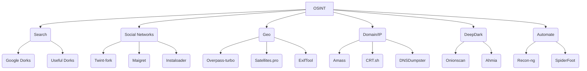

# 🕵️‍♂️ OSINT Bible 2026
> Compilation, procedures, tools and ethics for open source research

## ⚠️ Ethical Disclaimer

This repository is dedicated to the responsible and ethical practice of Open-Source Intelligence (OSINT). All information, tools, and methodologies provided herein are intended solely for educational, research, and lawful investigative purposes. Users are strongly encouraged to adhere to ethical guidelines, respect privacy rights, comply with applicable laws and regulations, and obtain necessary permissions before conducting any investigations. Misuse of this information for illegal activities, harassment, or violation of privacy is strictly prohibited and may result in legal consequences. By accessing this repository, you agree to use the content responsibly and ethically.

---

## 🧭 Quick Index with Buttons
[1. Fundamentals](#1-fundamentals) | [2. 4-Step Methodology](#2-4-step-methodology) | [3. Tools Mind Map](#3-tools-mind-map) | [4. Internet Search](#4-internet-search) | [5. Social Networks](#5-social-networks) | [6. Geoint & Images](#6-geoint--images) | [7. Domain / IP / DNS](#7-domain--ip--dns) | [8. Deep & Dark Web](#8-deep--dark-web) | [9. Automation (Python)](#9-automation-python) | [10. Report Templates](#10-report-templates) | [11. Legal Considerations](#11-legal-considerations) | [12. Extra Resources](#12-extra-resources) | [13. AI Intelligence](#13-ai-intelligence) | [14. Facial Recognition](#14-facial-recognition) | [15. Email/Phone Investigation](#15-email-phone-investigation) | [16. Data Breaches](#16-data-breaches) | [17. Blockchain/Crypto](#17-blockchain-crypto) | [18. Transport OSINT](#18-transport-osint) | [19. WiFi/Wardriving](#19-wifi-wardriving) | [20. Content Verification](#20-content-verification) | [21. Username Enumeration](#21-username-enumeration) | [22. Web Scraping](#22-web-scraping) | [23. Metadata Extraction](#23-metadata-extraction) | [24. Network Scanning](#24-network-scanning) | [25. Dark Web](#25-dark-web) | [26. All-in-One Frameworks](#26-all-in-one-frameworks) | [27. Advanced Maltego](#27-advanced-maltego) | [28. Professional Methodologies](#28-professional-methodologies) | [29. Advanced Google Dorks](#29-advanced-google-dorks) | [30. Learning Resources](#30-learning-resources) | [31. People Investigations](#31-people-investigations) | [32. Company Research](#32-company-research) | [33. Threat Intelligence Feeds](#33-threat-intelligence-feeds)

---

## 1. Fundamentals
| Concept | Quick Definition |
|---|---|
| **OSINT** | Intelligence obtained from public sources without violating logical or physical access |
| **OPSEC** | Minimize footprint: VPN → VM → alias → metadata strip |
| **Intelligence Cycle** | Direction → Collection → Processing → Analysis → Dissemination |
| **PII** | Information that identifies: email, phone, RFC, CURP, IP, IMEI, MAC |
| **Primary Source** | Original publication (tweet, official PDF, photo EXIF) |
| **Secondary Source** | Article citing the primary (validate) |

---

## 2. 4-Step Methodology
1. **Define question** → What do I want to know?  
2. **Identify sources** → Table below |
3. **Collect** → Manual + automations |
4. **Validate and document** → Screenshots, hash, date, URL, archive.org |

| Data Type | Usual Location | Star Tool |
|---|---|---|
| Name | LinkedIn, Facebook | [Maigret](https://github.com/soxoj/maigret) |
| Email | Data breaches, newsletters | [HIBP](https://haveibeenpwned.com) |
| Phone | WhatsApp Business, TrueCaller | [Infobel](https://www.infobel.com) |
| Username | Forums, gaming, GitHub | [Snoop](https://github.com/snooppr/snoop) |
| Photo | Geolocation, EXIF | [Exiftool](https://exiftool.org) |
| Domain | WHOIS, certificates | [Amass](https://github.com/owasp-amass/amass) |
| IP | Scanning, Shodan | [Shodan](https://shodan.io) |
| Crypto wallet | Blockchain explorers | [BlockCypher](https://live.blockcypher.com) |

---

## 3. Tools Mind Map


---

## 4. Internet Search
### 4.1 Google Dorks – 20 essentials
| Objective | Dork | Example |
|---|---|---|
| Government PDFs | `site:gov filetype:pdf "contract"` | Mexico |
| Exposure | `intitle:"index of" passwords.txt` | — |
| IP Cameras | `inurl:viewer/live/index.html` | — |
| Emails | `site:linkedin.com "@company.com"` | — |
| Subdomains | `site:*.target.com -www` | — |

### 4.2 Alternative Search Engines
- [DuckDuckGo "bangs"](https://duckduckgo.com/bang) → `!archive`
- [Yandex](https://yandex.com) → best results CIS
- [Baidu](https://baidu.com) → Asia
- [Startpage](https://startpage.com) → no logs
- [Shodan](https://shodan.io) → IoT, ICS, SCADA
- [Censys](https://censys.io) → cert + banner
- [FOFA](https://fofa.info) → China, free API
- [ZoomEye](https://zoomeye.org) → similar to Shodan
- [BinaryEdge](https://binaryedge.io) → global scanning
- [Hunter.io](https://hunter.io) → corporate emails
- [PublicWWW](https://publicwww.com) → search in source code
- [SearchCode](https://searchcode.com) → search in 75B lines of code
- [SimilarSites](https://www.similarsites.com) → similar sites
- [Netlas](https://netlas.io) → internet intelligence
- [CriminalIP](https://www.criminalip.io) → search in connected internet
- [NerdyData](https://www.nerdydata.com) → website technologies
- [GreyNoise](https://www.greynoise.io) → internet noise
- [Intezer Analyze](https://analyze.intezer.com) → malware analysis
- [Kaspersky OpenTIP](https://opentip.kaspersky.com) → threat scanning
- [VirusTotal](https://virustotal.com) → file/URL analysis
- [AlienVault OTX](https://otx.alienvault.com) → threat exchange
- [ExploitDB](https://www.exploit-db.com) → exploit database
- [MalwareBazaar](https://bazaar.abuse.ch) → malware samples
- [Malware Domain List](https://www.malwarepatrol.net) → malicious domains
- [PhishTank](https://www.phishtank.com) → phishing URLs
- [URLhaus](https://urlhaus.abuse.ch) → malware URLs
- [ThreatMiner](https://www.threatminer.org) → threat intelligence
- [YARAify](https://yaraify.abuse.ch) → YARA rules
- [PulseDive](https://pulsedive.com) → IOC search
- [ThreatFox](https://threatfox.abuse.ch) → malware IOCs
- [Breach Directory](https://breachdirectory.org) → breach searches
- [Have I Been Pwned](https://haveibeenpwned.com) → breach verification
- [DNSViz](https://dnsviz.net) → DNSSEC visualization
- [DNS Twister](https://dnstrails.report) → similar domains
- [DNSdumpster](https://dnsdumpster.com) → DNS enumeration
- [SpyOnWeb](https://spyonweb.com) → related sites
- [Yark](https://github.com/Owez/yark) → archive YouTube
- [CovertAction](https://covertactionmagazine.com) → investigative journalism
- [Trellix Research](https://www.trellix.com/en-us/about/newsroom/stories/research.html) → threat research
- [CP Research](https://research.checkpoint.com) → Checkpoint research
- [Wikistrat](https://www.wikistrat.com/blog) → collaborative analysis
- [PolySwarm](https://polyswarm.network) → threat scanning
- [HackerOne Hacktivity](https://hackerone.com/hacktivity) → public vulnerabilities
- [WikiLeaks](https://wikileaks.org) → leaked documents
- [Talos Reports](https://talosintelligence.com/vulnerability_reports) → vulnerability reports
- [MalAPI](https://malapi.io) → malware APIs
- [UserSearch](https://usersearch.org) → user search
- [SecureList](https://securelist.com) → Kaspersky blog
- [SPLC Hate Map](https://www.splcenter.org/hate-map) → hate map
- [ICSR](https://icsr.info) → radicalization studies
- [Militant Wire](https://www.militantwire.com) → militancy analysis
- [START Publications](https://www.start.umd.edu/publications) → terrorism publications
- [SPLC Resources](https://www.splcenter.org/resources) → SPLC resources
- [Tracking Terrorism](https://trackingterrorism.org) → terrorism tracking
- [Mapping Militants](https://cisac.fsi.stanford.edu/mappingmilitants) → mapping militants
- [Naval Institute](https://news.usni.org) → naval news
- [Institute of International Relations](https://www.iir.cz/en) → international relations
- [Janes](https://www.janes.com) → defense intelligence
- [TASS News](https://tass.com) → Russian news
- [Sputnik News](https://sputnikglobe.com) → Sputnik news
- [PIPS](https://www.pakpips.com) → Pakistan peace studies
- [PICSS](https://www.picss.net) → Pakistan conflict studies
- [Reuters](https://www.reuters.com) → news agency
- [RT](https://rt.com) → Russia Today
- [InternetActivism](https://internetactivism.org) → humanitarian tools
- [IISS](https://iiss.org) → international studies institute
- [CFR](https://cfr.org/newsletters) → council on foreign relations
- [SciHub](https://sci-hub.ru) → access to scientific papers
- [ResearchHub](https://www.researchhub.com) → research discussion
- [IDCrawl](https://www.idcrawl.com) → people search
- [Osint Industries](https://osint.industries) → email/phone search
- [ESPY](http://espysys.com) → phone search
- [SUNDERS](https://sunders.uber.space) → surveillance cameras
- [Privacy Watch](https://privacywatch.app) → OSINT tools
- [Deepinfo](https://deepinfo.com) → internet intelligence
- [Session](https://getsession.org) → private messaging
- [Consortium News](https://consortiumnews.com) → independent journalism
- [Tutanota](https://tutanota.com) → encrypted email
- [Committee to Protect Journalists](https://cpj.org) → journalist protection
- [SecurityWeek](https://www.securityweek.com) → security news
- [NCRI](https://networkcontagion.us) → network contagion research
- [Geopolitical Economy Report](https://geopoliticaleconomy.com) → geopolitical reports
- [The Grayzone](https://thegrayzone.com) → independent journalism
- [The Moscow Times](https://www.moscowtimes.ru) → Russian news
- [FlightAware](https://www.flightaware.com) → flight tracking
- [FlightRadar24](https://www.flightradar24.com) → flight radar
- [MarineTraffic](https://www.marinetraffic.com) → maritime traffic
- [VesselFinder](https://www.vesselfinder.com) → ship search
- [NewspaperArchive](https://newspaperarchive.com) → newspaper archives
- [The Indian Express](https://indianexpress.com) → Indian news
- [Daily Excelsior](http://www.dailyexcelsior.com) → Jammu Kashmir news
- [DNA India](https://www.dnaindia.com) → Indian news
- [Greater Kashmir](https://www.greaterkashmir.com) → Kashmir news
- [Nagaland Post](https://www.nagalandpost.com) → Nagaland news
- [RFE/RL](https://www.rferl.org) → Radio Free Europe
- [Akto](https://www.akto.io) → API security
- [Generated Photos](https://generated.photos) → AI photos
- [Factinsect](https://factinsect.com) → AI fact-checking
- [HDRobots](https://hdrobots.com) → AI tools directory
- [Channel 4 News](https://www.channel4.com/news) → British news
- [ThreatMon Reports](https://threatmon.io/reports) → threat reports
- [0t.rocks Search](https://search.0t.rocks) → people search
- [Israel Datasets](https://data.gov.il/dataset) → Israeli datasets
- [Simplex 3D](https://simplex3dx.co.il/?en) → 3D maps Israel
- [AI Dubbing](https://elevenlabs.io/dubbing) → AI dubbing
- [Budget Key](https://next.obudget.org/?lang=en) → Israel budget
- [Ship Spotting](https://www.shipspotting.com) → ship photos
- [Broadcastify](https://www.broadcastify.com) → police audio
- [OpenCelliD](https://www.opencellid.org) → cell tower database
- [AviationStack](https://aviationstack.com) → aviation API
- [DigitalSide TI](https://osint.digitalside.it) → threat intelligence
- [DocumentCloud](https://www.documentcloud.org/documents/) → document management
- [IDRW](https://idrw.org) → Indian defense
- [XFE](https://exchange.xforce.ibmcloud.com) → X-Force exchange
- [Scumware](https://www.scumware.org) → malware research
- [Ukraine Live Cams](https://nagix.github.io/ukraine-livecams) → Ukraine cameras
- [TWN](http://www.the-webcam-network.com) → webcam network
- [Opentopia](http://www.opentopia.com) → public webcams
- [Transparency](https://www.transparency.org) → anti-corruption
- [Maigret](https://github.com/soxoj/maigret) → user search
- [OCCRP](https://www.occrp.org/en) → organized crime
- [Qdorks](https://qdorks.com) → dork generator
- [Radio Garden](https://radio.garden) → world radios
- [LolArchiver OSINT](https://osint.lolarchiver.com) → OSINT search
- [BreachBase](https://breachbase.com) → breach base
- [WorldCam](https://worldcam.eu) → world webcams
- [Webcam Galore](https://www.webcamgalore.com) → webcams
- [WiFi Map](https://www.wifimap.io) → WiFi hotspots
- [OpenTrafficCamMap](https://otc.armchairresearch.org/map) → traffic cameras
- [KrooozCams](https://www.kroooz-cams.com) → cruise webcams
- [Skyline Webcams](https://www.skylinewebcams.com/en/webcm) → skyline webcams
- [Pictimo](https://www.pictimo.com) → world webcams
- [Instances.social](https://instances.social) → Mastodon recommender
- [CamHacker](https://www.camhacker.com) → public webcams
- [Labs TIB Geoestimation](https://labs.tib.eu/geoestimation) → geographic estimation
- [Picarta](https://picarta.ai) → photo location prediction
- [Tiny Scan](https://www.tiny-scan.com) → URL scanning
- [ZeroDay](https://www.zero-day.cz) → zero-day vulnerabilities
- [Predicta Search](https://predictasearch.com) → digital search
- [Ventusky](https://www.ventusky.com) → weather maps
- [OSV](https://osv.dev) → open source vulnerabilities
- [Certs](https://certs.io) → certificate information
- [Coalition ESS](https://ess.coalitioninc.com) → exploit scoring
- [Validin](https://app.validin.com) → attack surface mapping
- [CastrickClues](https://castrickclues.com) → OSINT search
- [CIRCL PDNS](https://www.circl.lu/services/passive-dns) → passive DNS
- [InTheWild](https://inthewild.io) → exploits in wild
- [TheWebCo](https://thewebco.ai) → people intelligence
- [360 Quake](https://quake.360.net) → cyberspace mapping
- [Cloudflare Radar](https://radar.cloudflare.com/traffic) → internet trends
- [Crisis24](https://crisis24.garda.com) → security risk management
- [arXiv](https://arxiv.org) → scientific papers

### 4.3 Archives and snapshots
- [Wayback Machine](https://archive.org/web)
- [CachedView](https://cachedview.com) (Google + Archive.is)
- [URLScan](https://urlscan.io) → capture + DOM + requests
- [Screenshot Guru](https://screenshot.guru) → screen test
- [Stored Website](https://stored.website) → cached pages
- [ThreatMiner](https://www.threatminer.org) → IOC context
- [YARAify](https://yaraify.abuse.ch) → YARA rules
- [PulseDive](https://pulsedive.com) → IOC search
- [ThreatFox](https://threatfox.abuse.ch) → malware IOCs
- [Breach Directory](https://breachdirectory.org) → breaches
- [Have I Been Pwned](https://haveibeenpwned.com) → breach verification
- [DNSViz](https://dnsviz.net) → DNSSEC
- [DNS Twister](https://dnstrails.report) → similar domains
- [DNSdumpster](https://dnsdumpster.com) → DNS enumeration
- [SpyOnWeb](https://spyonweb.com) → related sites
- [Yark](https://github.com/Owez/yark) → archive YouTube

---

## 5. Social Networks
### 5.1 Twitter/X
| Task | Tool | Notes |
|---|---|---|
| Download all tweets | [Twint-docker](https://github.com/twintproject/twint) | `docker run -it --rm twint -u user --since 2024-01-01` |
| Network analysis | [Network Tool](https://networktool.org) | RT graph |
| Deleted tweets | [Deleted Tweet Finder](https://deletedtweetfinder.com) | Aggregated API |
| Sentiment | [Sentiment140](http://sentiment140.com) | CSV bulk |

### 5.2 Instagram
| Task | Tool | Risk |
|---|---|---|
| Photos + metadata | [Instaloader](https://github.com/instaloader/instaloader) | Low |
| Anonymous stories | [StoriesIG](https://storiesig.app) | Low |
| Profile analysis | [SOLG](https://github.com/solg-oss) | Medium |
| World map | [Picuki](https://picuki.com) | Low |

### 5.3 LinkedIn
| Task | Tool | Legal Note |
|---|---|---|
| Employees | [CrossLinked](https://github.com/m8r0wn/crosslinked) | Scrape = ToS |
| Email pattern | [Hunter](https://hunter.io) | 25 free/month |
| Photo URL | [LinkedIn-sniper](https://github.com/DisK0nn3cT/LinkedIn-sniper) | Public only |

### 5.4 Facebook
1. **Facebook Recover Lookup** - Link: [Facebook Recover Lookup](https://www.facebook.com/login/identify?ctx=recover) - Description: Used to check if a given email or phone number is associated with any Facebook account or not.
2. **CrowdTangle Link Checker** - Link: [CrowdTangle Link Checker](https://apps.crowdtangle.com/chrome-extension) - Description: Shows the specific Facebook posts, Instagram posts, tweets, and subreddits that mention this link.
3. **Social Searcher** - Link: [Social Searcher](https://www.social-searcher.com/) - Description: Allows you to monitor all public social mentions in social networks and the web.
4. **Lookup-id.com** - Link: [Lookup-id.com](https://lookup-id.com/) - Description: Helps you find the Facebook ID of anyone's profile or a Group.
5. **Who posted this** - Link: [Who posted this](https://whopostedwhat.com/) - Description: Facebook keyword search for people who work in the public interest. It allows you to search keywords on specific dates.
6. **Facebook Search** - Link: [Facebook Search](https://www.sowsearch.info/) - Description: Allows you to search on Facebook for posts, people, photos, etc., using some filters.
7. **Facebook Graph Searcher** - Link: [Facebook Graph Searcher](https://intelx.io/tools?tab=facebook) - Description: To search someone on Facebook.
8. **Facebook People Search** - Link: [Facebook People Search](https://www.facebook.com/directory/people/) - Description: Search on Facebook by victim's name.
9. **DumpItBlue** - Link: [DumpItBlue+](https://chrome.google.com/webstore/detail/dumpitblue%2B/igmgknoioooacbcpcfgjigbaajpelbfe/) - Description: helps to dump Facebook stuff for analysis or reporting purposes.
10. **Export Comments** - Link: [Export Comments](https://exportcomments.com/) - Description: Easily exports all comments from your social media posts to Excel file.
11. **Facebook Applications** - Link: [Facebook Applications](https://khalil-shreateh.com/khalil.shtml/social_applications/facebook-applications/) - Description: A collection of online tools that automate and facilitate Facebook.
12. **Social Analyzer** - Link: [SocialAnalyzer - Social Sentiment & Analysis](https://chromewebstore.google.com/detail/socialanalyzer-social-sen/efeikkcpimdfpdlmlbjdecnmkknjcfcp) - Description: a free tool of social media monitoring and analysis.
13. **AnalyzeID** - Link: [AnalyzeID](https://analyzeid.com/) - Description: Just looking for sites that supposedly may have the same owner. Including a FaceBook App ID match.
14. **SOWsearch** - Link: [sowsearch](https://www.sowsearch.info/) - Description: a simple interface to show how the current Facebook search function works.
15. **Facebook Matrix** - Link: [FacebookMatrix](https://plessas.net/facebookmatrix) - Description: Formulas for Searching Facebook.
16. **Who posted what** - Link: [Who Posted What](https://whopostedwhat.com/) - Description: A non public Facebook keyword search for people who work in the public interest. It allows you to search keywords on specific dates.
17. **StalkFace** - Link: [StalkFace](https://stalkface.com/en/) - Description: Toolkit to stalk someone on Facebook.
18. **Search is Back** - Link: [Search is Back](https://searchisback.com/) - Description: ind people and events on Facebook Search by location, relationships, and more!.
19. **FB-Search** - Link: [FB-Search](https://fb-search.com) - Description: busca por teléfono o correo.
20. **FB-Posts-scraper** - Link: [FB-Posts-scraper](https://github.com/rugantio/fbcrawl) - Description: (Python).
21. **FB-Video-downloader** - Link: [FB-Video-downloader](https://fdown.net) - Description: .

### 5.5 Instagram
1. **SnapInsta** - Link: [SnapInsta](https://snapinsta.app) - Description: Download Photos, Videos, IGTV & more from a public Instagram account.
2. **IFTTT Integrations** - Link: [IFTTT Instagram integrations](https://ifttt.com/instagram) - Description: Popular Instagram workflows & automations.
3. **Pickuki** - Link: [Pickuki](https://www.picuki.com/) - Description: Browse publicly available Instagram content without logging in.
4. **IMGinn.io** - Link: [IMGinn.io](https://imginn.io/) - Description: view and download all the content on the social network Instagram all at one place.
5. **Instaloader** - Link: [Instaloader](https://github.com/instaloader/instaloader) - Description: Download pictures (or videos) along with their captions and other metadata from Instagram.
6. **SolG** - Link: [SolG](https://github.com/yezz123/SoIG) - Description: The Instagram OSINT Tool gets a range of information from an Instagram account that you normally wouldn't be able to get from just looking at their profile.
7. **Osintgram** - Link: [Osintgram](https://github.com/Datalux/Osintgram) - Description: Osintgram is an OSINT tool on Instagram to collect, analyze, and run reconnaissance.
8. **Toutatis** - Link: [toutatis](https://pypi.org/project/toutatis/) - Description: It is a tool written to retrieve private information such as Phone Number, Mail Address, ID on Instagram accounts via API.
9. **instalooter** - Link: [instalooter](https://pypi.org/project/instalooter/) - Description: InstaLooter is a program that can download any picture or video associated from an Instagram profile, without any API access.
10. **Exportgram** - Link: [Exportgram](https://exportgram.net/) - Description: A web application made for people who want to export instagram comments into excel, csv and json formats.
11. **Profile Analyzer** - Link: [Profile Analyzer](https://inflact.com/tools/profile-analyzer/) - Description: Analyze any public profile on Instagram – the tool is free, unlimited, and secure. Enter a username to take advantage of precise statistics.
12. **Find Instagram User Id** - Link: [Find Instagram User Id](https://www.codeofaninja.com/tools/find-instagram-user-id/) - Description: This tool called "Find Instagram User ID" provides an easy way for developers and designers to get Instagram account numeric ID by username.
13. **Instahunt** - Link: [Instahunt](https://instahunt.huntintel.io/) - Description: Easily find social media posts surrounding a location.
14. **InstaFreeView** - Link: [InstaFreeView](https://instafreeview.com/) - Description: InstaFreeView Private Instagram Profile Viewer is a free app to view Instagram profile posts without login.
15. **InstaNavigation** - Link: [instanavigation](https://instanavigation.com/) - Description: Anonymous story viewing on Instagram.
16. **TikTok-scraper-dl** - Link: [TikTok-scraper-dl](https://github.com/drawrow1/tiktok-scraper) - Description: .
17. **Musicaldown** - Link: [Musicaldown](https://musicaldown.com) - Description: web.

### 5.6 LinkedIn
1. **RecruitEm** - Link: [RecruitEm](https://recruitin.net/) - Description: Allows you to search social media profiles. It helps recruiters to create a Google boolean string that searches all public profiles.
2. **RocketReach** - Link: [RocketReach](https://rocketreach.co/person) - Description: Allows you to programmatically search and lookup contact info over 700 million professionals and 35 million companies.
3. **Phantom Buster** - Link: [Phantom Buster](https://phantombuster.com/phantombuster) - Description: Automation tool suite that includes data extraction capabilities.
4. **linkedprospect** - Link: [LinkedIn Boolean Search](https://linkedprospect.com/linkedin-boolean-search-tool/#tool) - Description: Build a targeted list of LinkedIn people using boolean search.
5. **ReverseContact** - Link: [Reverse Email Lookup](https://www.reversecontact.com/) - Description: Find Linked Profiles associated with any email.
6. **LinkedIn Search Engine** - Link: [Programmable Search Engine](https://cse.google.com/cse?cx=daaf18e804f81bed0) - Description: Programmable Search Engine for LinkedIn profiles.
7. **Free People Search Tool** - Link: [Free People Search Tool](https://freepeoplesearchtool.com/#gsc.tab=0) - Description: Find people easily online.
8. **IntelligenceX Linkedin** - Link: [IntelligenceX Linkedin](https://intelx.io/tools?tab=linkedin) - Description: A webbased tool for searching someone on Linkedin.
9. **Linkedin Search Tool** - Link: [Linkedin Search Tool](https://inteltechniques.com/tools/Linkedin.html) - Description: Provides you a interface with various tools for Linkedin Osint.
10. **LinkedInt** - Link: [LinkedInt](https://github.com/vysecurity/LinkedInt) - Description: Providing you with Linkedin Intelligence.
11. **InSpy** - Link: [InSpy](https://github.com/jobroche/InSpy) - Description: InSpy is a python based LinkedIn enumeration tool.
12. **CrossLinked** - Link: [CrossLinked](https://github.com/m8sec/CrossLinked) - Description: CrossLinked is a LinkedIn enumeration tool that uses search engine scraping to collect valid employee names from an organization.

### 5.7 Twitter/X
1. **TweetDeck** - Link: [TweetDeck](https://tweetdeck.twitter.com/) - Description: Offers a more convenient Twitter experience by allowing you to view multiple timelines in one easy interface.
2. **FollowerWonk** - Link: [FollowerWonk](https://followerwonk.com/bio) - Description: Helps you find Twitter accounts using bio and provides many other useful features.
3. **Twitter Advanced Search** - Link: [Twitter Advanced Search](https://twitter.com/search-advanced) - Description: Allows you to search on Twitter using filters for better search results.
4. **Wayback Tweets** - Link: [Wayback Tweets](https://waybacktweets.streamlit.app/) - Description: Display multiple archived tweets on Wayback Machine and avoid opening each link manually.
5. **memory.lol** - Link: [memory.lol](https://memory.lol/app/) - Description: a tiny web service that provides historical information about twitter users.
6. **SocialData API** - Link: [SocialData API](https://socialdata.tools/) - Description: an unofficial Twitter API alternative that allows scraping historical tweets, user profiles, lists and Twitter spaces without using Twitter's API.
7. **Social Bearing** - Link: [Social Bearing](https://socialbearing.com/) - Description: Insights & analytics for tweets & timelines.
8. **Tinfoleak** - Link: [Tinfoleak](https://tinfoleak.com/) - Description: Search for Twitter users leaks.
9. **Network Tool** - Link: [Network Tool](https://osome.iu.edu/tools/networks/) - Description: Explore how information spreads across Twitter with an interactive network using OSoMe data.
10. **Foller** - Link: [Foller](https://foller.me/) - Description: Looking for someone in the United States? Our free people search engine finds social media profiles, public records, and more!
11. **SimpleScraper OSINT** - Link: [SimpleScraper OSINT](https://airtable.com/appyDhNeSetZU0rIw/shrceHfvukijgln9q/tblxgilU0SzfXNEwS/viwde4ACDDOpeJ8aO?blocks=bipxY3tKD5Lx0wmEU) - Description: This Airtable automatically scrapes OSINT-related twitter accounts ever 3 minutes and saves tweets that contain coordinates.
12. **Deleted Tweet Finder** - Link: [Deleted Tweet Finder](https://cache.digitaldigging.org/) - Description: Search for deleted tweets across multiple archival services.
13. **Twitter Search Tool** - Link: [Twitter search tool](https://www.aware-online.com/en/osint-tools/twitter-search-tool/) - Description: On this page you can create advanced search queries within Twitter.
14. **Twitter Video Downloader** - Link: [Twitter Video Downloader](https://twittervideodownloader.com/) - Description: Download Twitter videos & GIFs from tweets.
15. **Download Twitter Data** - Link: [Download Twitter Data](https://www.twtdata.com/) - Description: Download Twitter data in csv format by entering any Twitter handle, keyword, hashtag, List ID or Space ID.
16. **Twitonomy** - Link: [Twitonomy](https://www.twitonomy.com/) - Description: Twitter #analytics and much more.
17. **tweeterid** - Link: [tweeterid](https://tweeterid.com/) - Description: Type in any Twitter ID or @handle below, and it will be converted into the respective ID or username.
18. **BirdHunt** - Link: [BirdHunt](https://birdhunt.huntintel.io/) - Description: Easily find social media posts surrounding a location.

### 5.8 Pinterest
1. **DownAlbum** - Link: [DownAlbum](https://chrome.google.com/webstore/detail/downalbum/cgjnhhjpfcdhbhlcmmjppicjmgfkppok) - Description: Google Chrome extension for downloading albums of photos from various websites, including Pinterest.
2. **Experts PHP: Pinterest Photo Downloader** - Link: [Pinterest Photo Downloader](https://www.expertsphp.com/pinterest-photo-downloader.html) - Description: Website providing a tool to download photos from Pinterest.
3. **Pingroupie** - Link: [Pingroupie](http://pingroupie.com) - Description: A Meta Search Engine for Pinterest that lets you discover Collaborative Boards, Influencers, Pins, and new Keywords.
4. **Tailwind** - Link: [Tailwind](https://www.tailwindapp.com) - Description: Social media scheduling and management tool that supports Pinterest.
5. **Pinterest Guest** - Link: [Pinterest Guest](https://addons.mozilla.org/en-US/firefox/addon/pinterest-guest) - Description: Mozilla Firefox add-on for browsing Pinterest without logging in or creating an account.
6. **SourcingLab: Pinterest** - Link: [SourcingLab: Pinterest](https://sourcinglab.io/search/pinterest) - Description: Pinterest search feature for finding pins, boards, and users.

### 5.9 Reddit
1. **F5BOT** - Link: [F5BOT](https://f5bot.com) - Description: Receive notifications for new Reddit posts matching specific keywords.
2. **Karma Decay** - Link: [Karma Decay](http://karmadecay.com) - Description: Reverse image search for finding similar or reposted images on Reddit.
3. **Mostly Harmless** - Link: [Mostly Harmless](http://kerrick.github.io/Mostly-Harmless/#features) - Description: A suite of tools for Reddit, including user analysis, subreddit comparison, and more.
4. **OSINT Combine: Reddit Post Analyzer** - Link: [OSINT Combine: Reddit Post Analyzer](https://www.osintcombine.com/reddit-post-analyser) - Description: Analyze and gather information from Reddit posts for OSINT purposes.
5. **Phantom Buster** - Link: [Phantom Buster](https://phantombuster.com/phantombuster?category=reddit) - Description: Automation tool suite that includes Reddit data extraction capabilities.
6. **rdddeck** - Link: [rdddeck](https://rdddeck.com) - Description: Real-time dashboard for monitoring multiple Reddit communities.
7. **Readr for Reddit** - Link: [Readr for Reddit](https://chrome.google.com/webstore/detail/readr-forreddit/molhdaofohigaepljchpmfablknhabmo) - Description: Google Chrome extension for an improved reading experience on Reddit.
8. **Reddit Archive** - Link: [Reddit Archive](http://www.redditarchive.com) - Description: Archive of Reddit posts and comments for historical reference.
9. **Reddit Comment Search** - Link: [Reddit Comment Search](https://redditcommentsearch.com) - Description: Search for specific comments and conversations on Reddit.
10. **Redditery** - Link: [Redditery](http://www.redditery.com) - Description: Explore Reddit posts and comments based on various criteria.
11. **Reddit Hacks** - Link: [Reddit Hacks](https://github.com/EdOverflow/hacks) - Description: Collection of Reddit hacks and tricks for advanced users.
12. **Reddit List** - Link: [Reddit List](http://redditlist.com) - Description: Directory of popular subreddits organized by various categories.
13. **reddtip** - Link: [reddtip](https://www.redditp.com) - Description: Show appreciation to Reddit users by sending them tips in cryptocurrencies.
14. **Reddit Search** - Link: [Reddit Search (realsrikar)](https://realsrikar.github.io/reddit-search) - Description: Various tools and websites for searching and discovering content on Reddit.
15. **Reddit Shell** - Link: [Reddit Shell](https://redditshell.com) - Description: Command-line interface for browsing and interacting with Reddit.
16. **Reddit Stream** - Link: [Reddit Stream](http://reddit-stream.com) - Description: Live-streaming of Reddit comments for real-time discussions.
17. **Reddit Suite** - Link: [Reddit Enhancement Suite (Chrome Extension)](https://chrome.google.com/webstore/detail/redditenhancementsuite/kbmfpngjjgdllneeigpgjifpgocmfgmb) - Description: Browser extension that enhances the Reddit browsing experience with additional features.
18. **Reddit User Analyser** - Link: [Reddit User Analyser](https://atomiks.github.io/reddit-user-analyser) - Description: Analyze and visualize the activity and behavior of Reddit users.
19. **redditvids** - Link: [redditvids](https://redditvids.com) - Description: Watch Reddit videos and browse popular video subreddits.
20. **Redective** - Link: [Redective](http://redective.com) - Description: Investigate and analyze Reddit users based on their post history.
21. **Reditr** - Link: [Reditr](http://reditr.com) - Description: Desktop Reddit client with a clean and intuitive interface.
22. **Reeddit** - Link: [Reeddit](https://reedditapp.com) - Description: Simplified and clean Reddit web interface for a distraction-free browsing experience.
23. **ReSavr** - Link: [ReSavr](https://www.resavr.com) - Description: Retrieve and save deleted Reddit comments for later viewing.
24. **smat** - Link: [smat](https://www.smat-app.com/timeline) - Description: Social media analytics tool that includes Reddit for tracking trends and engagement.
25. **socid_extractor** - Link: [socid_extractor](https://github.com/soxoj/socid_extractor) - Description: Extract user information from Reddit and other social media platforms.
26. **Suggest me a subreddit** - Link: [Suggest me a subreddit](https://nikas.praninskas.com/suggest-subreddit) - Description: Get recommendations for new subreddits to explore based on your preferences.
27. **Subreddits** - Link: [Subreddits](http://subreddits.org) - Description: Directory of active subreddits organized by various categories.
28. **uforio** - Link: [uforio](http://uforio.com) - Description: Generate word clouds from Reddit comment threads.
29. **Universal Reddit Scraper (URS)** - Link: [Universal Reddit Scraper (URS)](https://github.com/JosephLai241/URS) - Description: Python-based tool for scraping Reddit data for analysis.
30. **Vizit** - Link: [Vizit](https://redditstuff.github.io/sna/vizit) - Description: Visualize and analyze relationships between Reddit users and subreddits.
31. **Wisdom of Reddit** - Link: [Wisdom of Reddit](https://wisdomofreddit.com) - Description: Curated collection of insightful quotes and comments from Reddit.

### 5.10 Github
1. **Awesome Lists** - Link: [Awesome Lists](http://awesomelists.top) - Description: A curated list of awesome lists for various programming languages, frameworks, and tools.
2. **CoderStats** - Link: [CoderStats](https://coderstats.net) - Description: A platform for developers to track and showcase their coding activity and statistics from GitHub.
3. **Commit-stream** - Link: [Commit-stream](https://github.com/x1sec/commit-stream) - Description: A tool for monitoring and collecting GitHub commits in real-time.
4. **Digital Privacy** - Link: [Digital Privacy](https://github.com/ffffffff0x/Digital-Privacy) - Description: A collection of resources and tools for enhancing digital privacy and security.
5. **Find Github User ID** - Link: [Find Github User ID](http://caius.github.io/github_id) - Description: A web tool for finding the unique identifier (ID) of a GitHub user.
6. **GH Archive** - Link: [GH Archive](http://www.gharchive.org) - Description: A project that provides a public dataset of GitHub activity, including events and metadata.
7. **Git-Awards** - Link: [Git-Awards](http://git-awards.com) - Description: A website that ranks GitHub users and repositories based on their contributions and popularity.
8. **GitGot** - Link: [GitGot](https://github.com/BishopFox/GitGot) - Description: A semi-automated, feedback-driven tool for auditing Git repositories.
9. **gitGraber** - Link: [gitGraber](https://github.com/hisxo/gitGraber) - Description: A tool for searching and cloning sensitive information in GitHub repositories.
10. **git-hound** - Link: [git-hound](https://github.com/tillson/git-hound) - Description: A tool for finding sensitive information exposed in GitHub repositories.
11. **Github Dorks** - Link: [Github Dorks](https://github.com/techgaun/github-dorks) - Description: A collection of GitHub dorks, which are search queries to find sensitive information in repositories.
12. **Github Stars** - Link: [Github Stars](http://githubstars.com) - Description: A website that showcases GitHub repositories with the most stars and popularity.
13. **Github Trending RSS** - Link: [Github Trending RSS](https://mshibanami.github.io/GitHubTrendingRSS) - Description: An RSS feed generator for trending repositories on GitHub.
14. **Github Username Search Engine** - Link: [Github Username Search Engine](https://jonnygovish.github.io/Github-username-search-engine) - Description: A search engine to find GitHub usernames based on various filters and criteria.
15. **Github Username Search Engine** - Link: [Github Username Search Engine](https://githubnotes-47071.firebaseapp.com/#/?_k=n0bgxn) - Description: Another search engine to find GitHub usernames with advanced filtering options.
16. **GitHut** - Link: [GitHut](https://githut.info) - Description: A website that provides statistics and visualizations of programming languages on GitHub.

### 5.11 Snapchat
1. **addmeContacts** - Link: [addmeContacts](http://add-me-contacts.com) - Description: A platform to find and connect with new contacts on various social media platforms.
2. **AddMeSnaps** - Link: [AddMeSnaps](https://www.addmesnaps.com) - Description: A website for discovering and adding new Snapchat friends.
3. **ChatToday** - Link: [ChatToday](https://chattoday.com) - Description: An online chat platform for connecting and chatting with people from around the world.
4. **Gebruikersnamen: Snapchat** - Link: [Gebruikersnamen: Snapchat](https://gebruikersnamen.nl/snapchat) - Description: A website for finding Snapchat usernames.
5. **GhostCodes** - Link: [GhostCodes](https://www.ghostcodes.com) - Description: An app for discovering new Snapchat users and their stories.
6. **OSINT Combine: Snapchat MultiViewer** - Link: [OSINT Combine: Snapchat MultiViewer](https://www.osintcombine.com/snapchat-multi-viewer) - Description: A tool for viewing multiple Snapchat accounts simultaneously.
7. **Snap Map** - Link: [Snap Map](https://map.snapchat.com) - Description: Snapchat's feature that allows users to share their location and view Snaps from around the world.
8. **Snapchat-mapscraper** - Link: [Snapchat-mapscraper](https://github.com/nemec/snapchat-map-scraper) - Description: A tool for scraping public Snapchat Stories from the Snap Map.
9. **Snap Political Ads Library** - Link: [Snap Political Ads Library](https://www.snap.com/en-GB/political-ads) - Description: Snapchat's library of political ads displayed on the platform.
10. **Social Finder** - Link: [Social Finder](https://socialfinder.app) - Description: A platform to search and discover social media profiles on various platforms.
11. **SnapIntel** - Link: [SnapIntel](https://github.com/Kr0wZ/SnapIntel) - Description: a python tool providing you information about Snapchat users.
12. **AddMeS** - Link: [AddMeS](https://addmes.io/) - Description: The 'Add Me' directory of Snapchat users on web.

### 5.12 WhatsApp
1. **checkwa** - Link: [checkwa](https://checkwa.online) - Description: An online tool to check the status and availability of WhatsApp numbers.
2. **WhatsApp Fake Chat** - Link: [WhatsApp Fake Chat](http://www.fakewhats.com/generator) - Description: An online tool to generate fake WhatsApp conversations for fun or pranks.
3. **Whatsapp Monitor** - Link: [Whatsapp Monitor](https://github.com/ErikTschierschke/WhatsappMonitor) - Description: A tool for monitoring and analyzing WhatsApp messages and activities.
4. **whatsfoto** - Link: [whatsfoto](https://github.com/zoutepopcorn/whatsfoto) - Description: A Python script to download profile pictures from WhatsApp contacts.

### 5.13 Skype
1. **addmeContacts** - Link: [addmeContacts](http://add-me-contacts.com) - Description: A platform to find and connect with new contacts on various social media platforms.
2. **ChatToday** - Link: [ChatToday](https://chattoday.com) - Description: An online chat platform for connecting and chatting with people from around the world.
3. **Skypli** - Link: [Skypli](https://www.skypli.com) - Description: A website for discovering and connecting with new Skype contacts.

### 5.14 Telegram
1. **ChatBottle: Telegram** - Link: [ChatBottle: Telegram](https://chatbottle.co/bots/telegram) - Description: A directory of Telegram bots for various purposes.
2. **ChatToday** - Link: [ChatToday](https://chattoday.com) - Description: An online chat platform for connecting and chatting with people from around the world.
3. **informer** - Link: [informer](https://github.com/paulpierre/informer) - Description: A Python library for retrieving information about Telegram channels, groups, and users.
4. **_IntelligenceX: Telegram** - Link: [_IntelligenceX: Telegram](https://intelx.io/tools?tab=telegram) - Description: IntelligenceX's Telegram tool for searching and analyzing Telegram data.
5. **Lyzem.com** - Link: [Lyzem.com](https://lyzem.com) - Description: A website to search and find Telegram groups and channels.
6. **Telegram Channels** - Link: [Telegram Channels](https://telegramchannels.me) - Description: A directory of Telegram channels covering various topics.
7. **Telegram Channels** - Link: [Telegram Channels](https://tlgrm.eu/channels) - Description: A platform to discover and browse Telegram channels.
8. **Telegram Channels Search** - Link: [Telegram Channels Search](https://xtea.io/ts_en.html) - Description: A search engine to find Telegram channels by keywords.
9. **Telegram Directory** - Link: [Telegram Directory](https://tdirectory.me) - Description: A comprehensive directory of Telegram channels, groups, and bots.
10. **Telegram Group** - Link: [Telegram Group](https://www.telegram-group.com) - Description: A website to search and join Telegram groups.
11. **telegram-history-dump** - Link: [telegram-history-dump](https://github.com/tvdstaaij/telegram-history-dump) - Description: A Python script to dump the history of a Telegram chat into a SQLite database.
12. **Telegram-osint-lib** - Link: [Telegram-osint-lib](https://github.com/Postuf/telegram-osint-lib) - Description: A Python library for performing open-source intelligence (OSINT) on Telegram.
13. **Telegram Scraper** - Link: [Telegram Scraper](https://github.com/th3unkn0n/TeleGram-Scraper) - Description: A powerful Telegram scraping tool for extracting user information and media.
14. **Tgram.io** - Link: [Tgram.io](https://tgram.io) - Description: A platform to explore and search for Telegram channels, groups, and bots.
15. **Tgstat.com** - Link: [Tgstat.com](https://tgstat.com) - Description: A comprehensive platform for analyzing and tracking Telegram channels and groups.
16. **Tgstat RU** - Link: [Tgstat RU](https://tgstat.ru) - Description: A Russian platform for analyzing and monitoring Telegram channels and groups.

### 5.15 Discord
1. **DiscordOSINT** - Link: [DiscordOSINT](https://github.com/husseinmuhaisen/DiscordOSINT?tab=readme-ov-file#-discord-search-syntax-) - Description: This Repository Will contain useful resources to conduct research on Discord.
2. **Discord.name** - Link: [Discord.name](https://discord.name/) - Description: Discord profile lookup using user ID.
3. **Lookupguru** - Link: [Lookupguru](https://lookup.guru/) - Description: Discord profile lookup using user ID.
4. **Discord History Tracker** - Link: [Discord History Tracker](https://dht.chylex.com/) - Description: Discord History Tracker lets you save chat history in your servers, groups, and private conversations, and view it offline.
5. **Top.gg** - Link: [Top.gg](https://top.gg/) - Description: Explore millions of Discord Bots.
6. **Unofficial Discord Lookup** - Link: [Unofficial Discord Lookup](https://discord.id/) - Description: Search for discord profile using id.
7. **Disboard** - Link: [Disboard](https://disboard.org/) - Description: DISBOARD is the place where you can list/find Discord servers.

### 5.16 ONLYFANS
1. **OnlyFans Finder** - Link: [The Favourite OnlyFans search](https://onlyfansfinder.co/) - Description: The tools allow easy searching via advanced filtering capabilities and sorting functionality, making it easy to access desired material.
2. **OnlyFam** - Link: [OnlyFam](https://onlyfam.com) - Description: OnlyFans Search & Model Finder - Find Creators in the World's Largest OnlyFans Database
3. **OnlyFinder** - Link: [OnlyFinder](https://onlyfinder.com/) - Description: OnlyFans Search Engine - OnlyFans Account Finder.
4. **OnlySearch** - Link: [OnlySearch](https://onlysearch.co/) - Description: Find OnlyFans profiles by searching for key words.
5. **Sotugas** - Link: [SóTugas](https://sotugas.com/) - Description: Encontra Contas do OnlyFans Portugal 🇵🇹.
6. **Fansmetrics** - Link: [Fansmetrics](https://fansmetrics.com/) - Description: Use this OnlyFans Finder to search in 3,000,000 OnlyFans Accounts.
7. **Findr.fans** - Link: [Findr.fans](https://findr.fans/) - Description: Only Fans Search Tool.
8. **Hubite** - Link: [Hubite](https://hubite.com/en/onlyfans-search/) - Description: Advanced OnlyFans Search Engine.
9. **Similarfans** - Link: [Similarfans](https://similarfans.com/) - Description: Blog for OnlyFans content creators.
10. **Fansearch** - Link: [Fansearch](https://www.fansearch.com/) - Description: Fansearch is the best OnlyFans Finder to search in 3,000,000 OnlyFans Accounts.
11. **Fulldp** - Link: [Fulldp](https://fulldp.co/onlyfans-full-size-profile-picture/) - Description: Download Onlyfans Full-Size Profile Pictures.

### 5.17 TikTok
1. **Mavekite** - Link: [Mavekite](https://mavekite.com/) - Description: Search the profile using username.
2. **TikTok hashtag analysis toolset** - Link: [TikTok hashtag analysis toolset](https://github.com/bellingcat/tiktok-hashtag-analysis) - Description: The tool helps to download posts and videos from TikTok for a given set of hashtags over a period of time.
3. **TikTok Video Downloader** - Link: [TikTok Video Downloader](https://ssstik.io/en-1) - Description: ssstiktok is a free TikTok video downloader without watermark tool that helps you download TikTok videos without watermark (Musically) online.
4. **Exolyt** - Link: [exolyt](https://exolyt.com/) - Description: The best tool for TikTok analytics & insights.

---

## 6. Geoint & Images
### 6.1 Metadata
```bash
exiftool -a -u foto.jpg | grep -i "gps\|date\|camera"
# strip before publishing
exiftool -all= foto_sanitizada.jpg
```

### 6.2 Geolocate
- [Google Earth Pro](https://earth.google.com) → temporal displacement
- [Suncalc](https://suncalc.org) → shadow = time
- [Geolocation-verification](https://github.com/spmedia/geolocation-verification)
- [Overpass-turbo](https://overpass-turbo.eu) → POI within radius
- [FlightAware](https://www.flightaware.com) → flight tracking
- [FlightRadar24](https://www.flightradar24.com) → flight radar
- [MarineTraffic](https://www.marinetraffic.com) → maritime traffic
- [VesselFinder](https://www.vesselfinder.com) → ships
- [WiGLE](https://wigle.net) → geolocated WiFi database
- [OpenCelliD](https://www.opencellid.org) → cell towers
- [Broadcastify](https://www.broadcastify.com) → police audio
- [AviationStack](https://aviationstack.com) → aviation API
- [Labs TIB Geoestimation](https://labs.tib.eu/geoestimation) → geographic estimation
- [Picarta](https://picarta.ai) → photo location prediction
- [Ventusky](https://www.ventusky.com) → weather maps
- [Simplex 3D](https://simplex3dx.co.il/?en) → 3D maps Israel
- [Ukraine Live Cams](https://nagix.github.io/ukraine-livecams) → Ukraine cameras
- [TWN](http://www.the-webcam-network.com) → webcam network
- [Opentopia](http://www.opentopia.com) → public webcams
- [WorldCam](https://worldcam.eu) → world webcams
- [Webcam Galore](https://www.webcamgalore.com) → webcams
- [OpenTrafficCamMap](https://otc.armchairresearch.org/map) → traffic cameras
- [KrooozCams](https://www.kroooz-cams.com) → cruise webcams
- [Skyline Webcams](https://www.skylinewebcams.com/en/webcm) → skyline webcams
- [Pictimo](https://www.pictimo.com) → world webcams
- [CamHacker](https://www.camhacker.com) → public webcams

### 6.3 Satellite / Drone
- [Sentinel-Hub](https://apps.sentinel-hub.com) → 10m resolution, free
- [NASA-FIRMS](https://firms.modaps.eosdis.nasa.gov) → real-time fires
- [Zoom Earth](https://zoom.earth) → METAR overlay
- [FlightRadar24](https://www.flightradar24.com) → flight radar
- [ADS-B Exchange](https://globe.adsbexchange.com) → no military filters
- [FlightAware](https://flightaware.com) → flight history
- [PiAware (Raspberry Pi)](https://flightaware.com/adsb/piaware) → own ADS-B receiver
- [MarineTraffic](https://www.marinetraffic.com) → global AIS tracking
- [VesselFinder](https://www.vesselfinder.com) → free alternative
- [FleetMon](https://www.fleetmon.com) → fleet monitoring
- [ShipSpotting](http://www.shipspotting.com) → ship photo database

---

## 7. Domain / IP / DNS
| Objective | Tool | Quick Command |
|---|---|---|
| Subdomains | Amass | `amass enum -d target.com -o subs.txt` |
| Certificates | CRT.sh | `curl https://crt.sh/?q=%25.target.com&output=json` |
| Historical DNS | [SecurityTrails](https://securitytrails.com) | Free API 50/month |
| Neighbor IPs | [BGP.he](https://bgp.he.net) | CIDR |
| Reputation | [VirusTotal](https://virustotal.com) | `vt ip_info <ip>` |
| Quick scan | [Nmap-online](https://nmap.online) | no VPN |
| Subdomains | Subdomain Center | `https://www.subdomain.center` |
| Subdomains | SubdomainRadar | `https://www.subdomainradar.io` |
| Historical DNS | DNSTrails | `https://dnstrails.com/` |
| Historical DNS | DNS History | `http://dnshistory.org` |
| Reputation | Talos | `https://www.talosintelligence.com/` |
| Scan | Binary Defense | `https://www.binarydefense.com/banlist.txt` |
| BGP Ranking | CIRCL BGP | `https://bgpranking.circl.lu` |
| Botnet Tracker | MalwareTech | `https://intel.malwaretech.com/` |
| BOTVRIJ.EU | BOTVRIJ | `http://www.botvrij.eu/` |
| C&C Tracker | Bambenek | `http://osint.bambenekconsulting.com/feeds/c2-ipmasterlist.txt` |
| CertStream | CertStream | `https://certstream.calidog.io/` |
| CCSS Forum | CCSS Forum | `http://www.ccssforum.org/malware-certificates.php` |
| CI Army List | CINS Score | `http://cinsscore.com/#list` |
| Cisco Umbrella | Cisco Umbrella | `http://s3-us-west-1.amazonaws.com/umbrella-static/index.html` |
| Cloudmersive | Cloudmersive | `https://cloudmersive.com/virus-api` |
| Critical Stack | Critical Stack | `https://intelstack.com/` |
| CrowdSec | CrowdSec | `https://app.crowdsec.net/` |
| Cyber Cure | Cyber Cure | `https://www.cybercure.ai/` |
| Cyware | Cyware | `https://cyware.com/community/ctix-feeds` |
| DataPlane | DataPlane | `https://dataplane.org/` |
| Focsec | Focsec | `https://focsec.com` |
| DigitalSide | DigitalSide | `https://osint.digitalside.it/` |
| Disposable Domains | Disposable Domains | `https://github.com/martenson/disposable-email-domains` |
| Emerging Threats | Emerging Threats | `http://rules.emergingthreats.net/fwrules/` |
| ExoneraTor | ExoneraTor | `https://exonerator.torproject.org/` |
| Exploitalert | Exploitalert | `http://www.exploitalert.com/` |
| FastIntercept | FastIntercept | `https://intercept.sh/threatlists/` |
| Feodo Tracker | Feodo Tracker | `https://feodotracker.abuse.ch/` |
| FireHOL | FireHOL | `http://iplists.firehol.org/` |
| FraudGuard | FraudGuard | `https://fraudguard.io/` |
| Grey Noise | Grey Noise | `http://greynoise.io/` |
| Hail a TAXII | Hail a TAXII | `http://hailataxii.com/` |
| HoneyDB | HoneyDB | `https://riskdiscovery.com/honeydb/` |
| Icewater | Icewater | `https://github.com/SupportIntelligence/Icewater` |
| Infosec CERT-PA | Infosec CERT-PA | `https://infosec.cert-pa.it` |
| InQuest Labs | InQuest Labs | `https://labs.inquest.net` |
| I-Blocklist | I-Blocklist | `https://www.iblocklist.com/lists` |
| IPsum | IPsum | `https://raw.githubusercontent.com/stamparm/ipsum/master/ipsum.txt` |
| James Brine | James Brine | `https://jamesbrine.com.au` |
| Kaspersky Feeds | Kaspersky | `https://support.kaspersky.com/datafeeds` |
| Maldatabase | Maldatabase | `https://malcore.io` |
| Malpedia | Malpedia | `https://malpedia.caad.fkie.fraunhofer.de/` |
| MalShare | MalShare | `http://www.malshare.com/` |
| Maltiverse | Maltiverse | `https://www.maltiverse.com/` |
| MalwareBazaar | MalwareBazaar | `https://bazaar.abuse.ch/` |
| Malware Domain List | Malware Domain List | `https://www.malwarepatrol.net/` |
| MetaDefender | MetaDefender | `https://www.opswat.com/developers/threat-intelligence-feed` |
| Netlab OpenData | Netlab | `https://data.netlab.360.com/` |
| NoThink! | NoThink! | `http://www.nothink.org` |
| NormShield | NormShield | `https://services.normshield.com` |
| NovaSense | NovaSense | `https://novasense-threats.com` |
| Obstracts | Obstracts | `https://www.obstracts.com/` |
| OpenPhish | OpenPhish | `https://openphish.com/phishing_feeds.html` |
| 0xSI_f33d | 0xSI_f33d | `https://feed.seguranca-informatica.pt/index.php` |
| PhishTank | PhishTank | `https://www.phishtank.com/developer_info.php` |
| PickupSTIX | PickupSTIX | `https://www.celerium.com/pickupstix` |
| REScure | REScure | `https://rescure.fruxlabs.com/` |
| RST Cloud | RST Cloud | `https://rstcloud.net/` |
| Rutgers IPs | Rutgers | `https://report.cs.rutgers.edu/mrtg/drop/dropstat.cgi?start=-86400` |
| SANS ICS | SANS ICS | `https://isc.sans.edu/suspicious_domains.html` |
| SecurityScorecard | SecurityScorecard | `https://github.com/securityscorecard/SSC-Threat-Intel-IoCs` |
| Stixify | Stixify | `https://www.stixify.com/` |
| signature-base | signature-base | `https://github.com/Neo23x0/signature-base` |
| Spamhaus | Spamhaus | `https://www.spamhaus.org/` |
| Sophos Intelix | Sophos | `https://www.sophos.com/intelix` |
| Spur | Spur | `https://spur.us` |
| SSL Blacklist | SSL Blacklist | `https://sslbl.abuse.ch/` |
| Statvoo | Statvoo | `https://statvoo.com/dl/top-1million-sites.csv.zip` |
| Strongarm | Strongarm | `https://strongarm.io` |
| SIEM Rules | SIEM Rules | `https://www.siemrules.com` |
| Talos | Talos | `https://www.talosintelligence.com/` |
| threatfeeds.io | threatfeeds.io | `https://threatfeeds.io` |
| threatfox | threatfox | `https://threatfox.abuse.ch/` |
| Technical Blogs | Technical Blogs | `https://www.threatconnect.com/blog/ingest-technical-blogs-reports/` |
| Threat Jammer | Threat Jammer | `https://threatjammer.com` |
| ThreatMiner | ThreatMiner | `https://www.threatminer.org/` |
| ThreatPipes | ThreatPipes | `https://www.threatpipes.com` |
| ThreatExchange | ThreatExchange | `https://developers.facebook.com/docs/threat-exchange/` |
| TypeDB CTI | TypeDB CTI | `https://github.com/typedb-osi/typedb-cti` |
| VirusBay | VirusBay | `https://beta.virusbay.io/` |
| threatnote.io | threatnote.io | `https://github.com/brianwarehime/threatnote` |
| XFE | XFE | `https://exchange.xforce.ibmcloud.com/` |
| Yeti | Yeti | `https://yeti-platform.github.io/` |
| 1st Dual Stack | 1st Dual Stack | `https://IOCFeed.mrlooquer.com/` |
| Yara-Rules | Yara-Rules | `https://github.com/Yara-Rules/rules` |
| VirusShare | VirusShare | `https://virusshare.com/` |
| CIRCL PDNS | CIRCL PDNS | `https://www.circl.lu/services/passive-dns` |
| InTheWild | InTheWild | `https://inthewild.io` |
| 360 Quake | 360 Quake | `https://quake.360.net` |
| Cloudflare Radar | Cloudflare Radar | `https://radar.cloudflare.com/traffic` |
| Validin | Validin | `https://app.validin.com` |
| OSV | OSV | `https://osv.dev` |
| Coalition ESS | Coalition ESS | `https://ess.coalitioninc.com` |
| Certs | Certs | `https://certs.io` |
| CastrickClues | CastrickClues | `https://castrickclues.com` |
| TheWebCo | TheWebCo | `https://thewebco.ai` |

### 7.1 Google Dorks – Domains
```
site:*.target.com filetype:pdf
site:*.target.com intitle:"dashboard"
site:*.target.com intext:"confidential"
```

---

## 8. Deep & Dark Web
| Need | Solution | URL |
|---|---|---|
| Search .onion | [Ahmia](https://ahmia.fi) | clean index |
| Check if data leaked | [HaveIBeenPwned](https://haveibeenpwned.com) | API |
| Markets | DarkOwl (paid) | — |
| Forums | Onionscan (cli) | `docker run --rm -it onionscan -service http://forum.onion` |
| Credentials | [DeHashed](https://dehashed.com) (freemium) | — |
| Search .onion | TOR Link | `https://tor.link` |
| Scanner services | OnionScan | `https://github.com/s-rah/onionscan` |
| Verified directory | Dark.fail | `https://dark.fail` |
| Old searcher | Torch | (only .onion) |
| Scraper onion | DarkDump | `https://github.com/josh0xA/darkdump` |
| Tor Project | Tor Project | `https://torproject.org` |
| Public webcams | TWN | `http://www.the-webcam-network.com` |
| Public webcams | Opentopia | `http://www.opentopia.com` |
| World webcams | WorldCam | `https://worldcam.eu` |
| Webcams | Webcam Galore | `https://www.webcamgalore.com` |
| Traffic cameras | OpenTrafficCamMap | `https://otc.armchairresearch.org/map` |
| Cruise webcams | KrooozCams | `https://www.kroooz-cams.com` |
| Skyline webcams | Skyline Webcams | `https://www.skylinewebcams.com/en/webcm` |
| World webcams | Pictimo | `https://www.pictimo.com` |
| Public webcams | CamHacker | `https://www.camhacker.com` |
| Surveillance cameras | SUNDERS | `https://sunders.uber.space` |
| Ukraine cameras | Ukraine Live Cams | `https://nagix.github.io/ukraine-livecams` |

**OPSEC for .onion**
- TailsOS → USB → bridge-Tor → NO extra proxies
- Disable scripts Noscript → max
- Never maximize window (fingerprint)
- Never use VPN + Tor (traffic correlation)
- Use bridges if Tor is blocked
- NoScript to max
- No window resizing
- No downloading to persistent disk

---

## 9. Automation (Python)
### 9.1 Minimum Stack
```bash
python -m venv osint-env
source osint-env/bin/activate
pip install twint-fork recon-ng selenium requests beautifulsoup4 shodan
```

### 9.2 Mini-OSINT Script – unifies 5 sources
```python
#!/usr/bin/env python3
# mini_osint.py
import shodan, requests, json, sys
from bs4 import BeautifulSoup

API_KEY = 'YOUR_SHODAN_API'
s = shodan.Shodan(API_KEY)
domain = sys.argv[1]

# 1. Subdomains via CRT.sh
crt = requests.get(f'https://crt.sh/?q=%25.{domain}&output=json').json()
subs = sorted(set([r['name_value'] for r in crt]))
print('[+] Found subdomains:', len(subs))

# 2. IPs from resolution
ips = set()
for sub in subs[:20]:  # demo limit
    try:
        ips.add(socket.gethostbyname(sub))
    except:
        pass

# 3. Shodan quick look
for ip in ips:
    try:
        info = s.host(ip)
        print(ip, info['org'], info.get('vulns', 'N/A'))
    except:
        pass
```

### 9.3 Recon-ng – fast workflow
```bash
recon-ng
> marketplace install all
> workspaces add target
> use domains-domains/brute_force
> set SOURCE target.com
> run
> use hosts-hosts/resolve
> run
> use reporting/csv
> run
```

---

## 10. Report Templates
Folder `/templates/` in your repo. Mandatory YAML front-matter:

```markdown
---
investigator: your-alias
date: 2025-12-16
objective: "Target Name"
scope: domain + RRSS
status: draft # draft | reviewed | delivered
---

# Executive Summary
(5 lines)

# Primary Sources
- URL | date | capture hash

# Chronology
- 2024-10-01: Domain registration
- 2025-01-15: First leak

# Annexes
- Screenshots folder `/annexes/`
- CSV extracts
```

---

## 11. Legal Considerations
| Country | Framework | Key |
|---|---|---|
| Mexico | PDP Law 2018 | Explicit consent for PII |
| Spain | LOPD-GDPR | Art. 6.1-f: legitimate interest (research) |
| USA | CFAA | No bypass to authentication |
| Europe | GDPR | DPIA if >1000 people |
| — | OSINT-Code-Ethics | No doxxing, no stalking, no data selling |

**Ethical checklist**
☐ Is the source 100% public?
☐ Is the data sensitive PII? → minimize
☐ Is there verifiable public interest?
☐ Can it be de-identified?

---

## 12. Extra Resources
### Free Books
- [Open Source Intelligence – CNI Spain (PDF)](https://www.cni.es/es/recursos/docencia/inteligencia-fuentes-abiertas)
- [OSINT-Field-Manual – US Army](https://fas.org/irp/doddir/army/osint-field-manual.pdf)

### Courses / Certifications
- [SEINT (SANS 487)](https://sans.org)
- [OSINT-Do-jo](https://twitter.com/osintdojo) – daily challenges
- [Michel Bacchus – YouTube OSINT in Spanish](https://youtube.com/c/MichelBacchus)

### Communities
- [Telegram: OSINT Latam](https://t.me/OSINTLatam)
- [Discord: OSINT Español](https://discord.gg/osint-es)
- [Reddit: r/OSINT](https://reddit.com/r/osint)

---

## 13. AI Intelligence
**AI-powered tools for OSINT 2025:**

| Tool | Function | URL | Note |
|---|---|---|---|
| **anonchatgpt** | Anonymous ChatGPT client | https://anonchatgpt.com | No account needed |
| **ai-toolkit** | Essential AI toolkit for journalists | https://huggingface.co/spaces/JournalistsonHF/ai-toolkit | Free and open-source |
| **Decktopus** | Professional presentations | https://www.decktopus.com/ | Create in minutes |
| **Monica** | ChatGPT copilot in Chrome | https://monica.im/ | Summarize, translate, define |
| **Poised** | Communication coach | https://www.poised.com/ | Real-time feedback |
| **StockimgAI** | AI image creation | https://stockimg.ai/ | Logos, wallpapers, covers |
| **ChatPDF** | Ask questions to PDFs | https://www.chatpdf.com/ | Simple and free |
| **SheetplusAI** | Excel formulas with AI | https://sheetplus.ai/ | Save 80% time |
| **10web** | AI website builder | https://10web.io/ | Fill form to build |
| **BabelX** | Multilingual OSINT platform with AI | https://www.babelstreet.com | Text analysis in 200+ languages |
| **Fivecast** | Predictive analysis with ML | https://www.fivecast.com | Real-time threat detection |
| **HyperVerge** | Deepfake detection | https://hyperverge.co | AI biometric verification |
| **ShadowDragon** | Social Darkint with AI | https://shadowdragon.io | Behavior analysis |
| **Talkwalker** | Media monitoring with AI | https://www.talkwalker.com | Advanced sentiment analysis |
| **DorkGPT** | AI dork generator | https://www.dorkgpt.com | Automatically creates Google dorks |
| **SearchDorks** | Dorks for multiple engines | https://kriztalz.sh/search-dorks | FOFA, Shodan, Censys, ZoomEye |

---

## 14. Facial Recognition
**Beyond basic searches:**

| Tool | Capability | URL | Cost |
|---|---|---|---|
| **PimEyes** | Facial search on internet | https://pimeyes.com | Freemium |
| **OSINT by PimEyes** | Pro version for professionals | https://osint.pimeyes.com | Paid |
| **FaceCheck.ID** | Search in social networks | https://facecheck.id | Freemium |
| **Clearview AI** | Police facial recognition | (Requires authorization) | Professional |

**Usage methodology:**
1. Capture high-quality image
2. Use FaceCheck.ID for social networks
3. PimEyes for broad web search
4. Validate results by crossing platforms

---

## 15. Email/Phone Investigation

#### **📧 Email OSINT Tools**

| Tool | Function | URL |
|---|---|---|
| **Holehe** | Find associated accounts to email | https://github.com/megadose/holehe |
| **GHunt** | Investigate Google accounts | https://github.com/mxrch/GHunt |
| **Epieos** | Email + phone reverse lookup | https://epieos.com |
| **h8mail** | Search in data breaches | https://github.com/khast3x/h8mail |
| **EmailHippo** | Email verification | https://tools.emailhippo.com |
| **Hunter.io** | Find corporate emails | https://hunter.io |

#### **📱 Phone OSINT Tools**

| Tool | Function | URL |
|---|---|---|
| **Phoneinfoga** | Investigation framework | https://github.com/sundowndev/phoneinfoga |
| **Truecaller** | Call identifier | https://www.truecaller.com |
| **Infobel** | International search | https://www.infobel.com |
| **Numverify** | Validation API | https://numverify.com |

**Automation script (Python):**
```python
# email_osint_checker.py
import holehe
import requests

def check_email_accounts(email):
    """Checks in 120+ platforms"""
    modules = holehe.import_submodules('holehe.modules')
    for module in modules:
        # Execute verification
        pass
```

---

## 16. Data Breaches

**Alternatives and complements to HIBP:**

| Platform | Database | URL | Access |
|---|---|---|---|
| **DeHashed** | 17+ billion records | https://dehashed.com | Freemium |
| **Snusbase** | Recent breaches | https://snusbase.com | Paid |
| **LeakCheck** | Real-time search | https://leakcheck.io | Freemium |
| **Intelligence X** | Dark web + breaches | https://intelx.io | Freemium |
| **h8mail** | Local breach search | GitHub | Free |

**Quick command:**
```bash
# h8mail - mass search
h8mail -t targets.txt -bc local_breach_folder/ --power-all
```

---

## 17. Blockchain/Crypto

**Specialized tools:**

| Tool | Blockchain | URL | Function |
|---|---|---|---|
| **Chainalysis Reactor** | Multi-chain | https://www.chainalysis.com | Forensic analysis professional |
| **Elliptic** | Bitcoin, Ethereum | https://www.elliptic.co | Money laundering detection |
| **Arkham Intelligence** | Multi-chain | https://www.arkhamintelligence.com | Entity mapping with AI |
| **Glassnode** | On-chain analytics | https://glassnode.com | Advanced metrics |
| **Etherscan** | Ethereum | https://etherscan.io | Main explorer |
| **Blockchain.info** | Bitcoin | https://www.blockchain.com/explorer | Classic explorer |
| **BlockCypher** | Multi-chain API | https://www.blockcypher.com | Free API |
| **Wallet Explorer** | Bitcoin | https://www.walletexplorer.com | Wallet analysis |

**Investigation methodology:**
```
1. Identify wallet address
2. Search in Arkham Intelligence (known labels)
3. Analyze transactions in Etherscan/Blockchain.info
4. Trace fund flow with BlockCypher
5. Check in Chainalysis if available
```

---

## 18. Transport OSINT

#### **🚗 Vehicle Investigation**

| Tool | Function | URL |
|---|---|---|
| **VINCheck** | Free VIN decoder | https://www.vehiclehistory.com |
| **OpenALPR** | License plate recognition | https://github.com/openalpr/openalpr |
| **Carfax** | Vehicle history (US) | https://www.carfax.com |
| **Cybergliknet Vehicle OSINT** | Multiple functions | https://cybergliknet.com/blog-detail.php?slug=vehicle-osint |

#### **✈️ Aviation - FlightRadar and ADS-B**

| Tool | Function | URL |
|---|---|---|
| **FlightRadar24** | Live tracking | https://www.flightradar24.com |
| **ADS-B Exchange** | No military filters | https://globe.adsbexchange.com |
| **FlightAware** | Flight history | https://flightaware.com |
| **PiAware (Raspberry Pi)** | Own ADS-B receiver | https://flightaware.com/adsb/piaware |

**Setup of homemade ADS-B receiver:**
```bash
# Configure PiAware on Raspberry Pi
sudo apt-get install piaware
sudo piaware-config <options>
sudo systemctl restart piaware
```

#### **🚢 Maritime - AIS Tracking**

| Tool | Function | URL |
|---|---|---|
| **MarineTraffic** | Global AIS tracking | https://www.marinetraffic.com |
| **VesselFinder** | Free alternative | https://www.vesselfinder.com |
| **FleetMon** | Fleet monitoring | https://www.fleetmon.com |
| **ShipSpotting** | Photo database | http://www.shipspotting.com |

---

## 19. WiFi/Wardriving

| Tool | Function | URL/Installation |
|---|---|---|
| **WiGLE** | Global WiFi database | https://wigle.net |
| **WiGLE WiFi Wardriving (Android)** | Mapping app | Google Play |
| **Kismet** | WiFi/Bluetooth detector | https://www.kismetwireless.net |
| **Aircrack-ng** | WiFi audit suite | https://www.aircrack-ng.org |

**OSINT use case:**
```
1. Search unique SSID in WiGLE
2. Find approximate router location
3. Correlate with other geolocation data
4. Identify movements/locations of target
```

---

## 20. Content Verification

**Fact-checking tools:**

| Tool | Function | URL | Type |
|---|---|---|---|
| **InVID & WeVerify** | Video verification plugin | https://weverify.eu/verification-plugin | Extension |
| **FotoForensics** | ELA image analysis | https://fotoforensics.com | Web |
| **Forensically** | Visual analysis suite | https://29a.ch/photo-forensics | Web |
| **HyperVerge Deepfake Detector** | AI detection | https://hyperverge.co | API |
| **Sensity AI** | Deepfakes detection | https://sensity.ai | Professional |
| **Content Authenticity Initiative** | Origin verification | https://contentauthenticity.org | Standard |

**Verification process:**
```
1. Extract metadata with ExifTool
2. Analyze with FotoForensics (ELA)
3. Check consistencies with Forensically
4. For video: use InVID for keyframes
5. Reverse image search in TinEye/Google
```

---

## 21. Username Enumeration

**Beyond Maigret and Sherlock:**

| Tool | Platforms | URL | Highlight |
|---|---|---|---|
| **Sherlock** | 400+ platforms | https://github.com/sherlock-project/sherlock | Faster |
| **Maigret** | 500+ platforms | https://github.com/soxoj/maigret | More precise |
| **WhatsMyName** | 600+ platforms | https://github.com/WebBreacher/WhatsMyName | Most complete |
| **Snoop** | 320+ (RU/CIS emphasis) | https://github.com/snooppr/snoop | Russian/CIS |
| **Blackbird** | 200+ with PDF report | https://github.com/p1ngul1n0/blackbird | Export |
| **UserSearch** | 600+ platforms | https://usersearch.org | Largest Reverse User Search Online |

**Speed comparison:**
```bash
# Benchmark (10 usernames)
sherlock: ~45 seconds
maigret: ~90 seconds (more precise)
blackbird: ~60 seconds (with report)
```

---

## 22. Web Scraping

| Tool | Function | URL | Level |
|---|---|---|---|
| **Photon** | Ultra-fast crawler | https://github.com/s0md3v/Photon | Intermediate |
| **Scrapy** | Complete framework | https://scrapy.org | Advanced |
| **Playwright** | Browser automation | https://playwright.dev | Advanced |
| **Selenium** | Classic automation | https://www.selenium.dev | Intermediate |
| **Beautiful Soup** | HTML/XML parser | https://www.crummy.com/software/BeautifulSoup | Basic |

**Basic Photon script:**
```bash
python photon.py -u https://target.com \
  --export=json \
  --dns \
  --keys \
  --threads 10
```

---

## 23. Metadata Extraction

**Complete suite:**

| Tool | File Type | URL | Platform |
|---|---|---|---|
| **ExifTool** | Images, PDF, Office | https://exiftool.org | CLI |
| **FOCA** | Office, PDF (GUI) | https://github.com/ElevenPaths/FOCA | Windows |
| **Metagoofil** | Public documents | https://github.com/laramies/metagoofil | CLI |
| **MAT2** | Metadata cleaner | https://0xacab.org/jvoisin/mat2 | CLI |

**Metadata workflow:**
```bash
# 1. Extract metadata
exiftool -a -u -g1 document.pdf > metadata.txt

# 2. Search sensitive info
grep -i "author\|creator\|email\|gps" metadata.txt

# 3. Clean before publishing
mat2 --inplace clean_document.pdf
```

---

## 24. Network Scanning

**Advanced tools:**

| Tool | Speed | URL | Ideal Use |
|---|---|---|---|
| **Nmap** | Medium | https://nmap.org | Complete scan |
| **Masscan** | Very fast | https://github.com/robertdavidgraham/masscan | Internet-scale |
| **RustScan** | Very fast | https://github.com/RustScan/RustScan | Modern port |
| **Nuclei** | Templates | https://github.com/projectdiscovery/nuclei | Vulnerabilities |

**Speed comparison:**
```bash
# Scan 65k ports on 1 IP
nmap: ~5 minutes
rustscan: ~10 seconds → then nmap
masscan: ~5 seconds (less detail)
```

---

## 25. Dark Web

**Specialized tools:**

| Tool | Function | URL | Requirement |
|---|---|---|---|
| **Ahmia** | .onion searcher | https://ahmia.fi | Web browser |
| **OnionScan** | Service scanner | https://github.com/s-rah/onionscan | Tor installed |
| **Dark.fail** | Verified directory | https://dark.fail | Tor Browser |
| **Torch** | Old searcher | (only .onion) | Tor Browser |
| **DarkDump** | Onion scraper | https://github.com/josh0xA/darkdump | Python + Tor |

**Dark Web OPSEC:**
```
1. Operating system: Tails OS (amnesic)
2. Never use VPN + Tor (traffic correlation)
3. Use bridges if Tor is blocked
4. NoScript to max
5. No window resizing
6. No downloading to persistent disk
```

---

## 26. All-in-One Frameworks

**All-in-one platforms:**

| Framework | Language | URL | Strength |
|---|---|---|---|
| **SpiderFoot** | Python | https://github.com/smicallef/spiderfoot | Total automation |
| **Recon-ng** | Python | https://github.com/lanmaster53/recon-ng | Modular |
| **theHarvester** | Python | https://github.com/laramies/theHarvester | Email/subdomain |
| **OSRFramework** | Python | https://github.com/i3visio/osrframework | Spanish suite |
| **Maltego** | Java | https://www.maltego.com | Visualization |
| **Spiderfoot HX** | Python | https://www.spiderfoot.net/hx | Commercial version |

**SpiderFoot setup:**
```bash
git clone https://github.com/smicallef/spiderfoot.git
cd spiderfoot
pip3 install -r requirements.txt
python3 sf.py -l 127.0.0.1:5001
# Open http://localhost:5001
```

---

## 27. Advanced Maltego

**Essential plugins:**

| Transform Hub | Function | Note |
|---|---|---|
| **Standard Transforms** | 150+ official transforms | Free |
| **Shodan Transform** | Shodan integration | Requires API |
| **VirusTotal** | Malware/URL analysis | Requires API |
| **Netlas Transform** | Similar to Shodan | https://netlas.io |
| **Hunter.io** | Email search | Requires account |
| **Builtwith** | Site technologies | Requires API |

**Create custom transform:**
```python
# my_transform.py
from maltego_trx.entities import Person, EmailAddress
from maltego_trx.transform import DiscoverableTransform

class PersonToEmail(DiscoverableTransform):
    @classmethod
    def create_entities(cls, request, response):
        person_name = request.Value
        # Your logic here
        response.addEntity(EmailAddress, f"{person_name}@example.com")
        return response
```

---

## 28. Professional Methodologies

#### **Bellingcat Methodology**
```
1. Identification: What are we investigating?
2. Preservation: Archive EVERYTHING (archive.is, wayback)
3. Verification: Triangulate with 3+ sources
4. Contextualization: Complete chronology
5. Documentation: Screenshots + hash + timestamp
6. Validation: Peer review before publishing
```

#### **Professional OSINT Cycle (5 Phases)**
```
PHASE 1: DIRECTION
├── Define questions (RFI)
├── Establish legal limits
└── Approve scope

PHASE 2: COLLECTION
├── Passive sources
├── Semi-passive sources
└── Save evidence

PHASE 3: PROCESSING
├── Normalize data
├── Translate languages
└── Structure information

PHASE 4: ANALYSIS
├── Link analysis (Maltego)
├── Timeline creation
├── Pattern recognition
└── Cross validation

PHASE 5: DISSEMINATION
├── Executive report
├── Technical report
├── Visual presentation
└── Evidence archive
```

---

## 29. Advanced Google Dorks

**2025 Dorks (specific):**

```
# Sensitive information leaks
site:pastebin.com "password" "@company.com"
site:github.com "api_key" OR "api_secret" "company"
site:trello.com intext:"password" OR intext:"passwd"

# Exposed corporate documents
site:*.s3.amazonaws.com ext:xls | ext:xlsx "confidential"
filetype:pdf intext:"internal use only" site:gov

# IP cameras and IoT devices
inurl:/view/view.shtml
intitle:"webcamXP 5"

# Exposed admin panels
intitle:"index of" "admin"
intitle:"Dashboard" inurl:login
inurl:wp-admin intitle:"Dashboard"

# Exposed databases
intitle:"phpMyAdmin" "Welcome to phpMyAdmin"
inurl:"/phpmyadmin/index.php"
"#mysql dump" filetype:sql

# Employee information
site:linkedin.com "company name" "CEO" | "CTO" | "CISO"
site:*.linkedin.com "@companymail.com"

# Subdomains (combine with crt.sh)
site:*.target.com -www
site:*.*.target.com
```

---

## 30. Learning Resources

**📺 YouTube Channels (Spanish):**
- Ethical Hacking - Pablo González
- CyberSecurityJobs
- DragonJAR
- José Luis García
- Security Hacklabs

**📚 Recommended Books:**
1. "Open Source Intelligence Techniques" - Michael Bazzell (8th ed., 2024)
2. "OSINT for Threat Intelligence" - Scott J Roberts
3. "The OSINT Handbook" - i-intelligence

**🎓 Certifications:**
- **GOSI** (GIAC Open Source Intelligence) - SANS
- **CSCTP** (Certified Social Media Intelligence Expert) - McAfee Institute
- **OSINT Professional Certification** - OSINT Combine

**🔗 Communities:**
- Reddit: r/OSINT, r/OpenSourceIntelligence
- Discord: IntelTechniques Server, OSINT-FR
- Telegram: OSINT Latam, OSINT Dojo
- Twitter/X: #OSINT, #OSINTfor Good

---

## 31. People Investigations

**Tools for investigating individuals:**

| Tool | Function | URL |
|---|---|---|
| **Pipl** | People search engine | https://pipl.com |
| **Spokeo** | Background checks | https://www.spokeo.com |
| **BeenVerified** | Public records search | https://www.beenverified.com |
| **Intelius** | People finder | https://www.intelius.com |
| **Whitepages** | Phone and address lookup | https://www.whitepages.com |
| **ZabaSearch** | Free people search | https://www.zabasearch.com |
| **PeopleFinder** | Comprehensive search | https://www.peoplefinder.com |
| **Instant Checkmate** | Background reports | https://www.instantcheckmate.com |
| **TruthFinder** | Public records | https://www.truthfinder.com |
| **US Search** | People search | https://www.ussearch.com |

---

## 32. Company Research

**Tools for investigating companies:**

| Tool | Function | URL |
|---|---|---|
| **Crunchbase** | Company database | https://crunchbase.com |
| **AngelList** | Startup database | https://angel.co |
| **PitchBook** | Private company data | https://pitchbook.com |
| **ZoomInfo** | Business contacts | https://www.zoominfo.com |
| **Hoovers** | Company profiles | https://www.hoovers.com |
| **Dun & Bradstreet** | Business credit reports | https://www.dnb.com |
| **EDGAR** | SEC filings | https://www.sec.gov/edgar |
| **OpenCorporates** | Global company registry | https://opencorporates.com |
| **Company House** | UK company registry | https://find-and-update.company-information.service.gov.uk |
| **Bloomberg** | Financial data | https://www.bloomberg.com |

---

## 🤝 Contribute
1. Fork ➜ 2. Branch `new-tool` ➜ 3. PR with tested URL (screenshot mandatory)  
Read [CONTRIBUIR.md](CONTRIBUIR.md) before.

---

## 📄 License
GPL-3 – Educational and research use. **Don't be naughty.**

---

> «Information wants to be free, but privacy wants to be respected.»  
> — unknown
